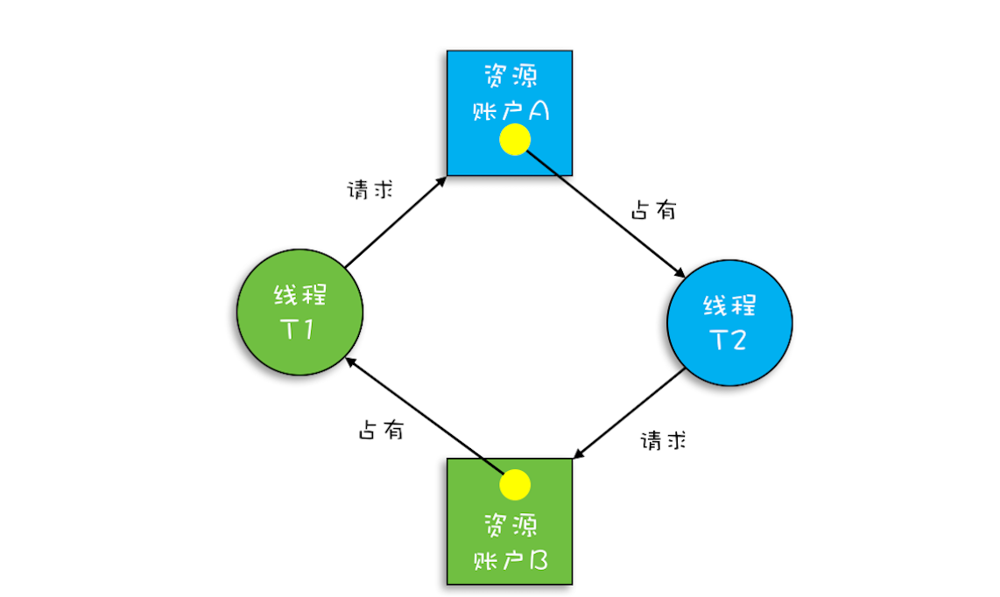

# 死锁问题

## 1 转账问题优化

对应转账问题，最简单的方式就是使用一把粗粒度锁，保护所有的账户：

```java
class Account {
  private int balance;

  // 转账
  void transfer(Account target, int amt){
    synchronized(Account.class) {
      if (this.balance > amt) {
        this.balance -= amt;
        target.balance += amt;
      }
    }
  }
}
```

但是这样有严重的性能问题，所有的转账都变成串行了，这是不可接受的。

## 2 初步优化引发的死锁问题

对上述问题的优化思路是，仅针对转账操作涉及到用户进行加锁，具体代码如下：

```java
/**
 * 每个用户对应一个 Account 对象。
 */
class Account {

    private int balance;

    /**
     * 转账
     *
     * @param target 转入账户
     * @param amt    转入金额
     */
    void transfer(Account target, int amt) {
        // 锁定转出账户
        synchronized (this) {
            // 锁定转入账户
            synchronized (target) {
                if (this.balance > amt) {
                    this.balance -= amt;
                    target.balance += amt;
                }
            }
        }
    }

}
```

使用细粒度锁可以提高并行度，是性能优化的一个重要手段。但是使用细粒度锁是有代价的，这个代价就是可能会导致**死锁**。死锁的一个比较专业的定义是：**一组互相竞争资源的线程因互相等待，导致“永久”阻塞的现象**。

如何发生死锁的：

1. 假设线程 T1 执行账户 A 转账户 B 的操作，账户 `A.transfer(账户 B)`；
2. 同时线程 T2 执行账户 B 转账户 A 的操作，账户 `B.transfer(账户 A)`。

可能产生的情况是 T1 获取了账户 A 的锁，试图获取账户 B 的锁，T2 获取了账户 B 的锁，试图获取账户 A 的锁，这样，这两个线程将永远等待下去。

### 借助资源分配图来可视化锁的占用情况

资源分配图是个有向图，它可以描述资源和线程的状态

- 资源用方形节点表示，线程用圆形节点表示。
- 资源中的点指向线程的边表示线程已经获得该资源。
- 线程指向资源的边则表示线程请求资源，但尚未得到。

转账发生死锁时的资源分配图就如下图所示：



## 3 如何预防死锁

**并发程序一旦死锁，一般没有特别好的方法，很多时候我们只能重启应用。因此，解决死锁问题最好的办法还是规避死锁**。

要避免死锁就需要分析死锁发生的条件，有个叫 Coffman 的牛人早就总结过了，只有以下这四个条件都发生时才会出现死锁：

1. **互斥**，共享资源 X 和 Y 只能被一个线程占用；
2. **占有且等待**，线程 T1 已经取得共享资源 X，在等待共享资源 Y 的时候，不释放共享资源 X；
3. **不可抢占**，其他线程不能强行抢占线程 T1 占有的资源；
4. **循环等待**，线程 T1 等待线程 T2 占有的资源，线程 T2 等待线程 T1 占有的资源，就是循环等待。

因此，**只要我们破坏其中一个，就可以成功避免死锁的发生**。对应以上四个条件，在解决死锁时，有如下对应操作：

1. 对于互斥：这个条件我们没有办法破坏，因为我们用锁为的就是互斥。
2. 对于“占用且等待”这个条件，我们可以一次性申请所有的资源，这样就不存在等待了。
3. 对于“不可抢占”这个条件，占用部分资源的线程进一步申请其他资源时，如果申请不到，可以主动释放它占有的资源，这样不可抢占这个条件就破坏掉了。
4. 对于“循环等待”这个条件，可以靠按序申请资源来预防。所谓按序申请，是指资源是有线性顺序的，申请的时候可以先申请资源序号小的，再申请资源序号大的，这样线性化后自然就不存在循环了。

## 4 总结

- 用细粒度锁来锁定多个资源时，要注意死锁的问题。
- 针对多种解决方案，评估一下操作成本，从中选择一个成本最低的方案。
