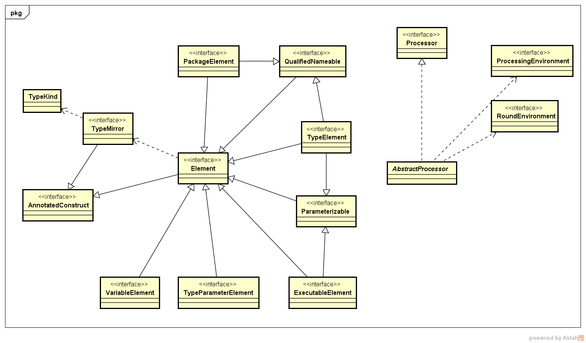

# APT 编译时注解处理器

[JSR-269](https://jcp.org/en/jsr/detail?id=269)（Pluggable Annotation Processing API）中引入了 APT，APT(Annotation Processor Tool)用于在编译时期扫描和处理注解信息。

JSR-269 把 method, package, constructor, type, variable, enum, annotation 等 Java 语言元素映射为 Types 和 Elements，从而将 Java 语言的语义映射成为对象，我们可以在 `javax.lang.model`包下面找到这些类。APT 不是运行时的，可以把 APT 看作一个编译插件，在编译过程中，javac 会将特定注解处理器关心的标有特定注解的 **Java 语言的语义对象** 传递给它，然后注解注解处理器对这些元素进行处理，如果注解处理器处理元素时（执行process方法）产生了新的 Java 代码，编译器会再调用一次注解处理器，如果第二次处理还有新代码产生，就会接着调用，直到没有新代码产生为止。每执行一次 `process()` 方法被称为一个 round。注意，APT 不是对源代码进行修改，且 APT 无法修改原源代码。

注解最早是在 java5 引入，主要包含 apt 和 `com.sum.mirror` 包中相关的 mirror api，此时 apt 和 javac 是各自独立的。从 java6 开始，注解处理器正式标准化，apt 工具也被直接集成在 javac 当中。

**编译一个编译时注解处理主要分两步：**

1. 继承 AbstractProcessor，实现自己的注解处理器。
2. 注册处理器，并打成 jar 包。

## 1 相关 API 介绍

编译时注解设计到的API有:

- AbstractProcessor： 抽象的注解处理器，我们需要继承它来实现自己的处理器
- ProcessingEnvironment： 用于获取相关工具对象，我们可以通过它获取下面工具对象
    - Elements：包含用于操作Element的工具方法
    - Messager：用来报告错误，警告和其他提示信息
    - Filer：用来创建新的源文件，class文件以及辅助文件
    - Types：包含用于操作TypeMirror的工具方法
- RoundEnvironment：**这是一个非常重要的类，通过它我们获取被注解标注的对象(方法、字段、类等)**
- Element：表示一个程序元素，比如包、类或者方法。每个元素都表示一个静态的语言级构造
- TypeMirror：表示Java编程语言中的类型，这些类型包括基本类型、声明类型（类和接口类型）、数组类型、类型变量和null类型。还可以表示通配符类型参数、executable的签名和返回类型，以及对应于包和关键字 `void` 的伪类型。


### AbstractProcessor

```java
/*
 * 方法的调用顺序为：
 *          init
 *          getSupportedSourceVersion
 *          getSupportedAnnotationTypes
 *          process
*/
public class SampleAnnotationProcessor extends AbstractProcessor {

  private Messager mMessager;

  /**
   * 该方法由注解处理器自动调用，其中ProcessingEnvironment类提供了很多有用的工具类：Filter，Types，Elements，Messager等
   */
  @Override
  public synchronized void init(ProcessingEnvironment processingEnv) {
      super.init(processingEnv);
  }

  /**
   * 该方法返回字符串的集合表示该处理器用于处理那些注解
   */
  @Override
  public Set<String> getSupportedAnnotationTypes() {
      LinkedHashSet<String> annotations = new LinkedHashSet<>();
      annotations.add(SamplePrint.class.getCanonicalName());
      return annotations;
  }

  /**
   * 该方法用来指定支持的java版本，一般来说我们都是支持到最新版本，因此直接返回SourceVersion.latestSupported(）即可
   */
  @Override
  public SourceVersion getSupportedSourceVersion() {
      return SourceVersion.latestSupported();
  }

  /**
   * 该方法是注解处理器处理注解的主要地方，我们需要在这里写扫描和处理注解的代码，
   * 以及最终生成的java文件。其中需要深入了解的是RoundEnvironment类，该类用于查找出程序元素上使用的注解。
   *
   *  处理先前round产生的类型元素上的注释类型集，并返回这些注释是否由此Processor声明。如果返回true，则这些注释已声明并且不要求后续Processor处理它们；如果返回false，
   *  则这些注释未声明并且可能要求后续Processor处理它们。Processor可能总是返回相同的boolean值，或者可能基于所选择的标准而返回不同的结果。
   */
  @Override
  public boolean process(Set<? extends TypeElement> annotations, RoundEnvironment roundEnv) {
      annotations.forEach((Consumer<TypeElement>) typeElement -> {
          for (Element element : roundEnv.getElementsAnnotatedWith(typeElement)) {
              mMessager.printMessage(Diagnostic.Kind.NOTE, element.toString());
          }
      });
      return true;
  }
}
```

### ProcessingEnvironment

```java
    public interface ProcessingEnvironment {
        Map<String,String> getOptions();
        //Messager用来报告错误，警告和其他提示信息
        Messager getMessager();
        //Filter用来创建新的源文件，class文件以及辅助文件
        Filer getFiler();
        //Elements中包含用于操作Element的工具方法
        Elements getElementUtils();
         //Types中包含用于操作TypeMirror的工具方法
        Types getTypeUtils();
        SourceVersion getSourceVersion();
        Locale getLocale();
    }
```

### RoundEnvironment

```java
public interface RoundEnvironment {

  //如果此 round 生成的类型不是以注释处理的后续 round 为准，则返回 true；否则返回 false。
  boolean processingOver();
  //如果在以前的处理 round 中发生错误，则返回 true；否则返回 false。
  boolean errorRaised();
  //  返回以前的 round 生成的注释处理根元素。
  Set<? extends Element> getRootElements();
  //  返回使用给定注释类型注释的元素。
  Set<? extends Element> getElementsAnnotatedWith(TypeElement a);
  //  返回使用给定注释类型注释的元素。
  Set<? extends Element> getElementsAnnotatedWith(Class<? extends Annotation> a);

}
```

### Element

表示一个静态的，语言级别的构件。而任何一个结构化文档都可以看作是由不同的element组成的结构体，对于java源文件来说，Element代表程序元素的包，类，方法。每个元素都表示一个静态的语言级构造。

```java

public interface Element extends javax.lang.model.AnnotatedConstruct {

    //返回此元素定义的类型
    TypeMirror asType();
    //返回此元素的类型。 
    ElementKind getKind();
    //返回此元素的修饰符，不包括注释。但包括显式修饰符，比如接口成员的 public 和 static 修饰符。
    Set<Modifier> getModifiers();
    //例如，类型元素 java.util.Set<E> 的简单名称是 "Set"。
    Name getSimpleName();
    /*
    返回封装此元素（非严格意义上）的最里层元素。
        如果此元素的声明在词法上直接封装在另一个元素的声明中，则返回那个封装元素。 
        如果此元素是顶层类型，则返回它的包。 
        如果此元素是一个包，则返回 null。 
        如果此元素是一个类型参数，则返回 null。
    */
    Element getEnclosingElement();
    //返回此元素直接封装（非严格意义上）的元素。
    List<? extends Element> getEnclosedElements();
    //返回此元素针对指定类型的注释（如果存在这样的注释），否则返回 null。
    @Override
    <A extends Annotation> A getAnnotation(Class<A> annotationType);
    //将一个 visitor 应用到此元素。应用于访问者模式。
    <R, P> R accept(ElementVisitor<R, P> v, P p);
}

```
其子类包括：

- PackageElement      表示一个包程序元素。提供对有关包及其成员的信息的访问。
- VariableElement        代表一个 字段, 枚举常量, 方法或者构造方法的参数, 局部变量及 异常参数等元素
- PackageElement        代表包元素
- TypeElement            代表类或接口元素
- ExecutableElement      代码方法，构造函数，类或接口的初始化代码块等元素，也包括注解类型元素


### TypeMirror

表示 Java 编程语言中的类型。这些类型包括基本类型、声明类型（类和接口类型）、数组类型、类型变量和 null 类型。还可以表示通配符类型参数、executable 的签名和返回类型，以及对应于包和关键字 void 的伪类型。 应该使用 Types 中的实用工具方法比较这些类型。不保证总是使用相同的对象表示某个特定的类型。TypeMirror类中最重要的是getKind()方法，该方法返回TypeKind类型(kind:种类)，**getKind()方法返回的是TypeKind，TypeKind是枚举类型，表示类型镜像的种类。**


### 常用API

```java
//根据全类路由获取Element
Element Elements.getTypeElement("java.lang.String");

//Element转换为TypeMirror
TypeMirror Element.asType()

//获取传给编译器的参数
Map<String,String> ProcessingEnvironment：getOptions();

//Element转换为Type类型的标识，比如Type.SHORT.ordinal();
int TypeUtils.typeExchange(Element)
```

----
## 2 编译时注解API相关类图



----
## 3 打包注解并注册

为了让java编译器或能够找到自定义的注解处理器我们需要对其进行注册和打包：自定义的处理器需要被打成一个jar，并且需要在jar包的`META-INF/services`路径下中创建一个固定的文件`javax.annotation.processing.Processor`，在`javax.annotation.processing.Processor`文件中需要填写自定义处理器的完整路径名，有几个处理器就需要填写几个。比如：

```java
com.ztiany.SamplePrintProcessor
com.ztiany.CodeProcessor
```

如果使用Google的**AutoService**则可以免去上面步骤

```java
//依赖
compile 'com.google.auto.service:auto-service:1.0-rc2'

//示例
@AutoService(Processor.class) //固定写法，这样就可以免去配置
@SupportedOptions(String)//支持的传递给APT处理的参数的key名称
@SupportedSourceVersion(SourceVersion.RELEASE_7)//支持的java版本
@SupportedAnnotationTypes({String})//支持的注解全路径名数组
public class RouterProcessor extends AbstractProcessor {
   ......
}
```

---
## 4 Gradle APT插件

AndroidStudio 应该使用 **Anroid-apt** 或者 **annotationProcessor**，APT 插件的作用是：

 - 只允许配置编译时注解处理器依赖，但在最终 APK 或者 Library 中不包含注解处理器的代码。
 - 设置源路径，以便由注解处理器生成的代码能被 AndroidStudio 识别。

在 IDEA 上使用 APT， 可以参考 [gradle-apt-plugin](https://github.com/tbroyer/gradle-apt-plugin)。

---
## 5 开发实践

- 1 在`init(ProcessingEnvironment processingEnv)`方法中做一些初始化工作，然后通过 processingEnv 获取需要用到的工具类。
```java
@Override
    public synchronized void init(ProcessingEnvironment processingEnv) {
        super.init(processingEnv);

        mFiler = processingEnv.getFiler();
        types = processingEnv.getTypeUtils();
        elements = processingEnv.getElementUtils();
        typeUtils = new TypeUtils(types, elements);
        logger = new Logger(processingEnv.getMessager());
    }
```

- 2 在`process(Set<? extends TypeElement> set, RoundEnvironment roundEnvironment)`方法中一般有如下步骤：
    - 获取所有的应用了目标注解的元素，用定义的数据类型封装其他，统一存放在列表中
    - 遍历列表，处理每个元素，生成对应的代码

---
## 6 使用标准类库提供的访问者

在 `javax.lang.model.util` 中  中提供了 ElementVisitor 接口用来遍历所有被编译的 Java 源码的元素，这是一个访问者设计模式的实现。

---
## 7 使用 javapoet

APT 生成的代码需要用字符串一个一个的拼接，其实是比较繁琐的，还好 square 开源了 javapoet，大大的提升了开发效率。

----
## 引用

博客

- [基础篇：带你从头到尾玩转注解](http://blog.csdn.net/dd864140130/article/details/53875814)
- [拓展篇：注解处理器最佳实践](http://blog.csdn.net/dd864140130/article/details/53957691)
- [万能的APT！编译时注解的妙用](http://zjutkz.net/2016/04/07/%E4%B8%87%E8%83%BD%E7%9A%84APT%EF%BC%81%E7%BC%96%E8%AF%91%E6%97%B6%E6%B3%A8%E8%A7%A3%E7%9A%84%E5%A6%99%E7%94%A8/)
- [浅析ButterKnife](http://mp.weixin.qq.com/s?__biz=MzI1NjEwMTM4OA==&mid=2651232205&idx=1&sn=6c24e6eef2b18f253284b9dd92ec7efb&chksm=f1d9eaaec6ae63b82fd84f72c66d3759c693f164ff578da5dde45d367f168aea0038bc3cc8e8&scene=0#wechat_redirect)
- [Java奇技淫巧-插件化注解处理API(Pluggable Annotation Processing API)](https://www.cnblogs.com/throwable/p/9139908.html)

工具

- [javapoet](https://github.com/square/javapoet)
- [auto service](https://github.com/google/auto/tree/master/service)
- [android-lite-tidy](https://github.com/litesuits/android-lite-tidy)