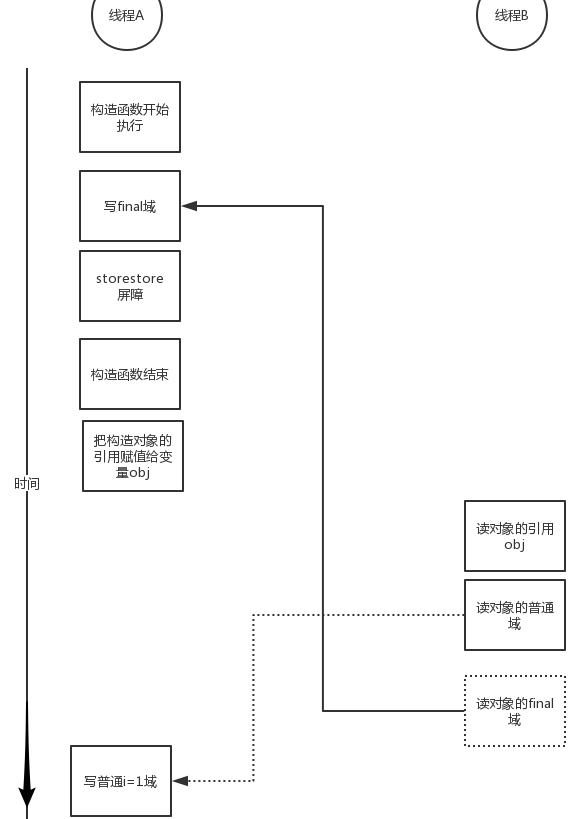
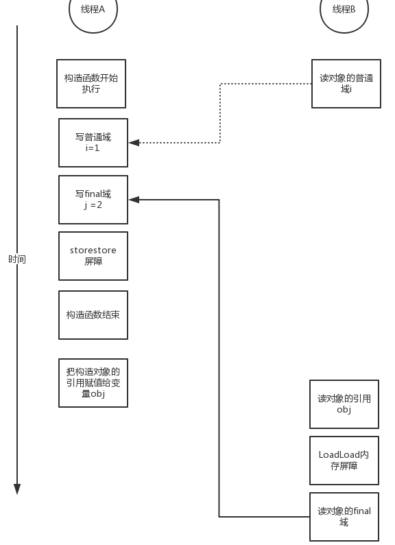

# final变量的内存语义

##  1 final变量重排序规则

final变量遵守以下重排序规则：

1. 在构造函数内对一个final域写入，与随后把这个被构造对象的引用赋值给一个引用变量，这两个操作之间不能重排序
2. 初次读取一个包含final域的对象的引用，与随后初次读这个final域，这两个操作之间不能重排序。(先读引用，后读引用对象的final域)

示例：

```java
    public class FinalMemory {
    
        static FinalExample sFinalExample;
    
        public static void main(String[] args) {
    
            new Thread() {
                @Override
                public void run() {
                    writer();//写线程A执行
                }
            }.start();

            new Thread() {
                @Override
                public void run() {
                    reader();//读线程B执行
                }
            }.start();
        }

        public static void writer() {
            sFinalExample = new FinalExample();
        }

        public static void reader() {
            FinalExample finalExample = sFinalExample;
            int a = finalExample.i;
            int b = finalExample.j;
            System.out.println(a + " " + b);
        }
       }
       
       class FinalExample {
        int i;
        final int j;
    
        FinalExample() {//构造函数
            i = 1;//写普通域
            j = 4;//写final域
        }

     }
```


## 2 写final域的重排序规则

1. JVM禁止把final域的写重排序到构造函数之外
2. 编译器会在final域的写之后，构造函数return之前，插入一个storestore内存屏障，这个内存屏障禁止处理器把final域的写重排序到构造函数之外

如上面示例，加入写线程A先执行writer，读线程B后执行reader。

writer方法的执行步骤是:

1. 构造一个FinalExample类型的对象
2. 把这个对象的引用赋值给引用变量obj

假设B线程读对象引用和读对象的成员之间没有重排序(这个假设是需要的)，可能存在下面情况：

在读线程B读取obj时，很可能对象还没有构造完成(对普通域i的写操作被重排序到构造函数之外，此时初始化值1还没有被写入i)，读线程B可能错误的读到普通变量i初始化之前的值，而写final域的操作，被final域的重排序规则限定在了构造函数之内，读线程B可以正确的读取到final域初始化之后的值。如下面视图：

**final域保证在对象的引用被任意线程可见之前，对象的final域已经初始化了，而普通变量没有这个保证**



## 3 读final域的重排序规则

读final域的重排序规则是：在一个线程中，初次读对象引用与初次读该对象包含的final域，JVM禁止重排序这两个操作。编译器会在读final域操作之前插入一道loadLoad内存屏障。而普通域没有这个规则限制，所以读浦东对象的普通域i可能重排序到读对象引用之前。

初次读对象引用与初次读该对象包含的final，这两个操作之间存在间接依赖关系。大多数处理器不会对存在间接依赖关系的顺序进行重排序，但是少数处理器会(如aplha处理器)，这个规则专门针对此类型的处理器。

假设处理器会对存在间接依赖关系的顺序进行重排序，下面是一种可能的执行顺序。




## 4 final域为引用类型

对于引用类型，写final域的重排序规则对编译器和处理器增加了如下约束，在构造函数内对final引用的对象的成员域的写入，与随后在构造函数外把这个被构造对象的引用赋值给一个引用变量，这两个操作之间不能重排序。

```java
     public class FinalRefExample {
        
            final int[] intArray;
            static FinalRefExample sFinalRefExample;
        
        
            public FinalRefExample() {
                this.intArray = new int[3];    //1 
                intArray[0] = 2;                     //2
            }
        
            public static void writeOne() {//写线程A
                sFinalRefExample = new FinalRefExample();//3
        
            }
        
            public static void writeTow() {//写线程B
                sFinalRefExample.intArray[2] = 4;//3
            }
        
        
            public static void reader() {//读线程C
                if (sFinalRefExample != null) {//5
                    int x = sFinalRefExample.intArray[0];//6
                }
            }
        }
```


如上面代码，除了1和2之间不能重排序，2和3之间也不能重排序。


## 5 为什么final引用不能从构造函数内溢出

上面说到：在引用变量为任意线程可见之前，该引用变量指向的对象的fianl域已经在构造函数内正确初始化了。其实这个效果，还需要一个保证：在构造函数内，不能让这个被构造对象的引用为其他线程可见，也就是引用不能在构造函数内移除。：

```java
    public class FinalReferenceEscapeExample {
    
        final int i;
        static FinalReferenceEscapeExample sFinalReferenceEscapeExample;
    
        FinalReferenceEscapeExample() {
            i = 4;
            sFinalReferenceEscapeExample = this;//这里造成了被构造对象的引用在构造函数内溢出
        }
    
        public static void writer() {
            new FinalReferenceEscapeExample();
        }
    
        public static void reader() {
            if (sFinalReferenceEscapeExample != null) {//有可能读到FinalReferenceEscapeExample的内部成员变量初始化之前的值
                int temp = sFinalReferenceEscapeExample.i;
            }
        }
    }
```

## 6 JSR-133为什么要增强final的语义

在旧的java内存模型中，一个最严重的缺陷就是线程可能看到final域的值会变化，因为JSR-133之前没有对final读写的重排序规则，线程可能看到final域初始化之前的值，增强final的语义就是为了修补这个漏洞。


