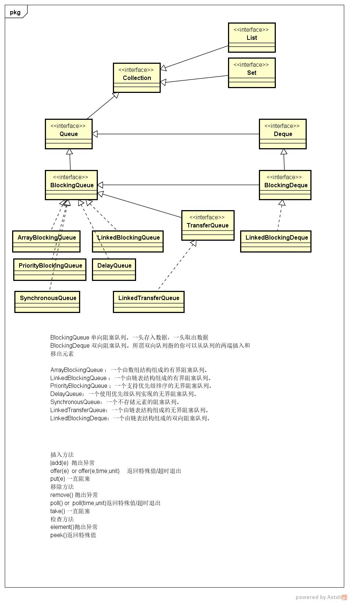

# 阻塞队列

---
## 1 阻塞队列介绍

阻塞队列（BlockingQueue）继承自Collection，是一个支持两个附加操作的队列。这两个附加的操作是：

- 在队列为空时，获取元素的线程会等待队列变为非空。
- 当队列满时，存储元素的线程会等待队列可用。

阻塞队列常用于**生产者和消费者**的场景，生产者是往队列里添加元素的线程，消费者是从队列里拿元素的线程。**阻塞队列就是生产者存放元素的容器**，而消费者也只从容器里拿元素。阻塞队列是线程安全的。

阻塞队列提供了四种处理方法:

| 方法\处理方式 | 抛出异常 | 返回特殊值 | 一直阻塞 | 超时退出 |
|----|----|----|
| 插入方法 | add(e) | offer(e) | put(e) | offer(e,time,unit) |
| 移除方法 | remove() | poll() | take() | poll(time,unit) |
| 检查方法 | element() | peek() | 不可用 | 不可用 |

- **抛出异常** 当阻塞队列满时，往队列中插入元素会抛出IllegalStateException异常，当对队列为空时，从队列中获取元素会抛出NoSuchElementException异常
- **返回特殊值** 当往队列中插入数据时，会返回布尔值来说明插入是否成功，从队列中获取元素是，若队列为空则返回null值
- **阻塞** 上面所说的两种附加操作
- **超时退出** 在阻塞的基础上加上超时的功能，获取超时后返回空值


---
## 2 Java中的阻塞队列

*   **ArrayBlockingQueue** ：一个由数组结构组成的有界阻塞队列。
*   **LinkedBlockingQueue** ：一个由链表结构组成的有界阻塞队列。
*   **PriorityBlockingQueue** ：一个支持优先级排序的无界阻塞队列。
*   **DelayQueue**：一个使用优先级队列实现的无界阻塞队列。
*   **SynchronousQueue**：一个不存储元素的阻塞队列。
*   **LinkedTransferQueue**：一个由链表结构组成的无界阻塞队列。
*   **LinkedBlockingDeque**：一个由链表结构组成的双向阻塞队列。

### 2.1 ArrayBlockingQueue

ArrayBlockingQueue是一个用数组实现的**有界阻塞队列**。此队列按照先进先出（**FIFO**）的原则对元素进行排序。**默认情况下不保证访问者公平的访问队列**，`所谓公平访问队列是指阻塞的所有生产者线程或消费者线程，当队列可用时，可以按照阻塞的先后顺序访问队列`，即先阻塞的生产者线程，可以先往队列里插入元素，先阻塞的消费者线程，可以先从队列里获取元素。在ArrayBlockingQueue构造函数中，我们可以传入特定的值指定ArrayBlockingQueue是否保证生产者与消费者的公平性。

通常情况下为了保证公平性会降低吞吐量。我们可以使用以下代码创建一个公平的阻塞队列：

        //capacity 指定容量
        ArrayBlockingQueue<String> arrayBlockingQueue  = new ArrayBlockingQueue<String>(10);
        //fair 公平，保证公平的阻塞队列
        ArrayBlockingQueue<String> fairArrayBlockingQueue  = new ArrayBlockingQueue<String>(10,true);

### 2.2 LinkedBlockingQueue

LinkedBlockingQueue是一个用**链表**实现的有界阻塞队列。此队列的默认和最大长度为Integer.MAX_VALUE。此队列按照先进先出的原则对元素进行排序。

    //无边界链表阻塞队列
        private LinkedBlockingQueue<String> linkedBlockingQueue = new LinkedBlockingQueue<String>();

### 2.3 PriorityBlockingQueue

PriorityBlockingQueue是一个支持优先级的无界队列。默认情况下元素采取自然顺序排列，也可以通过比较器**comparator**来指定元素的排序规则。元素按照升序排列。

        //优先级队列，可对元素进行优先级排序，设置初始化容量为10
        private PriorityBlockingQueue<String> priorityBlockingQueue = new PriorityBlockingQueue<String>(10);

### 2.4 DelayQueue

DelayQueue是一个支持**延时获取元素**的无界阻塞队列。队列使用PriorityQueue来实现。队列中的元素必须实现**Delayed**接口，在创建元素时可以指定多久才能从队列中获取当前元素。只有在延迟期满时才能从队列中提取元素。我们可以将DelayQueue运用在以下应用场景：

*   缓存系统的设计：可以用DelayQueue保存缓存元素的有效期，使用一个线程循环查询DelayQueue，一旦能从DelayQueue中获取元素时，表示缓存有效期到了。
*   定时任务调度。使用DelayQueue保存当天将会执行的任务和执行时间，一旦从DelayQueue中获取到任务就开始执行，从比如TimerQueue就是使用DelayQueue实现的。

#### 如何使用Delayed接口

DelayQueue中的元素必须实现Delayed接口，参考ScheduledThreadPoolExeutor里的ScheduleFutureTask类的实现，有以下三步：

1. 在创建对象时，初始化基本数据，使用time记录当前任务延迟到什么时候执行，可以sequenceNumber来表示元素在队列中的先后顺序：
2. 实现getDelay方法，返回当前元素还需要延长多少时间
3. 实现compareTo方法来指定元素的顺序，一般我们会把事件最长的放在队列的最后面


下面是一个简单的实现

```java
    public class DelayedTask implements Delayed {
        private static AtomicLong sequencer = new AtomicLong(0);
    
        private long mTime;
        private long mSequencer;
        private String mName;
    
        /**
         * 
         * @param r
         * @param result
         * @param ns  毫秒
         * @param period
         *            period
         */
        public DelayedTask(String name, long ns) {
            mName = name;
            mTime = ns;
            mSequencer = sequencer.getAndIncrement();
        }
    
        public int compareTo(Delayed o) {
            if (o == this) {
                return 0;
            }
            if (o instanceof DelayedTask) {
                DelayedTask delayedTask = (DelayedTask) o;
                long diff = mTime - delayedTask.mTime;
                if (diff < 0) {
                    return -1;
                } else if (diff > 0) {
                    return 1;
                } else if (mSequencer < delayedTask.mSequencer) {
                    return -1;
                } else {
                    return 1;
                }
            }
    
            long d = (getDelay(TimeUnit.NANOSECONDS) - o
                    .getDelay(TimeUnit.NANOSECONDS));
    
            return d == 0 ? 0 : ((d < 0 ? -1 : 1));
        }
    
        public long getDelay(TimeUnit unit) {
            long convert = unit.convert(mTime - System.nanoTime(), TimeUnit.NANOSECONDS);
            return unit.convert(mTime - System.nanoTime(), TimeUnit.NANOSECONDS);
        }
    
        public void start() {
        System.err.println(mName);
        }
    }
```

测试代码：

```java
            DelayQueue<DelayedTask> delayedTasks = new DelayQueue<DelayedTask>();
    
            delayedTasks.add(new DelayedTask("task 1", System.nanoTime() + TimeUnit.SECONDS.toNanos(10)));
            delayedTasks.add(new DelayedTask("task 2", System.nanoTime() + TimeUnit.SECONDS.toNanos(5)));
            delayedTasks.add(new DelayedTask("task 3", System.nanoTime() + TimeUnit.SECONDS.toNanos(3)));
            delayedTasks.add(new DelayedTask("task 4", System.nanoTime() + TimeUnit.SECONDS.toNanos(7)));
            delayedTasks.add(new DelayedTask("task 5", System.nanoTime() + TimeUnit.SECONDS.toNanos(6)));
            delayedTasks.add(new DelayedTask("task 6", System.nanoTime() + TimeUnit.SECONDS.toNanos(2)));
            
            while (!delayedTasks.isEmpty()) {
                DelayedTask poll = delayedTasks.poll();
                if(poll != null){
                    poll.start();
                }
            }
    打印结果为：
    
    task 6
    task 3
    task 2
    task 5
    task 4
    task 1
```

**如何实现延时队列**？延时队列的实现很简单，当消费者从队列里获取元素时，如果元素没有达到延时时间，就阻塞当前线程。

### 2.5 SynchronousQueue

SynchronousQueue是一个**不存储元素的阻塞队列**。每一个put操作必须等待一个take操作，否则不能继续添加元素。SynchronousQueue可以看成是一个传球手，负责把生产者线程处理的数据**直接传递**给消费者线程。队列本身并不存储任何元素，非常适合于传递性场景,比如在一个线程中使用的数据，传递给另外一个线程使用，SynchronousQueue的吞吐量高于LinkedBlockingQueue 和 ArrayBlockingQueue。


### 2.6 LinkedTransferQueue

LinkedTransferQueue是一个由链表结构组成的无界阻塞TransferQueue队列。相对于其他阻塞队列，LinkedTransferQueue多了tryTransfer和transfer方法。

#### transfer方法

transfer方法。如果当前有消费者正在等待接收元素（**消费者使用take()方法或带时间限制的poll()方法时**），transfer方法可以把生产者传入的元素立刻transfer（传输）给消费者。如果没有消费者在等待接收元素，transfer方法会将元素存放在队列的tail节点，并等到该元素被消费者消费了才返回。

transfer方法的关键代码如下：

```java
    Node pred = tryAppend(s, haveData);
    return awaitMatch(s, pred, e, (how == TIMED), nanos);
```

第一行代码是试图把存放当前元素的s节点作为tail节点。第二行代码是让CPU自旋等待消费者消费元素。因为自旋会消耗CPU，所以自旋一定的次数后使用Thread.yield()方法来暂停当前正在执行的线程，并执行其他线程。

tryTransfer方法。则是用来试探下生产者传入的元素是否能直接传给消费者。如果没有消费者等待接收元素，则返回false。和transfer方法的区别是tryTransfer方法无论消费者是否接收，**方法立即返回**。而transfer方法是必须等到消费者消费了才返回。

对于带有时间限制的tryTransfer(E e, long timeout, TimeUnit unit)方法，则是试图把生产者传入的元素直接传给消费者，但是如果没有消费者消费该元素则等待指定的时间再返回，如果超时还没消费元素，则返回false，如果在超时时间内消费了元素，则返回true。

```java
    final    LinkedTransferQueue<String> strings = new LinkedTransferQueue<String>();
        new Thread(){
            public void run() {
                try {
                 //等待五秒钟去获取元素
                    Thread.sleep(5000);
                    String poll = strings.poll();
                    System.err.println(poll);
                } catch (InterruptedException e) {
                    e.printStackTrace();
                }
            };
        }.start();
        
            try {
                strings.transfer("b");//五秒钟之后才能放入元素
            } catch (InterruptedException e) {
                e.printStackTrace();
            }
```

### 2.7 LinkedBlockingDeque

LinkedBlockingDeque是一个由链表结构组成的**双向阻塞队列**。**所谓双向队列指的你可以从队列的两端插入和移出元素**。双端队列因为多了一个操作队列的入口，在多线程同时入队时，也就减少了一半的竞争。相比其他的阻塞队列，LinkedBlockingDeque多了addFirst，addLast，offerFirst，offerLast，peekFirst，peekLast等方法，以First单词结尾的方法，表示插入，获取（peek）或移除双端队列的第一个元素。以Last单词结尾的方法，表示插入，获取或移除双端队列的最后一个元素。另外插入方法add等同于addLast，移除方法remove等效于removeFirst。但是**take方法却等同于takeFirst**，不知道是不是Jdk的bug，使用时还是用带有First和Last后缀的方法更清楚。

```java
    LinkedBlockingDeque<String> strings = new LinkedBlockingDeque<String>(10);
```

---
## 3 阻塞队列继承关系




---
## 4 应用场景

- 阻塞队列可以用来当锁
- 生产与消费模式


