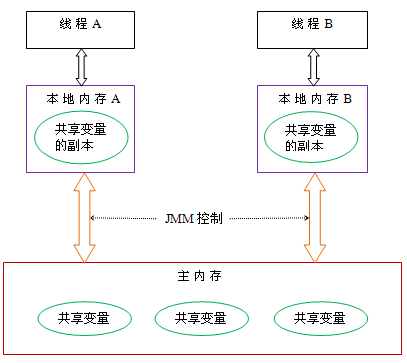
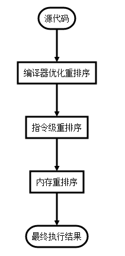

---
# 1 内存模型

## 1.1 什么是内存模型

多处理器系统中，处理器都会有多级缓存，就像前面说的这些高速缓存离处理器很近并且可以存储一部分数据，所以高速缓存可以改善处理器获取数据的速度和减少对共享内存数据总线的占用。虽然缓存能极大的提高性能，但是同时也带来了挑战。比如：当两个处理器同时操作同一个内存地址的时候，该如何处理？这两个处理器在什么条件下才能看到相同的值？

而内存模型就是：**定义一些充分必要的规范，这些规范使得其他处理器对内存的写操作对当前处理器可见，或者当前处理器的写操作对其他处理器可见。**

实现可见性要求：**其他处理器对内存的写一定发生在当前处理器对同一内存的读之前，称之为其他处理器对内存的写对当前处理器可见。**


## 1.2 Java内存模型

Java内存模型简称JMM，而JMM指的就是一套规范，现在最新的规范为**JSR-133**，此规范包括：

1.  **线程之间如何通过内存通信**；
2.  **线程之间通过什么方式通信才合法，才能得到期望的结果**。

并发编程模型的两个关键问题：线程之间如何`通信`及线程之间如何`同步`。
- 通信是指线程之间以何种方式来交换信息。命令编程模式下主要有两种通信机制：`共享内存`和`消息传递`。Java并发采用的是`共享内存模式`。
- 同步是指程序中用于控制不同线程间操作发生相对顺序的机制。

## 1.3 Java内存模型的抽象结构

Java内存模型将内存分为`共享内存`和`本地内存`。共享内存又称为堆内存，指的就是线程之间共享的内存，包含所有的**实例域、静态域和数组元素**。而每个线程都有一个私有的，只对自己可见的内存，称之为本地内存。

>本地内存涵盖：缓存、写缓冲区、寄存器以及其他的硬件和编译器优化。所有线程拥有的资源是由cpu分配的

- 堆内存在线程间共享。
- 局部变量、方法参数、异常处理参数不会被线程共享，不受内存模型的影响。

java线程之间的通信方式由JMM控制，JMM决定一个线程对共享变量的写入何时对另一个线程可见。JMM定义了线程和主内存之间的抽象关系。线程间的共享变量都存储在主内存中，而每个线程都有一个私有的本地内存，本地内存存储了该线程以读/写共享变量的副本，JMM规定线程不能直接在主内存修改共享变量。Java的内存模型抽象示意图如下：




线程间的通信必须通过主内存。**JMM通过控制主内存与每个线程的本地内存之间的交互，来为Java程序员提供内存可见性的保证。**

---
# 2 重排序

在执行程序时，为了提高性能，编译器和处理器常常会对指令做重排序，`指令重排序`包括下面三种：

- **编译器优化重排序**，在不改变单线程程序语义的前提下。
- **指令级并行的重排序**，如果不存在数据依赖性，处理器可以改变语句对应机器指令的执行顺序。
- **内存系统重排序**，由于处理器可以使用缓存和读写缓冲区，这使得加载和存储操作看起来可能是乱序执行的。



这些重排序可能会导致多线程出现的内存可见性问题。

- 对于编译器，JMM的编译器重排序会禁止特定类型的重排序
- 对于处理器重排序，JMM的处理器重排序规则会要求java编译器在生成执行序列时，插入特定类型的内存屏障(Menory Barriers)指令，通过内存屏障指令来禁止特定类型的处理器重排序。

>JMM属于语言级的内存模型，它确保在不同的编译器和不同的处理器平台上，通过禁止特定类型的编译器重排序和处理器重排序为程序员提供一致的内存可见性保证。

## 2.1  内存屏障

现代的处理器使用写缓存区临时保存向内存写入的数据，以此来减少对内存总线的占用，它们会通过批处理的方式刷新写缓冲区。虽然性能提升了，但是每个处理器上的写缓冲区只对自己可见，这个特性会对内存操作的执行顺序产生重要的影响：处理器对内存的读写操作的执行顺序，不一定与内存实际发生的读写顺序一致！

而且现代的处理器都会使用缓冲区，因此现处理器都会允许对写-读操作进行重排序。而且不同cpu的重排序的行为不同。


下面是常见处理器允许的重排序类型的列表：

|| Load-Load | Load-Store | Store-Store | Store-Load | 数据依赖 |
| --- | --- | --- | --- | --- | --- |
| sparc-TSO | N | N | N | Y | N |
| x86 | N | N | N | Y | N |
| ia64 | Y | Y | Y | Y | N |
| PowerPC | Y | Y | Y | Y | N |

由此可见，任何处理器都不会对存在数据依赖的指令进行重排序。


为了保证内存可见性，Java编译器在生成指令序列的适当位置插入了内存屏障指令来禁止特定类型的处理器的重排序，JMM把内存指令分为四类：

| 屏障类型 | 指令示例 | 说明 |
| --- | --- | --- |
|LoadLoad Barriers|Load1; LoadLoad; Load2 |确保load1数据的装载先于Load2及其所有后续装载指令的装载|
|StoreStore Barriers|Store1;StoreStore;Store2|确保Sotre1数据对其他处理器可见(刷新到主内存)先于Sotre2及其所有后续的存储指令的存储|
|LoadStore Barriers|Load1;LoadStore;Store2|确保load1数据的装载先于Sotre2及其后续所有的存储指令刷新到主内存|
|StoreLoad Barriers|Store1 ;StoreLoad;Load2|确保Store1数据对其他处理器可见(刷新到主内存)先于Load2及其所有后续装载指令的装载，StoreLoad Barriers会使该屏障之前的所有内存访问指令(存储和装载)完成后，才执行该屏障之后的内存访问指令|

StoreLoad Barriers是全能型的指令，同时具有其他三个屏障指令的效果，现代的大多数处理器都支持该指令(其他类型的不一定支持)，但是这个指令的执行也很昂贵，它要求当前处理器把缓冲区的所有数据全部刷新到内存中去。


## 2.2 happens-before简介

happens-before就是什么一定发生在什么之前，jsr133采用happens-before概念来说明操作之间的可见性。在JMM中如果一条操作要对另一条操作可见，那么他们一定存在happens-before关系。

与程序员密切相关的happens-before规则如下：

*   程序顺序规则：一个线程中的每个操作，happens- before 于该线程中的任意后续操作。
*   监视器锁规则：(一个线程)对一个监视器锁的解锁，happens- before 于随后对(另一个线程)这个监视器锁的加锁。
*   volatile变量规则：对一个volatile域的写，happens- before 于任意后续对这个volatile域的读。
*   传递性：如果A happens- before B，且B happens- before C，那么A happens- before C。


**`注意`**，两个操作之间具有happens-before关系，并不意味着前一个操作必须要在后一个操作之前执行！happens-before仅仅要求前一个操作（执行的结果）对后一个操作可见，且前一个操作按顺序排在第二个操作之前（the first is visible to and ordered before the second).

这两点很重要：

1. 并不意味着前一个操作必须要在后一个操作之前执行
2. 仅仅要求前一个操作（执行的结果）对后一个操作可见

一个happens-before规则通常对应于多个编译器和处理器重排序规则。对于java程序员来说，happens-before规则简单易懂，它避免java程序员为了理解JMM提供的内存可见性保证而去学习复杂的重排序规则以及这些规则的具体实现。

happens-before是JMM最核心的概念，对于Java程序员来说，理解happens-before是理解JMM的关键。

### 2.2.1 JMM的设计

从JMM的设计者角度出发，需要考虑两个因素。

- 程序员对内存模型的使用，希望内存模型易于使用，易于编程，希望基于一个强内存模型来编程
- 编译器和处理器对内存模型的实现，编译器和处理器希望内存模型对他们的束缚越少越好，这样他们就可以尽可能的做优化，编译器希望基于一个弱内存模型

以上两个因素是相互矛盾的，JSR-133专家组在设计JMM核心时的目标就是找到一个好的平衡点，一方面为程序员提供足够强的内存可见性，一方面对对编译器和处理器的限制尽可能的放松.下面看JSR-133是如何实现这一目标的：

例如下面代码：

    double pi = 3.14;             //A
    double r = ;                  //B
    double area = pi * r * r;     //C

上面计算圆的面积存在三个happens-before关系：

1. A happens-before B
2. B happens-before C
3. A happens-before C

在这三个happens-before关系中，2和3是必须的，但是1不是必须的，因此JMM把happens-before要求禁止的重排序分为下面两类：

- 会改变程序执行结果的重排序  JMM要求编译器和处理器必须禁止这种重排序
- 不会变程序执行结果的重排序  JMM对编译器和处理器的此种重排序不做要求

由此可见，JMM向程序员提供的happens-before规则能够满足程序员的需求，向程序员提供了足够强的内存可见性，同时JMM对编译器和处理器的束缚已经尽可能少。所以JMM只是遵守一个基本的原则：**只要不该比程序的执行结果(单线程程序和正确同步的多线程程序)，编译器和处理器怎么优化都可以**。

### 2.2.2 happens-before的定义

>happens-before最初由Leslie Lamportz在一篇影响深远的论文中提出：《Time, Clocks and the Ordering of Events in a Distributed System》，Leslie Lamport使用happens-before来定义分布式系统中，事件之间的一个偏序关系(partial ordering)。Leslie Lamport在这篇论文中给出了一个分布式算法，该算法可以将该偏序关系扩展为某种全序关系。

JSR-133使用 happens-before的概念来指定两个操作之间的执行顺序，JMM通过 happens-before关系向程序员提供跨线程的内存可见性保证

JSR-133：java内存模型和线程规范对 happens-before关系定义如下：

1. 如果一个操作 happens-before另一操作，那么第一个操作的执行结果将对第二个操作的执行结果可见，而且第一个操作的执行顺序在第二个操作之前
2. 两个操作之间的存在 happens-before关系，并不意味着Java平台的具体实现就必须按照 happens-before关系指定的顺序执行，如果重排序之后的结果与按照 happens-before关系来执行的结果一致，那么这种重拍戏并不非法


**上面1是对程序员的承诺**，如果A happens-before B，那么Java内存模型向程序员保证——A操作的结果将对B操作可见，且A的执行顺序在B之前(这只是JMM向程序员的保证)

**上面2是JMM对编译器和处理器重排序的约束**，只要不该比程序的执行结果(单线程程序和正确同步的多线程程序)，编译器和处理器怎么优化都可以，JMM这么做的原因是，程序员对这两个操作是否真的被重排序并不关心，程序员关系的是程序执行的结果不能改变，因此happens-before 本质上和as if serial是一回事。

- happens-before 保证正确同步的多线程程序的执行结果不变
- as if serial 保证单线程程序的执行结果不被改变

### 2.2.3 happens-before的规则

JSR-133：java内存模型和线程规范定义了如下happens-before规则：

1. 程序顺序规则：一个线程的每个操作happens-before与该线程中任意后续操作
2. 监视器规则：一个线程对一个锁的解锁，happens-before与随后一个线程对这个锁的加锁
3. volaile变量规则：对一个volatile域的写，happens-before与任意后续对这个volatile变量的读
4. 传递性：如果Ahappens-before B，B happens-before C,那么 A happens-before C.
5. start规则：如果线程A执行`ThreadB.start()`启动B线程，那么A线程的`ThreadB.start()`操作happens-before与线程B中任意操纵。
6. join规则：如果线程A执行操作`ThreadB.join()`并成功返回，那么线程B中任意操纵happens-before于线程A从`ThreadB.join()`操作成功返回。

对于上面第5点意味着：线程A执行`ThreadB.start()`启动B线程前，对所有共享变量的操作，对接下来线程B开始执行操作后都将确保都线程B可见。
对于上面第6点意味着：假设线程A在执行过程中，通过执行`ThreadB.join()`来等待线程B的终止，那么对于线程B终止之前修改了的共享变量，都将对线程A从`ThreadB.join()`成功返回后可见。


## 2.3 数据依赖性

两个操作访问同一个变量，且这两个操作中有一个为写操作，那么这两个操作存在数据依赖性。

如下面：

    写后读
    a = 1;
    b = a;
    
    写后写
    a = 1;
    a = 3;
    
    读后写
    a = b;
    b = 1;
    
只要重排序上面的执行顺序，程序的结果就会改变，编译器和处理器都不会对存在数据依赖的指令做重排序。


需要注意的是，这里的数据依赖性仅仅针对**`单个处理器`**中执行的指令序列和**`单个线程`**中执行的操作。不同处理器和多线性间的数据依赖不被编译器和处理器考虑。


## 2.4 as-if-serial语义与程序顺序规则

as-if-serial语义是指，编译器和处理器为了提高并行度时可以对某些执行进行重排序，但是不管怎么排序，（单线程）程序的执行结果不能被改变。编译器和处理器，rutime都必须遵守ai-if-serial语义

如果有下面三个步骤：

    A 获取A的面积
    B 获取B的面积
    C 用A+B获取总的面积

这里有三个happens-before规则：

- A happens-before B
- B happens-before C
- A happens-before C

虽然按顺序A在B之前。也就是说`A happens-before B`，但实际执行顺序上B可以A排在B前面，因为这里操作A的结果并不需要对操作B可见。JMM仅仅要求前一个操作(执行结果)对后一个操作可见。而重排序厚度操作与操作A和操作B按happens-before顺序执行的结果一致，无论A和B怎么重排序C的结果始终不会变。JMM认为这种重排序不非法。


软件技术和硬件技术都有一个共同的目标：在不改变程序执行结果的前提下，尽可能的提供并行度。从happens-before的定义可以看出,JMM遵守这一目标。

## 2.5 重排序对多线程的影响

假如有如下代码：
```java
    public ReorderExample{
       int a = 0;
       boolean flat = false;

       public void writer(){
        a = 1;             //1
        flat = true;       //2
      }

      public vodi reader(){
          if(flag){           //3
           int i = a * a;     //4
          }
      }
    }
```

假设线程A先执行writer(),然后线程B在执行B方法，线程B在执行4时，能否看到A在操作1对共享变量a做的修改呢？

不一定，操作1和操作2没有数据依赖性，而操作3和操作4也没有树依赖性，所以有可能执行顺序如下：

| 时间  | 线程  |  操作 |
| ------------ | ------------ | ------------ |
|  t1 | 线程A  | 2  |
|  t2 | 线程B  | 3  |
|  t3 | 线程B  | 4  |
|  t4 | 线程A  | 1 |

或者：

| 时间  | 线程  |  操作 |
| ------------ | ------------ | ------------ |
|  t1 | 线程B  | 读取a计算a*a，写入重排序缓冲  |
|  t2 | 线程A  | 1 |
|  t3 | 线程A  | 2  |
|  t4 | 线程B  | 3 |
|  t5 | 线程B  | 4 |

3和4存在控制依赖关系，当代码存在控制依赖关系时，会影响指令的执行并行度，为此编译器和处理器会采取猜测执行来克服控制相关性，以处理器猜测为例，执行线程B的处理器可以提前读取并计算a*a，然后把计算结果临时保存到一个名为重排序缓冲的硬件缓存中，当执行3的条件判断为true时，把该计算结果写入i中。


由此可见，**重排序对多线程并发操作共享变量会产生不可预估的影响。**


---
# 3 顺序一致性

顺序一致性的内存模型是一个**理论的参考模型**，再设计的时候，处理器的内存模型和编程语言的内存模型都会以顺序一致性内存模型为参照

## 3.1 数据竞争

java内存模型对数据竞争的规范如下：
- 在一个线程中写一个变量
- 在另一个线程中读取同一个变量
- 而且写和读没有通过同步来排序


如果一个多线程的程序正确同步，那么就不存在数据竞争的问题，如果程序是正确同步的，程序的执行结果将具有顺序一致性，即程序的执行结果与顺序一致性内存模型的执行结果相同。

这里的同步是指(volatile synchronized fianl)的正确使用

## 3.2 顺序一致性内存模型

- 一个线程的所有操作必须按照程序的顺序来执行
- 不管程序是否同步，所有的线程都执行看到一个单一的操作执行顺序，每一个操作都必须原子执行且立刻对所有的线程可见

这就是理论的顺序一致性内存模型

但是顺序一致性内存模型只是一个参考的内存模型，而JVM根本不保证这样的顺序一致性，不但不保证顺序一致性，而且所有线程看到的操作顺序也可能不一致。

- 对于一个正确同步的程序，它的执行结果具有顺序一致性

下面是一个正确同步的程序：
```java
    class SynchronizedExample {
            int a = 0;
            boolean flag = false;
    
            public synchronized void writer() {
                a = 1;
                flag = true;
            }
    
            public synchronized void reader() {
                if (flag) {
                    int i = a;
                }
            }
        }
```
这个程序的执行具有顺序一致性的执行结果

虽然JMM**允许在临界区被进行内存重排序**(synchronized内)，但是JMM不允许临界区内的代码溢出到临界区外。


- 对于未同步或者为正确同步的程序，JMM只保证最新的安全性，JMM保证线程执行时读取到的值，要么是某个线程写入的值，要么是初始化的值，而不会无中生有的冒出来。JMM不会保证未同步或者未正确同步的程序的顺序一致性，因为未同步或者未正确同步的程序整体上是无须的，无法预估其执行结果。

为什么说整体上是无序的呢，类似下面代码：
```java
          new Thread(new Runnable() {//A
                @Override
                public void run() {
                    volatileExample.writer();
                }
            }).start();
    
    
            new Thread(new Runnable() {//B
                @Override
                public void run() {
                    volatileExample.reader();
                }
            }).start();
```
对于这段没用同步的代码，无法保证线程A线程B的执行顺序，A/B的执行是随机的，顺序都无法保证，所以无法保证顺序一致性。


### JMM与顺序一致性内存模型的差异

- JMM不保证单个线程的操作会按照程序顺序执行，比如重排序
- 顺序一致性保证所有线程都能看到一致的操作结果，而JMM不保证
- JMM不保证对64位的long、double、变量的写操作具有原子性，而顺序一致性内存模型保证所有的内存读写都具有原子性

>64位 CPU，是指CPU内部的通用寄存器的宽度为64比特，支持整数的64比特宽度的算术与逻辑运算。

### 总线事务

数据通过总线在处理器和内存间进行传递，每一次处理器和内存之间的数据传输都是通过一些列操作来完成的，这一系列步骤称之为 **总线事务**

总线事务包括：
- 读事务 数据从内存读取到处理器
- 写事务 数据从处理器写入到内存

关键点在于：总线会同步试着视图并发使用总线的事务，当一个处理器在总线的事务期间，总线会禁止其他处理器和I/O设备执行内存的读/写

在任意的时刻，最多只能有一个处理器访问内存，总线的这个特性确保了**单个总线事务之中的内存读/内存写操作具有原子性**

>在一些32位的处理器上，如果要求对64位数据的写操作具有原子性，会有比较大的开销，JMM鼓励但不要求JVM对64为数据的写操作具有原子性。

需要注意的是，在JSR133之前(JDK5)，一个64为位的数据的读写可以被拆分成两个32位的读写操作，但是在JSR133之后，只允许对64数据的写操作拆分成两个32位的写操作，任意数据的去操作都具有原子性。
