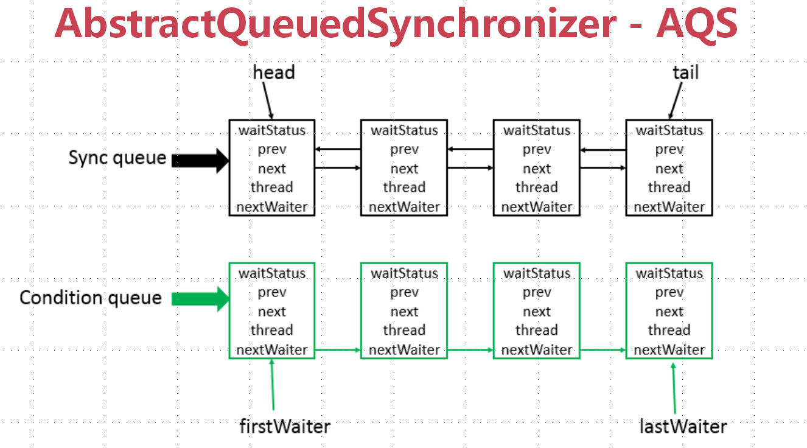
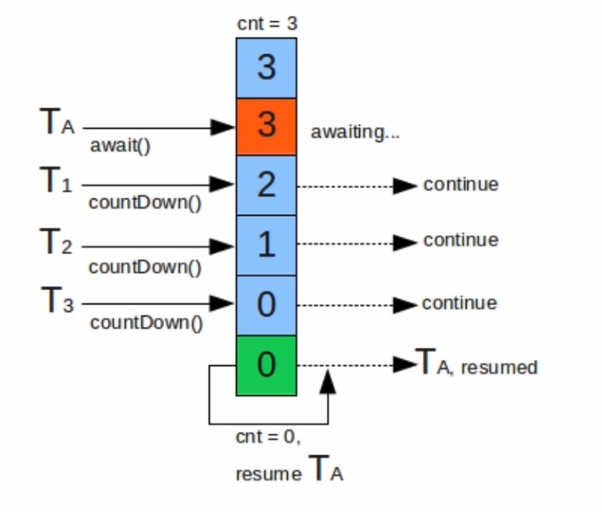
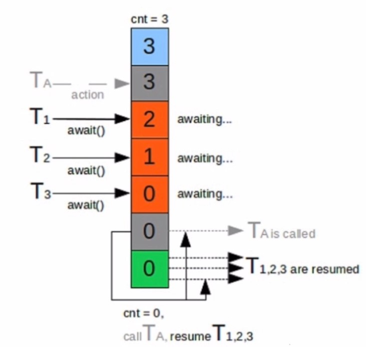

# JUC 核心 AQS

---
## 1 AQS 简介

AbstractQueuedSynchronizer 是并发容器J.U.C（java.lang.concurrent）的核心类。它实现了一个**FIFO**队列。底层实现的数据结构是一个**双向列表**。



**两个队列**：

- Sync queue：同步队列，是一个双向列表。包括 head 节点和 tail 节点。head 节点主要用作后续的调度。
- Condition queue：非必须，单向列表。当程序中存在 cindition 的时候才会存在此列表。

### AQS 设计思想

- 使用 Node 实现 FIFO 队列，可以用于构建锁或者其他同步装置的基础框架。
- 利用 volatile 修饰的 int 类型标识状态。在 AQS 类中有一个叫做 state 的成员变量，
>基于 AQS 有一个同步组件 ReentrantLock。在这个组件里，stste 表示获取锁的线程数，假如 `state=0`，表示还没有线程获取锁，1 表示有线程获取了锁。大于 1 时表示重入锁的数量。
- 使用方式：基于继承的使用方式，子类通过继承并通过实现它的模板方法管理其状态（acquire 和 release方法操作状态）。
- 可以同时实现排它锁和共享锁模式（独占、共享），站在一个使用者的角度，AQS的功能主要分为两类：独占和共享。它的所有子类中，要么实现并使用了它的独占功能的api，要么使用了共享锁的功能，而不会同时使用两套api，
>比如 ReentrantReadWriteLock 就是是通过两个内部类读锁和写锁分别实现了两套api来实现的。

### AQS 的实现思路

AQS 内部维护了一个 CLH 队列来管理锁。线程会首先尝试获取锁，如果失败就将当前线程及等待状态等信息包装成一个 node 节点加入到同步队列 sync queue 里。然后会不断的循环尝试获取锁，但条件是当前节点为 head 的直接后继才会尝试。如果失败就会阻塞自己直到自己被唤醒。而当持有锁的线程释放锁的时候，会唤醒队列中的后继线程。

>CLH锁即Craig, Landin, and Hagersten (CLH) locks，CLH 锁是一个自旋锁，能确保无饥饿性，提供先来先服务的公平性。

---
## 2 AQS 同步组件

- CoundDownLatch
- Semaphore
- CyclicBarrier
- ReentrantLock / Condition
- FutureTask

### CoundDownLatch

CoundDownLatch 通过一个计数来保证线程是否需要被阻塞。可以实现一个或多个线程**等待其他线程**执行完毕的场景。



```java
public class CountDownLatchExample1 {

    private final static int threadCount = 200;

    public static void main(String[] args) throws Exception {

        ExecutorService exec = Executors.newCachedThreadPool();

        final CountDownLatch countDownLatch = new CountDownLatch(threadCount);

        for (int i = 0; i < threadCount; i++) {
            final int threadNum = i;
            exec.execute(() -> {
                try {
                    test(threadNum);
                } catch (Exception e) {
                    log.error("exception", e);
                } finally {
                    countDownLatch.countDown();
                }
            });
        }
        countDownLatch.await();
        log.info("finish");
        exec.shutdown();
    }

    private static void test(int threadNum) throws Exception {
        Thread.sleep(100);
        log.info("{}", threadNum);
        Thread.sleep(100);
    }
}
```

### Semaphore

- 信号量在操作系统中是很重要的概念，JUC 里的 Semaphore 可以很轻松的完成类似操作系统信号量的控制。
- Semaphore 可以很容易控制系统中某个资源被同时访问的线程个数。
- **使用场景**：仅能提供有限访问的资源。比如数据库连接。

```java
public class SemaphoreExample4 {

    private final static int threadCount = 20;

    public static void main(String[] args) throws Exception {

        ExecutorService exec = Executors.newCachedThreadPool();

        final Semaphore semaphore = new Semaphore(3);

        for (int i = 0; i < threadCount; i++) {
            final int threadNum = i;
            exec.execute(() -> {
                try {
                    if (semaphore.tryAcquire(5000, TimeUnit.MILLISECONDS)) { // 尝试获取一个许可
                        test(threadNum);
                        semaphore.release(); // 释放一个许可
                    }
                } catch (Exception e) {
                    log.error("exception", e);
                }
            });
        }
        exec.shutdown();
    }

    private static void test(int threadNum) throws Exception {
        log.info("{}", threadNum);
        Thread.sleep(1000);
    }
}
```

### CyclicBarrier

CyclicBarrier 可以让**多个线程相互等待**直到到达某个节点。

相比 CoundDownLatch：

- CyclicBarrier 的计数器可以重复使用
- CyclicBarrier 是让**多个线程相互等待**，因此其可以实现更加复杂的情景。



```java
public class CyclicBarrierExample3 {

    private static CyclicBarrier barrier = new CyclicBarrier(5, () -> {
        log.info("callback is running");
    });

    public static void main(String[] args) throws Exception {

        ExecutorService executor = Executors.newCachedThreadPool();

        for (int i = 0; i < 10; i++) {
            final int threadNum = i;
            Thread.sleep(1000);
            executor.execute(() -> {
                try {
                    race(threadNum);
                } catch (Exception e) {
                    log.error("exception", e);
                }
            });
        }
        executor.shutdown();
    }

    private static void race(int threadNum) throws Exception {
        Thread.sleep(1000);
        log.info("{} is ready", threadNum);
        barrier.await();
        log.info("{} continue", threadNum);
    }
}
```

### ReentrantLock / Condition

Java 一共分为两类锁，一类是由 synchornized 修饰的锁，还有一种是 JUC 里提供的锁，核心就是 ReentrantLock， ReentrantLock 与 Synchronized 都是可重入锁，本质上都是 lock 与 unlock 的操作。

#### ReentrantLock 与 synchronized 的区别

- **可重入性**：两者的锁都是可重入的，差别不大，有线程进入锁，则计数器自增 1，等下降为 0 时才可以释放锁
- **锁的实现**：synchronized 是基于 JVM 实现的（无法直观的了解其实现），ReentrantLock 是JDK 实现的。可以查看其源码。
- **性能区别**：在 synchronized 优化之前，synchronized 性能较差，现在的 JDK synchronized 引入了偏向锁、轻量级锁（自旋锁）后，二者的性能差别不大，在两钟方法都可以的情况下，官方推荐 synchronized（写法更容易），synchronized 在优化时借用了ReentrantLock 的 CAS 技术，`试图在用户态就把问题解决，避免进入内核态造成线程阻塞`。
- **功能区别**：
    - 便利性：synchronized 更便利，它是由编译器保证加锁与释放。ReentrantLock 是需要手动释放锁，所以为了避免忘记手工释放锁造成死锁，必须在 finally 中声明释放锁。
    - 锁的细粒度和灵活度，ReentrantLock 优于 synchronized，ReentrantLock 配合 Condition 使用可以做到更细粒度的现场唤醒

ReentrantLock 独有的功能：

- 可以指定是公平锁还是非公平锁，synchronized 只能是非公平锁（所谓公平锁就是先等待的线程先获得锁）。
- 提供了一个 Condition 类，可以分组唤醒需要唤醒的线程。不像 synchronized 要么随机唤醒一个线程，要么全部唤醒。
- 提供能够中断等待锁的线程的机制，通过 `lock.lockInterruptibly()` 实现，这种机制 ReentrantLock 是一种自旋锁，通过循环调用 CAS 操作来实现加锁。性能比较好的原因是避免了进入内核态的阻塞状态。
- 提供了尝试获取锁的机制，通过 `tryLock()` 尝试获取锁，当获取锁失败后，返回 false，这个方法是非阻塞的。
- 提供了超时获取锁的机制，通过 `tryLock(long timeout, TimeUnit unit)`方法，如果锁定在给定的时间内没有被另一个线程保持且当前线程没有被中断，则获取这个锁定


#### ReentrantLock 与 synchronized 如何选择

JUC 包中的锁定类是用于高级情况和高级用户的工具，除非你对 Lock 的高级特性有特别清楚的了解以及有明确的需要，或这有明确的证据表明同步已经成为可伸缩性的瓶颈的时候，否则我们还是继续使用 synchronized。相比较这些高级的锁定类，synchronized 还是有一些优势的，比如：

- synchronized 不可能忘记释放锁。
- 有当JVM使用 synchronized 管理锁定请求和释放时，JVM 在生成线程转储时能够包括锁定信息，这些信息对调试非常有价值，它们可以标识死锁以及其他异常行为的来源。

#### 使用 ReentrantLock 模板方法

```java
private final static Lock lock = new ReentrantLock();
private static void add() {
    //lock 务必要放在 try 外面，防止因为 lock 可能产生的异常而导致锁被无故释放
    lock.lock();
    try {
        count++;
    } finally {
        lock.unlock();
    }
}
```

#### Condition

Condition 可以非常灵活的操作线程的唤醒，Condition 也有一个等待队列，即 AQS 中的 Condition queue

#### ReentrantReadWriteLock

ReentrantReadWriteLock 在没有任何读写锁的时候才可以取得写入锁(悲观读取，容易写线程饥饿)，也就是说如果一直存在读操作，那么写锁一直在等待没有读的情况出现，这样写锁就永远也获取不到，就会造成等待获取写锁的**线程饥饿**。

ReentrantReadWriteLock 使用场景比较少，下面是一个使用示例：

```java
public class LockExample3 {

    private final Map<String, Data> map = new TreeMap<>();

    private final ReentrantReadWriteLock lock = new ReentrantReadWriteLock();

    private final Lock readLock = lock.readLock();

    private final Lock writeLock = lock.writeLock();

    public Data get(String key) {
        readLock.lock();
        try {
            return map.get(key);
        } finally {
            readLock.unlock();
        }
    }

    public Set<String> getAllKeys() {
        readLock.lock();
        try {
            return map.keySet();
        } finally {
            readLock.unlock();
        }
    }

    public Data put(String key, Data value) {
        writeLock.lock();
        try {
            return map.put(key, value);
        } finally {
            readLock.unlock();
        }
    }

    class Data {

    }
}
```

#### StempedLock（JDK 8）

StempedLock 控制锁有三种模式（写、读、乐观读）。一个 StempedLock 的状态是由**版本和模式**两个部分组成。锁获取方法返回一个数字作为票据（stamp），它用相应的锁状态表示并控制相关的访问。数字  0表示没有写锁锁定访问，在读锁上分为悲观锁和乐观锁。

**乐观读**：如果读的操作很多而写的很少，我们可以乐观的认为读的操作与写的操作同时发生的情况很少，因此不 “悲观的使用完全的读取锁定”。程序可以查看读取资料之后是否遭到写入资料的变更，再采取之后的措施。这个改进，可以大幅度提供程序的并发量。

StempedLock 的 API 文档中提供了一个使用示例，下面是这个示例的解析：

```java
public class LockExample4 {

    class Point {
        private double x, y;
        //创建一个StampedLock
        private final StampedLock sl = new StampedLock();

        void move(double deltaX, double deltaY) { // an exclusively locked method
            long stamp = sl.writeLock();
            try {
                x += deltaX;
                y += deltaY;
            } finally {
                sl.unlockWrite(stamp);
            }
        }

        //下面看看乐观读锁案例
        double distanceFromOrigin() { // A read-only method
            //tryOptimisticRead 返回一个 long 票据，在之后可以用来验证, 如果已经被独占锁定，则返回 0
            //tryOptimisticRead 是一个乐观的读，使用这种锁的读不阻塞写，每次读的时候得到一个当前的stamp值
            long stamp = sl.tryOptimisticRead(); //获得一个乐观读锁
            
            //读取x和y，因为读取x时，y可能被写了新的值，所以下面需要判断
            double currentX = x, currentY = y;  //将两个字段读入本地局部变量
            
            //如果 stamp == 0，则始终返回 false
            //如果 stamp 表示当前线程持有的锁，则返回 true
            //如果读取的时候发生了写，则stampedLock的stamp属性值会变化，此时需要重读，再重读的时候需要加读锁（并且重读时使用的应当是悲观的读锁，即阻塞写的读锁）
            if (!sl.validate(stamp)) { //检查发出乐观读锁后同时是否有其他写锁发生？
                stamp = sl.readLock();  //如果没有，我们再次获得一个读悲观锁
                try {
                    currentX = x; // 将两个字段读入本地局部变量
                    currentY = y; // 将两个字段读入本地局部变量
                } finally {
                    sl.unlockRead(stamp);
                }
            }
            return Math.sqrt(currentX * currentX + currentY * currentY);
        }

        //下面是悲观读锁案例
        void moveIfAtOrigin(double newX, double newY) { // upgrade
            // Could instead start with optimistic, not read mode
            long stamp = sl.readLock();
            try {
                while (x == 0.0 && y == 0.0) { //循环，检查当前状态是否符合
                    long ws = sl.tryConvertToWriteLock(stamp); //将读锁转为写锁
                    if (ws != 0L) { //这是确认转为写锁是否成功
                        stamp = ws; //如果成功 替换票据
                        x = newX; //进行状态改变
                        y = newY;  //进行状态改变
                        break;
                    } else { //如果不能成功转换为写锁
                        sl.unlockRead(stamp);  //我们显式释放读锁
                        stamp = sl.writeLock();  //显式直接进行写锁 然后再通过循环再试
                    }
                }
            } finally {
                sl.unlock(stamp); //释放读锁或写锁
            }
        }
    }
}
```

#### 如何选择锁

1. 当只有少量竞争者，使用 synchronized
2. 竞争者不少但是线程增长的趋势是能预估的，使用 ReetrantLock
3. synchronized 不会造成死锁，jvm 会自动释放死锁。


