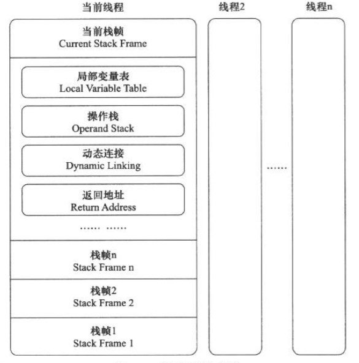
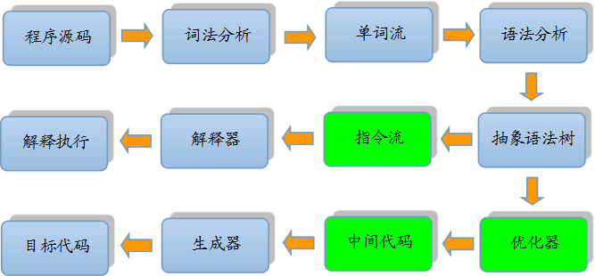

# 虚拟机字节码执行引擎

---
## 1 概述

虚拟机字节码执行引擎是虚拟机最核心的组成部分之一，**虚拟机**是相对于**物理机**的概念，物理机的执行引擎是直接建立在`处理器、硬件、指令集和操作系统`层面上的，而虚拟机的执行引擎则是由自己实现的，因此可以自行制定指令集与执行引擎的结构体系，并且能够执行那些不被硬件直接支持的指令集格式。

在不同的虚拟机实现里面，虚拟机在执行字节码时可能会有**解释执行**、**编译执行**或**两者兼备**，但从外观来看，所有的Java虚拟机的执行引擎都是一致的，输入的是字节码文件，处理的过程是对字节码解析的等效过程。

---
## 2 运行时栈帧结构

**栈帧**是用于支持虚拟机进行方法调用和方法执行的数据结构，栈帧存储了方法的`局部变量表、操作数栈、动态连接和方法返回地址`等信息。每一个方法从调用开始至执行完成的过程，都对应着一个栈帧在虚拟机栈里面从入栈到出栈的过程。每一个栈帧都包括了局部变量表、操作数栈、动态连接、方法返回地址和一些额外的附加信息。**在编译期，栈帧中需要多大的局部变量表，多深的操作数栈都已经完全确定**了，对于执行引擎来说，在活动线程中，只有位于栈顶的栈帧才是有效的，称为**当前栈帧**。



### 局部变量表

局部变量表（Local Variable Table）是一组变量值存储空间，用于存放方法参数和方法内部定义的局部变量表在Java程序编译为Class文件时，就在方法的Code属性的 `max_locals` 数据项中确定了该方法所需要分配的局部变量表的最大容量。局部变量表的容易以变量槽（Variable Slot）为最小单位。

在方法执行时，虚拟机是使用局部变量表完成参数变量列表的传递过程，如果是实例方法，那么局部变量表中的每0位索引的Slot默认是用于传递方法所属对象实例的引用，在方法中可以通过关键字 `this` 来访问这个隐含的参数，其余参数则按照参数列表的顺序来排列，占用从1开始的局部变量Slot，参数表分配完毕后，再根据方法体内部定义的变量顺序和作用域来分配其余的Slot。

局部变量表中的Slot是**可重用的**，方法体中定义的变量，其作用域并不一定会覆盖整个方法，如果当前字节码PC计算器的值已经超出了某个变量的作用域，那么这个变量对应的Slot就可以交给其它变量使用。参考下面代码：

```
public static void main(String ...args){
    byte[] placeholder = new byte[60 * 1024 * 1024];
    //placeholder不可以被回收
    System.gc();
}

public static void main(String ...args){
    {
        byte[] placeholder = new byte[60 * 1024 * 1024];
    }
    //placeholder可以被回收
    System.gc();
}
```

第一个方法的写法更利于虚拟机内存回收操作，不过对 placeholder 进行赋 null 操作也是一种优化手段，《Practical Java》中把**不使用的对象应该收到赋值为null值**作为一条推荐的编码规范，对此作者的看法是：

- 赋 null 操作在某些情况下确实有用，但不应该对赋 null 操作有过多的依赖
- 从编码角度讲，以恰当的变量作用域来控制变量回收时间才是最优雅的解决方法
- 从执行角度来讲，使用赋 null 操作来优化内存回收是建立在对字节码引擎概念模型的理解之上的，在虚拟机使用解释执行时，通用与概念模型比较接近，而经过JIT编译优化后，才是虚拟机执行字节码的主要方式，赋 null 操作通过在JIT编译后就会被去掉，这时候赋 null 操作就是没有意义的，上面例子，经过JIT编译优化后，即使没有赋 null 操作，gc执行时也可以回收调数组占用的内存。


局部变量不像前面介绍的类变量那样存在“准备阶段”。类变量有两次赋初始值的过程，一次在准备阶段，赋予系统初始值；另外一次在初始化阶段，赋予程序员定义的值。因此即使在初始化阶段程序员没有为类变量赋值也没有关系，类变量仍然具有一个确定的初始值。但局部变量就不一样了，如果一个局部变量定义了但没有赋初始值是不能使用的。


### 操作数栈

操作数栈也常被称为操作栈，它是一个后入先出栈（LIFO）。同局部变量表一样，操作数栈的最大深度也是编译的时候被写入到方法表的Code属性的 `max_stacks` 数据项中。操作数栈的每一个元素可以是任意Java数据类型，包括long和double。32位数据类型所占的栈容量为1，64位数据类型所占的栈容量为2。栈容量的单位为**字宽**，对于32位虚拟机来说，一个字宽占4个字节，对于64位虚拟机来说，一个字宽占8个字节。

当一个方法刚刚执行的时候，这个方法的操作数栈是空的，在方法执行的过程中，会有各种字节码指向操作数栈中写入和提取值，也就是入栈与出栈操作。例如，在做算术运算的时候就是通过操作数栈来进行的，又或者调用其它方法的时候是通过操作数栈来行参数传递的。

### 动态链接

每个栈帧都包含一个指向运行时常量池中该栈帧所属性方法的引用，持有这个引用是为了支持方法调用过程中的动态连接。在Class文件的常量池中存有大量的符号引用，字节码中的方法调用指令就以常量池中指向方法的符号引用为参数。这些符号引用一部分会在类加载阶段或第一次使用的时候转化为直接引用，这种转化称为静态解析。另外一部分将在每一次的运行期期间转化为直接引用，这部分称为动态连接。

### 方法返回地址

当一个方法被执行后，有两种方式退出这个方法：

- 第一种方式是执行引擎遇到任意一个方法返回的字节码指令，这时候可能会有返回值传递给上层的方法调用者(调用当前方法的的方法称为调用者)，是否有返回值和返回值的类型将根据遇到何种方法返回指令来决定，这种退出方法方式称为正常完成出口(Normal Method Invocation Completion)。
- 另外一种退出方式是，在方法执行过程中遇到了异常，并且这个异常没有在方法体内得到处理，无论是Java虚拟机内部产生的异常，还是代码中使用athrow字节码指令产生的异常，只要在本方法的异常表中没有搜索到匹配的异常处理器，就会导致方法退出，这种退出方式称为异常完成出口(Abrupt Method Invocation Completion)。一个方法使用异常完成出口的方式退出，是不会给它的调用都产生任何返回值的。

无论采用何种方式退出，在方法退出之前，都需要**返回到方法被调用的位置**，程序才能继续执行，方法返回时可能需要在栈帧中保存一些信息，用来帮助恢复它的上层方法的执行状态。一般来说，方法正常退出时，调用者PC计数器的值就可以作为返回地址，栈帧中很可能会保存这个计数器值。而方法异常退出时，返回地址是要通过异常处理器来确定的，栈帧中一般不会保存这部分信息。

方法退出的过程实际上等同于把当前栈帧出栈，因此退出时可能执行的操作有：**恢复上层方法的局部变量表和操作数栈，把返回值(如果有的话)压入调用都栈帧的操作数栈中，调用PC计数器的值以指向方法调用指令后面的一条指令等**。

### 附加信息

虚拟机规范允许具体的虚拟机实现增加一些规范里没有描述的信息到栈帧中。例如与调试相关的信息。

---
## 3 方法调用

方法调用并不等同于方法执行，**方法调用阶段唯一的任务就是确定调用方法的版本(即调用哪一个方法)** ，暂时还不涉及方法内部的具体运行过程。在程序运行时，进行方法调用是最普遍、最频繁的操作。在Class文件的编译过程中不包含传统编译中的连接步骤，**一切方法调用在Class文件里存储的都只是符号引用**，而不是方法在实际运行时内存布局中的入口地址(相当于直接引用)。这个特性给Java带来了更强大的动态扩展能力，但也使得Java方法的调用过程变得相对复杂，需要在类加载期间甚至到运行期间才能确定目标方法的直接引用。

- 解析：调用目标在程序代码写好时、编译器进行编译时就必须确定下来。这类方法的调用称为解析
- 分派；方法的动态调用

---
## 4 基于栈的字节码解释执行引擎

Java虚拟机是如何执行方法中的字节码指令的？在不同的虚拟机实现里面，虚拟机在执行字节码时可能会有**解释执行**、**编译执行**或**两者兼备**，这里探讨在解释执行时，虚拟机引擎是如何工作的。

### 解释执行

编译过程：


>第一条分叉线路表示解释执行过程，第二条分叉线路表示编译执行。

如今，基于物理机、虚拟机、或者非Java的其他高级语言虚拟机的语言，大都会遵循这种基于现代经典编译的思路：在执行前先对程序源代码进行词法分析、语法分析处理，再把源码代码转换为抽象语法树（Abstract Syntax Tree）。对于一门语言实现来说，词法分析、语法分析、以及后面的优化器和目标代码生成器都可以选择独立于执行引擎，形成一个完整意义的编译器去实现，比如C/C++语言，也可以把其中一部分步骤（比如生成AST之前的步骤）实现为一个半独立的编译器，比如Java，又或者把这些步骤和执行引擎全部集中封装在一个封闭的黑匣子里，比如大多数JavaScript引擎。

### 基于栈指令集与基于寄存器的指令集

Java 编译器输出的指令流，基本上是一种**基于栈的指令集**架构（Instruction Set Architecture，ISA）。指令流中的指令大部分都是零地址指令，它们依赖操作数栈进行工作。与之相对的另一套常用的指令集是**基于寄存器的指令集**，最典型的就是 x86 的二地址指令集，说得通俗一点，就是现在我们主流PC机中直接支持的指令集架构，这些指令集依赖于寄存器进行工作。

#### 基于栈指令集与基于寄存器的指令集的区别

以 `1+1` 为例，基于栈的指令集是这样子的：

```
iconst_1
iconst_1
iadd
istore_0
```

两条 iconst_1 指令连续把两个常量 1 压入栈中，iadd 指令把栈顶的两个值出栈、相加、然后将结果返回栈顶，最后 istore_0 把栈顶的值放到局部变量表的第 0 个 Slot 中。

如果是基于寄存器，那么程序可能会是这样子的：

```
mov eax, 1
add eax, 1
```
mov 指令把 EAX 寄存器的值设为 1，然后 add 指令再把这个值加 1，结果就保存在 EAX 寄存器里面。

#### 优缺点总结

基于栈的指令集主要的优点就是可移植，寄存器由硬件直接提供，程序直接依赖这些硬件寄存器则不可避免地要受到硬件的约束。栈架构指令集的主要缺点是执行速度相对来说会稍慢一些。虽然栈架构指令集的代码非常紧凑，但是完成相同功能所需的指令数量一般会比寄存器架构多，因为出栈、入栈操作本身就产生了相当多的指令数量。更重要的是，栈实现在内存之中，频繁的栈访问也就意味着频繁的内存访问，相对于处理器来说，内存始终是执行速度的瓶颈。尽管虚拟机可以采取栈顶缓存的手段，把最常用的操作映射到寄存器中避免直接内存访问，但这也只能是优化措施而不是解决本质问题的方法。由于指令数量和内存访问的原因，所以导致了栈架构指令集的执行速度会相对较慢。

### 基于栈的解释器执行过程

java 代码分析：

```
public class Test{
    public int calc(){
        int a = 100;
        int b = 200;
        int c = 300;
        return (a + b) * c;
    }
}
```

使用 `javap -v -c Test.class`反编译后得到如下代码：

```
public class Test
  minor version: 0
  major version: 52
  flags: ACC_PUBLIC, ACC_SUPER

Constant pool://类常量池
   #1 = Methodref          #3.#12         // java/lang/Object."<init>":()V
   #2 = Class              #13            // Test
   #3 = Class              #14            // java/lang/Object
   #4 = Utf8               <init>
   #5 = Utf8               ()V
   #6 = Utf8               Code
   #7 = Utf8               LineNumberTable
   #8 = Utf8               calc
   #9 = Utf8               ()I
  #10 = Utf8               SourceFile
  #11 = Utf8               Test.java
  #12 = NameAndType        #4:#5          // "<init>":()V
  #13 = Utf8               Test
  #14 = Utf8               java/lang/Object

{
  public Test();
    descriptor: ()V
    flags: ACC_PUBLIC
    Code:
      stack=1, locals=1, args_size=1
         0: aload_0
         1: invokespecial #1                  // Method java/lang/Object."<init>":()V
         4: return
      LineNumberTable:
        line 1: 0

//关注calc方法
  public int calc();
    descriptor: ()I
    flags: ACC_PUBLIC
    Code:
      //深度为2，4个Slot，一个参数(this引用)
      stack=2, locals=4, args_size=1
         0: bipush        100 //bipush的操作是将单个字节的整数常量推入操作栈顶，该指令跟随一个参数，表示推入的常量值
         2: istore_1    //istore_1的作用是将操作数栈顶的整型值出栈并存放到第1个局部变量Slot中
         3: sipush        200
         6: istore_2
         7: sipush        300
        10: istore_3
        11: iload_1        //iload_1将局部变量表的第一个Slot中断整型值复制到操作数栈顶
        12: iload_2        //iload_2将局部变量表的第二个Slot中断整型值复制到操作数栈顶
        13: iadd    //iadd指令需要两个操作数，其作用是将操作数栈中头两个栈顶元素出栈做加法操作，然后把结果重新放入栈顶
        14: iload_3    //iload_3将局部变量表的第三个Slot中断整型值复制到操作数栈顶
        15: imul    //imul与iadd相似，需要两个操作数，但是进行的是乘法操作
        16: ireturn        //ireturn 是方法返回指令，它结束方法的执行，并将操作数栈定的整数返回给此方法的调用者。
      LineNumberTable:
        line 5: 0
        line 6: 3
        line 7: 7
        line 8: 11
}
```