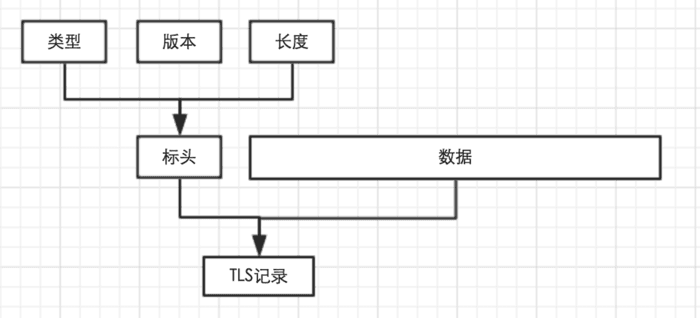
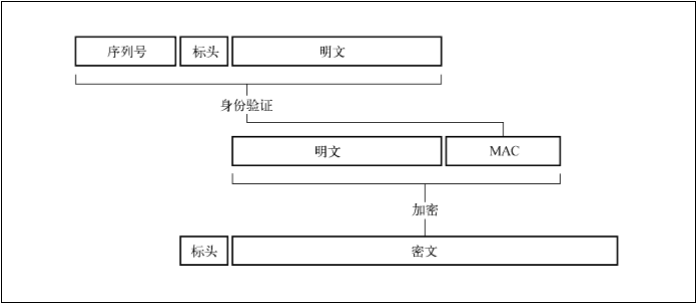
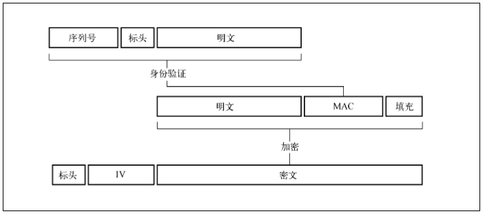
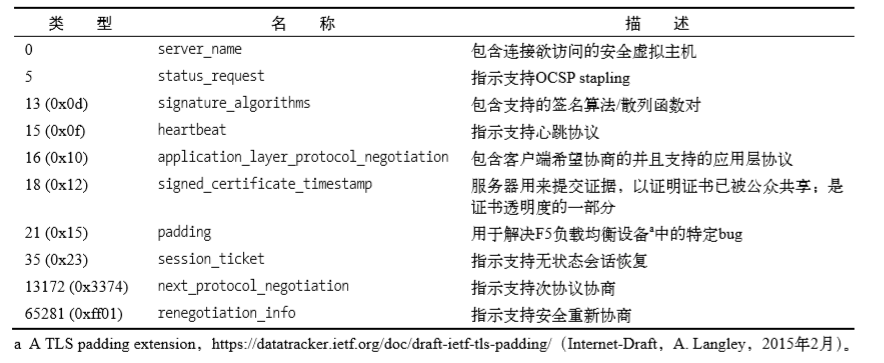

# TLS 协议

>理论需要靠实践来验证，所以在学习 TLS 协议时可以使用 wireshark 抓包来验证所学的知识。

---
## 1 记录协议

宏观上，**TLS 以记录协议（record protocol）实现**，记录协议负责在整个传输连接上交换所有的底层消息，并且可以配置加密，每一条 TLS 记录以一个短标头起始，标头包括记录内容的类型（或子协议）、协议版本和长度。消息写紧跟在标头之后：



除了这些字段，还会给每一 TLS 记录指定唯一的 64 位序列号，但不会在线路上传输，任何一端都有自身的序列号并跟踪来自另一端的数量，这些值是对抗重放攻击的一部分。

记录协议从多个重要的宏观角度对公信进行考虑，是一个很有用的协议抽象：

- **消息传输**：`记录协议`传输由`其他协议层`提交给它的`不透明数据缓冲区`。如果缓冲区数据超过记录的长度限制（16384字节），记录协议会将其切割成更小的片段，反过来也是可能的，属于同一个子协议的小缓冲区也可以组合成一个单独的记录。
- **加密以及完整性验证**：在一个刚建立的连接上，最初的消息是没有受到任何保护的，这是必须的，否则第一次协商就无法完成，但是一旦握手完成，记录层就开始按照协商取得的连接参数进行加密和完整性校验。
- **压缩**：理论上，在加密前对数据机进行压缩非常好，可是实践中几乎没有人这样做。
- **扩展性**：记录协议只关注数据传输和加密，而将其他特新转交给子协议，这个方法使得 TLS 可以扩展，因为可以很方便地添加子协议。

TLS 的主规格说明书定义了四个核心子协议：

- 握手协议（handshake protocol），包括身份验证和密钥交换。
- 密钥规格变更协议（change cipher spec protocol）
- 应用数据协议（application data protocol），数据阶段，保证机密性和完整性。
- 警报协议（alert protocol），包括关闭序列的警告。

---
## 2 握手协议

握手是 TLS 协议中最精密复杂的部分。在这个过程中，通信双方协商连接参数，并且完成身份验证。根据使用的功能不同，整个过程需要交换 6-10 条消息，根据配置和支持的协议扩展的不同，交换过程可能有多种变种，在使用中经常可以观察到以下三种流程：

1. 完整的握手：对服务器身份进行验证。即通常的单向认证。
2. 恢复之前的会话采用的简短握手。
3. 对客户端和服务器都进行身份验证。即双向认证。

### 完整的握手（单向验证）

每一个 TLS 连接都会以握手开始，如果客户端此前并未与服务器建立会话，那么双方执行一次完整的握手流程来协商 TLS 会话。握手过程中，客户端和服务器进行以下四个主要步骤：

- 交换各自支持的功能，对需要的连接参数达成一致。
- 验证出示的证书，或使用其他方式进行身份验证。
- 对将用于保护的会话的共享主密钥达成一致。（协商对称加密的密钥）
- 验证握手消息并未被第三方团队修改。

>在实际使用中，第 2 步和第 3 步都是密钥交换（更通用的说法是密钥生成）的一部分， 密钥交换是一个单独的步骤。作者更倾向于将它们分开来说，用以强调 **协议的安全性取决于正确的身份验证**。身份验证有效地在 TLS 的外层工作。如果没有身份验证，主动攻击者就可以将自身嵌入会话，并冒充会话的另一端。

常见的TLS握手流程，就是一种在不需要身份验证的客户端与需要身份验证的 服务器之间的握手，如下图所示：


对服务器进行身份验证的完整握手：

1. 客户端开始新的握手，并将自身支持的功能提交给服务器。（参数协商）
2. 服务器选择连接参数。
3. 服务器发送其证书链（仅当需要服务器身份验证时）。（验证身份）
4. 根据选择的密钥交换方式，服务器发送生成主密钥的额外信息。
5. 服务器通知自己完成了协商过程。
6. 客户端发送生成主密钥所需要的额外信息。
7. 客户端切换加密方式并通知服务器。（接下来客户端发的信息都要加密了）
8. 客户端计算`发送和接受到的握手消息的 MAC`并发送。
9. 服务器切换到加密方式并通知客户端。（接下来服务器发的信息都要加密了）
10. 服务器计算`发送和接受到的握手消息的 MAC`并发送。

假设没有错误，到最后一步，练级就建立起来了，可以开始发送应用数据了。具体细节如下：

#### (1) ClientHello

- 在一次新的握手流程中，ClientHello 消息总是第一条消息。这条消息将客户端的功能和首选项传送给服务器。
- 客户端会在新建连接后，希望重新协商或者响应服务器发起的重新协商请求 （由HelloRequest消息指示）时，发送这条消息。 

一条被简化的 ClientHello 消息内容如下：

```
Handshake protocol: ClientHello     
    Version: TLS 1.2     
    Random      
        Client time: May 22, 2030 02:43:46 GMT         
        Random bytes: b76b0e61829557eb4c611adfd2d36eb232dc1332fe29802e321ee871     
    Session ID: (empty)     
    Cipher Suites         
        Suite: TLS_ECDHE_RSA_WITH_AES_128_GCM_SHA256         
        Suite: TLS_DHE_RSA_WITH_AES_128_GCM_SHA256         
        Suite: TLS_RSA_WITH_AES_128_GCM_SHA256         
        Suite: TLS_ECDHE_RSA_WITH_AES_128_CBC_SHA         
        Suite: TLS_DHE_RSA_WITH_AES_128_CBC_SHA         
        Suite: TLS_RSA_WITH_AES_128_CBC_SHA         
        Suite: TLS_RSA_WITH_3DES_EDE_CBC_SHA         
        Suite: TLS_RSA_WITH_RC4_128_SHA     
    Compression methods         
        Method: null     
    Extensions         
        Extension: server_name             
            Hostname: www.feistyduck.com         
        Extension: renegotiation_info         
        Extension: elliptic_curves             
            Named curve: secp256r1             
            Named curve: secp384r1         
        Extension: signature_algorithms             
            Algorithm: sha1/rsa             
            Algorithm: sha256/rsa             
            Algorithm: sha1/ecdsa             
            Algorithm: sha256/ecdsa 
```

字段描述：

- Version：协议版本（protocol version）指示客户端支持的佳协议版本。
- Random：随机数（random）字段包含32字节的数据（只有28字节是随机生成的；剩余的4字 节包含额外的信息，受客户端时钟的影响）。在握手时，`客户端和服务器都会提供随机数`。这种随机性对每次握手都是独一无二的，在身份验证中起着举足轻重的作用。它可以防止重放攻击，并确认初始数据交换的完整性。同时随机数也是生成后续摘要密钥和加密密钥的重要参数。 
- Session ID ：在第一次连接时，会话ID（session ID）字段是空的，这表示客户端并不希望恢复某个已存在的会话。在后续的连接中，这个字段可以保存会话的唯一标识。服务器可以借助会话ID在自己的缓存中找到对应的会话状态。
- Cipher Suites ：密码套件（cipher suite）块是由客户端支持的所有密码套件组成的列表，该列表是按优先 级顺序排列的。
- Compression ：客户端可以提交一个或多个支持压缩的方法。默认的压缩方法是null，代表没有压缩。 
- Extensions 扩展（extension）块由任意数量的扩展组成。这些扩展会携带额外数据。

#### (2) ServerHello

ServerHello 消息的意义是将服务器选择的连接参数传送回客户端。这个消息的结构与 ClientHello 类似，只是每个字段只包含一个选项（即选中的可选参数）。服务器无需支持客户端支持的佳版本。如果服务器不支持与客户端相同的版本，可以提供 某个其他版本以期待客户端能够接受。 

```
Handshake protocol: ServerHello     
    Version: TLS 1.2     
    Random         
        Server time: Mar 10, 2059 02:35:57 GMT         
        Random bytes: 8469b09b480c1978182ce1b59290487609f41132312ca22aacaf5012     
    Session ID: 4cae75c91cf5adf55f93c9fb5dd36d19903b1182029af3d527b7a42ef1c32c80     
    Cipher Suite: TLS_ECDHE_RSA_WITH_AES_128_GCM_SHA256     
    Compression method: null     
    Extensions
        Extension: server_name         
        Extension: renegotiation_info
```

#### (3) Certificate

典型的Certificate消息用于携带服务器 `X.509` 证书链。证书链是以 ASN.1 DER 编码的一系列证书，一个接着一个组合而成。主证书必须第一个发送，中间证书按照正确的顺序跟在主证书之后。服务器必须保证它发送的证书与选择的算法套件一致。

>Certificate 消息是可选的，因为并非所有套件都使用身份验证，也并非所有身份验证方法都需要证书。更进一步说，虽然消息默认使用 X.509 证书，但是也可以携带其他形式的标志；一些套件就依赖PGP密钥。 

#### (4) ServerKeyExchange

ServerKeyExchange 消息的目的是携带密钥交换的额外数据。消息内容对于不同的协商算法套件都会存在差异。在某些场景中，服务器不需要发送任何内容，这意味着在这些场景中根本不会发送 ServerKeyExchange 消息。

#### (5) ServerHelloDone

ServerHelloDone 消息表明服务器已经将所有预计的握手消息发送完毕。在此之后，服务器会等待客户端发送消息。

#### (6) ClientKeyExchange

ClientKeyExchange 消息携带客户端为密钥交换提供的所有信息。这个消息受协商的密码套件的影响，内容随着不同的协商密码套件而不同。 

#### (7) ChangeCipherSpec

ChangeCipherSpec 消息表明发送端已取得用以生成连接参数的足够信息，已生成加密密钥， 并且将切换到加密模式。客户端和服务器在条件成熟时都会发送这个消息。 

#### (8) Finished

Finished 消息意味着握手已经完成。消息内容将加密，以便双方可以安全地交换验证整个握 手完整性所需的数据。

### 客户端验证（双向验证）

只有已经经过身份验证的服务器才能请求客户端进行身份验证。基于这个原因，这个选项被称为互相身份验证（mutual authentication）。

图示过程如下：


### 会话回复

会话回复可以重新恢复之前建立的 TLS 连接，这个机制减少了 TLS 握手过程的通信次数。

---
## 3 密钥交换

密钥交换是握手过程中最引人入胜的地方，在 TLS 中，会话安全性取决于称为 **主密钥（master secret）** 的 48 字节共享密钥。密钥交换的目的就是计算另一个值，即预主密钥（premaster secret）。这个值是组成主密钥的来源。

TLS支持许多密钥交换算法，能够支持各种证书类型、公钥算法和密钥生成协议。使用哪一种密钥交换由协商的套件所决定。一旦套件决定下来，两端都能了解按照哪种算法继续操作。实际使用的密钥交换算法主要有以下4种。

- RSA：RSA 是一种事实上的标准密钥交换算法，它得到了广泛的支持。但它受到一个问题的严重威胁：它的设计使被动攻击者可以解码所有加密数据，只要她能够访问服务器的私钥。因此，RSA密钥交换正慢慢被其他支持前向保密（forward  secrecy）的算法所替代。RSA 密钥交换是一种密钥传输（key  transport）算法，这种算法由客户端生成预主密钥，并以服务器公钥加密传送给服务器。
  - RSA密钥交换的过程十分直截了当。客户端生成预主密钥（46字节随机数），使用服务器公钥对其加密，将其包含在ClientKeyExchange消息中，后发送出去。服务器只需要解密这条消息 就能取出预主密钥。TLS使用的是RFC 3447①定义的RSAES-PKCS1-v1_5加密方案。
  - 因为RSA算法可以同时用于加密和数字签名，所以RSA密钥交换可以按照这种方式工 作。其他流行的密钥类型，比如DSA（DSS）和ECDSA，只能用于签名。
  - RSA密钥交换的简单性也是它大的弱点。用于加密预主密钥的服务器公钥，一般会保持多年不变。任何能够接触到对应私钥的人都可以恢复预主密钥，并构建相同的主密钥，从而危害到会话安全性。攻击者可以保存通信的所有内容，直到能接触到私钥为止，就能够破解之前所有的通信内容。

- DHE_RSA：临时 Diffie-Hellman（ephemeral Diffie-Hellman，DHE）密钥交换是一种构造完备的算法。它的优点是支持前向保密，缺点是执行缓慢。DHE是一种密钥协定算法，进行协商的团体都对密钥生成产生作用，并对公共密钥达成一致。在TLS中，DHE通常与RSA身份验证联合使用。
  
- ECDHE_RSA 和 ECDHE_ECDSA：临时椭圆曲线 Diffie-Hellman（ephemeral elliptic curve Diffie-Hellman，ECDHE）密钥交换建立在椭圆曲线加密的基础之上。椭圆曲线算法是相对较新的算法。大家认可它执行很快而且提供了前向保密。但是只有较新的客户端才能较好地支持。ECDHE也是一种密钥协定算法，其理论原理与DHE类似。在 TLS 中，ECDHE 可以与RSA或者 ECDSA 身份验证一起使用。

>原书关于密钥交换算法有非常完整的描述，如果需要进一步了解可以参阅原书。

---
## 4 身份验证

在 TLS 中，为了避免重复执行密码操作造成的巨大开销，**身份验证与密钥交换紧紧捆绑在一起** 。大多数场景下，身份验证的基础是证书支持的公钥密码（最常见的是 RSA，又是也用 ECDSA）。

一旦证书验证通过，客户端就知道使用的公钥，在此之后，客户端将公钥交给指定的密钥交换算法，并由它负责以某种方式使用公钥验证另一端。

在 RSA 密钥交换过程中：客户端生成一个随机值作为预主密钥，并服务器公钥加密后发送出去。用于对于私钥的服务器解密消息得到预主密钥。身份验证的原理就是：**只有用于对于私钥的服务器才能取得预主密钥，构造出正确的会话密钥，并生成正确的 Finished 消息**。

---
## 5 加密

TLS 可以使用各种加密算法，比如使用 3DES、AES、ARIA、CAMELLIA、RC4 或者 SEED 等算法，目前使用最为广泛的加密算法是 AES，TLS 支持三种加密类型：**序列密码、分组密码、已验证的密码**。在 TLS 中，完整性验证是加密处理的一部分，它要么在协议级中显式的处理，要么由协商的密钥隐式处理。

### 序列加密

使用序列密码时，加密由两步组成。第一步，计算MAC值，范围包含记录序列号、标头、 明文。MAC包含标头能确保未进行加密的标头不会遭受篡改。MAC包括序列号，能确保消息不 被重放。第二步，加密明文和MAC，生成密文。



### 分组加密

使用分组密码时，加密会涉及更多内容，因为需要为分组加密的特性准备解决方案。具体来说，需要以下几个步骤：

1. 计算序列号、标头和明文的 MAC。 
1. 构造填充，确认加密前的数据长度是分组大小（通常16字节）的整数倍。
1. 生成一个长度与分组大小一致的不可预期的初始向量（initialization vector，IV）。IV 能保证加密是不确定的。
1. 使用 CBC 分组模式加密明文、MAC 和填充。
1. 将 IV 和密文一起发送。



### 已验证的加密

已验证的密码将加密和完整性验证合二为一，全名是使用关联数据的已验证加密 （authenticated encryption with associated data，AEAD）。

表面上，它看起来是序列密码和分组密码的交叉。它不用填充，也不用初始向量，而是使用一个特殊的值，称为 nonce（在加密通信中仅 使用一次的密钥）。这个值必须唯一。加密过程比使用分组密码要简单一些。

1. 生成一个唯一的64位nonce。
2. 使用已验证加密算法加密明文；同时也将序列号和记录标头作为完整性验证依据的额外 数据交给算法。
3. 将 nonce 和密文一起发送。


已验证加密被认为是当前 TLS 中可用的加密模式中好的一种，因为它可以避免 MAC-then-encrypt 方式带来的问题。虽然 TLS 当前定义基于 GCM 和 CCM 块模式的已验证套件，实际上仅支持 GCM 套件。基于 ChaCha20 流密码的全新已验证套件当前正在进行标准化。

## 6 重新协商

大部分 TLS 连接都以握手为起点，经过应用数据传输，最后关闭会话，但是如果请求重新协商，就会发起一次新的握手，对新的连接安全参数达成一致，这个功能在以下场景会很有用：

- 客户端证书：它可以提供双因素身份验证，部署客户端证书有两种方法。
    1. 要求连接到网站的所有连接都需要客户端证书，但是这种方式对那些（还）没有证书的使用者并不友好；在连接成功以前，服务器无法向它们发送任何信息和说明。处理错误的情况同样不可能。
    2. 允许连接到网站根路径的连接不携带证书，设计一个需要提供客户端证书的子区域。当用户打算浏览子区域时，服务器发起重新协商请求，要求客户端提供证书。 
- 隐藏消息：第二次握手时加密的。
- 改变加密长度。

协议允许客户端在任意时刻简单地发送 ClientHello 消息请求重新协商，就如同建立一个新的连接一样，这称为 **客户端的重新连接（client-initiated renegotiation）**。服务器如果希望重新协商，它会发送 HelloRequest 协议消息给客户端，这个消息通知客户端停止发送应用数据，并开始新的握手，这称为 **服务器的重新连接（server-initiated renegotiation）**。

TLS RFC5246 允许客户端或服务器启动重新协商，建立新的加密参数的新握手。但正如设计的那样，重新协商并不安全，并且可被主动网络攻击者以很多方式滥用，它的弱点于 2009 年被发现，然后通过引进 renegotiatioin_info 扩展得以修正。

---
## 7 应用数据协议

应用数据协议携带者应用消息，只以 TLS 角度考虑的话，这些就是数据缓冲区。记录层使用当前连接安全参数对这些消息进行打包、碎片整理和加密。

---
## 8 警报协议

警报协议的目的是以简单的通知机制来告知对端通信发生异常，它通常会携带 close_notify  异常，在连接关闭时使用，报告错误，警报协议很简单，只有两个字段：

```c
struct{
    AlertLevel level; //严重程度
    AlertDescription description;//警报代码
}
```

## 9 关闭连接

关闭连接警报（closure alert）用于以有序的方式关闭 TLS 连接，一旦一端决定关闭连接，就会发送一个 close_notify 警报，另一端收到这个警报后，会丢弃任何未发送的数据，比发送自己的 close_notify 警报，在警报之后到来的任何消息都会被忽略。这个协议虽然简单，但是它可以避免截断攻击，也就是主动攻击者打断通信过程，组端后续所有消息的攻击，因为是必须的。

---
## 10 密码操作

下面是协议中一些重要的方面：伪随机函数、构建主密钥和生成连接密钥。

- 伪随机函数：在 TLS 中，伪随机函数用于生成任意数量的伪随机数。
- 主密钥：密钥交换过程生成的是预主密钥，对这个值的进一步加工，就是使用 PRF 生成的 48 字节主密钥。`master_secret = PRF(pre_master_secret, "master secret", ClientHello.random + ServerHello.random)`。因为使用不同的密钥交换方法，得到的预主密钥长度可能不同，所以需要执行这个步骤。同时，因为客户端和服务器的随机字段被用作种子，所以主密钥实际上也是随机的①，且与协商握 手绑定
- 密钥生成：连接所需的密钥材料是用单一的 PRF 调用基于主密钥和客户端、服务器的随机数生成的：`key_block = PRF(master_sercet, "key expansion",server_random + client_random)`。密钥块的长度根据协商的参数而有所不同。密钥块分为六个密钥：`两个MAC密钥、两个加密密钥和两个初始向量（只在必要时生成；序列密码不会使用IV）`。AEAD 套件不使用 MAC 密钥。 不同的密钥用于不同的操作，这样可以预防当共享相同密钥时，密钥学基元之间出现不可预见的 交互。同样，因为客户端和服务器都拥有各自的一组密钥，由其中一方产生的消息不会被解释成 是由另一方产生的。这个设计决策使协议更加可靠。

---
## 11 密码套件

上面说到的 TLS 握手过程中，ClientHello 中包含了一个 Cipher Suites 字段，Cipher Suites 表示 Client 支持的密码套件块，那么什么是密码套件块呢？

TLS 为了实现所需的安全特性提供了非常大的灵活性，它是一个创造实际密码协议的框架，虽然以往版本将某些机密基元硬编码到协议中，但是 TLS1.2 是完全可配置的，密钥套件是 **一组选定的加密基元和其他参数，它可以精确定义如何实现安全**。套件大致由以下属性定义：

- 身份验证方法
- 密钥交换方法
- 加密算法
- 加密密钥大小
- 密码模式
- MAC 算法
- PRF（TLS 1.2 一定使用）
- 用于 Finished 消息的散列函数
- verify_data 结构的长度

密钥套件都倾向于使用较长的描述性名称，并且相当一致：它们都由密钥交换方法、身份验 证方法、密码定义以及可选的MAC或PRF算法组合而成，参考下图


---
## 12 扩展

TLS 扩展是一种通用目的的扩展机制，使用这种机制可以在不修改协议本身的条件下为 TLS 协议增加功能，它在 2003 年作为一个单独的规格说明（RFC 3456）首次出现，但随后即被加入到 TLS 1.2 中。扩展以扩展块的形式加在 ClientHello 和 ServerHello 消息的末尾：`Extension extensions`。

扩展块由所需数量的扩展一个个堆叠而成。每一个扩展标头是2字节扩展类型（唯一标志）， 后接扩展数据：

```c
struct {
    ExtensionType extension_type;
    opaque extension_data;
} Extension;
```

常见的 TLS 扩展有:



---
## 13 协议限制

因为TLS在OSI层次中的定位和某些设计安排，除了那些偶然的弱点之外，当前它仍有几处众所周知的限制。

- 加密保护 TCP 连接的内容，但 **TCP 和所有其他更低层的协议的元数据仍然是明文传输** 。因 此，被动观察者可以确定源和目标的IP地址。这类信息的泄露不是TLS的责任，而是我们 当前的分层网络模型导致的限制。
- 即使在TLS层，也有 **很多信息以明文形式暴露出去** 。第一次握手一定是非加密的，可以`让被动观察者`（这些问题有方法可以避免，但是这些方法都没有被主流实现 所采用。 ）：
  - 了解客户端的功能，并使用其作为指纹；
  - 检查SNI信息确定期望访 问的虚拟主机；
  - 检查主机证书，以及何时会使用客户端证书；
  - 存在得到足够信息 以识别用户身份的可能性。
- 当启动加密以后，**某些协议信息仍能被清楚地探查到**：观察者可以了解到子协议和每条消息的长度。根据不同的协议，这些长度可以揭示某些底层通信的线索。

---
## 14 各协议版本之间的差异

自从SSL 3以来，协议核心并没有大幅改 变。TLS 1.0为了迎合使用另一个名称进行了有限的改变，发布TLS 1.1的首要目标是为了解决几 个安全性问题。TLS 1.2引入了已验证加密，清理了散列，另外去掉了协议中的硬编码基元。

- **SSL 3** ：SSL 3于1995年年末发布。为了弥补先前协议版本的诸多弱点，SSL 3从头开始设计了一套协 议，并一直沿用到了新版本的TLS。
- **TLS 1.0** ：TLS 1.0 于 1999年 1 月发布。
- **TLS 1.1** ：TLS 1.1 于 2006 年 4 月发布。
- **TLS 1.2** ：TLS 1.2于2008年8月发布。与TLS 1.1相比，它包含以下主要改进：
  - 添加已验证加密支持。
  - 添加对HMAC-SHA256密码套件的支持。
  - 删除IDEA和DES密码套件。
  - 虽然大部分扩展的实际文档还是在其他地方，但TLS将扩展和协议的主规格说明书进行了 集成。
  - 客户端可以使用一种新的扩展（signature_algorithms）来通报它愿意接受的散列和签名 算法。
  - 当使用TLS 1.2套件或者以协商协议是TLS 1.2为条件使用之前的套件时，在PRF中使用 SHA256代替MD5/SHA1组合。
  - 允许密码套件定义其自身的PRF。
  - 使用单一散列代替用于数字签名的MD5/SHA1组合。默认使用SHA256，并且密码套件可 以指定其自身使用的散列。签名散列算法以往是由协议强制指定，现在是散列函数式签 名结构中的一部分，而且在实施启用中可以选择佳算法。
  - 密码套件可以显式指定Finished消息中的verify_data成员的长度。

---
## 推荐阅读

- 通过阅读 [Wireshark 抓包理解 HTTPS 请求流程](https://www.jianshu.com/p/cf8c2f2cd18a) 可以加深 TLS 握手过程的理解。
- [数字签名、数字证书与HTTPS是什么关系？](https://www.zhihu.com/question/52493697)
