# [Socket网络编程进阶与实战](https://coding.imooc.com/learn/list/286.html) 笔记

---
## 1 导学

### Socket 难在哪里

- Http调用很简单，但是自己造一个Http框架很难。
- 平时使用的IM、推送都是基于第三方框架，自己写一个很难。
- 物联网正在蓬勃翻转，但是进行数据传输很难。
- 归根到底，只是会用而不知道内部的运行原理。

### 为什么 Socket 难用

- 缺少系统的学习。
- 数据粘包、数据丢包、心跳维持难处理。
- 高并发下的性能难以保证。

---
## 2 Socket 网络编程快速入门

### 2.1 什么是网络

- 在计算机领域中，网络是信息传输、接收、共享的虚拟平台。
- 通过它把各个点、面、体的信息联系到一起，从而实现这些这些资源的共享。
- 网络是人类发展史上最伟大的发明，促进了科技和人脸的发展。

局域网：

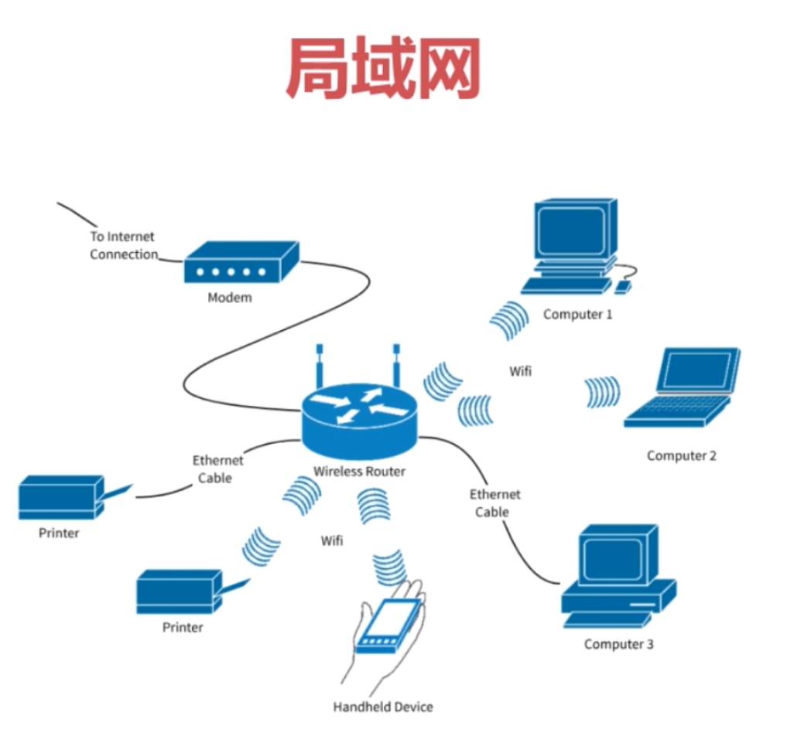

互联网：无数个局域网相互链接形成了互联网。

### 2.2 什么是网络编程

- 网络编程从大的方面来说就是对信息的发送到接收。
- 通过操作相应 API 调度计算机硬件资源，并利用传输管道（比如网线）进行数据交换的过程。
- 更为具体的涉及：网络模型、套接字、数据包。

#### 层网络模型

OSI 7 层网络模型：

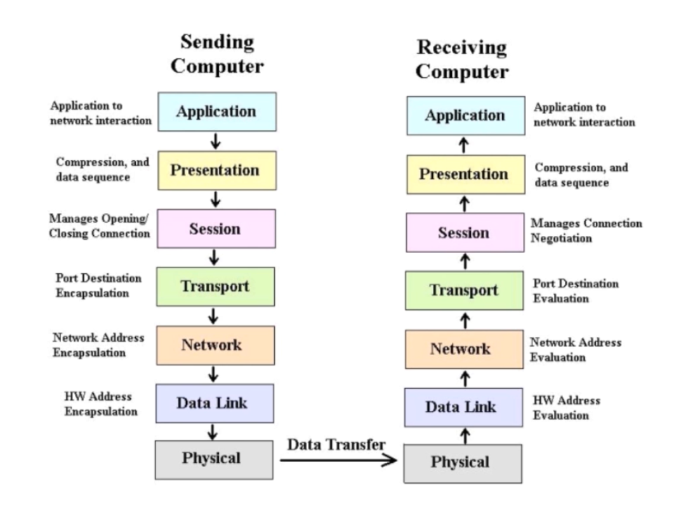

总结:

- 基础层：物理层、数据链路层、网络层
- 传输层：TCP-UDP 协议层、Socket
- 高级层：会话层、表示层、应用层

与 TCP 网络模型对应关系：

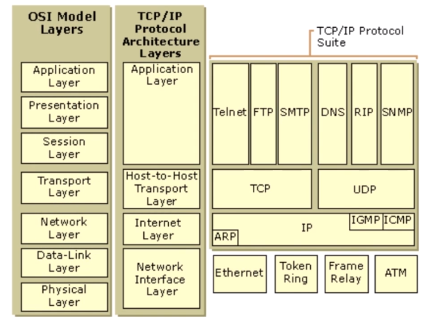

### 2.3 Socket 与 TCP、UDP

#### 什么是 Socket

- 简单来说 Socket 是 IP 地址与端口的结合协议（RFC 793）
- Socket 是一种地址与端口的结合描述协议
- Socket 是 TCP/IP 协议的相关 API 的总称，是网络 API 的集合实现
- Socket API 涵盖了：Stream Socket 和 Datagram Socket
- TCP/IP 是 Socket 的一种实现。但 Socket 并不只有 TCP/IP。

>维基百科：在计算器科学中，网上套接字（英语：Network socket），又译`网络套接字、网络接口、网上插槽`，是计算机网上中进程间数据流的`端点`。使用以网际协议（Internet Protocol）为通信基础的网上套接字，称为网际套接字（Internet socket）。因为网际协议的流行，现代绝大多数的网上套接字，都是属于网际套接字。**socket是一种操作系统提供的进程间通信机制**。
>在操作系统中，通常会为应用程序提供一组应用程序接口（API），称为`套接字接口`（英语：socket API）。应用程序可以通过套接字接口，来使用网上套接字，以进行数据交换。最早的套接字接口来自于4.2 BSD，因此现代常见的套接字接口大多源自Berkeley套接字（Berkeley sockets）标准。在套接字接口中，以IP地址及通信端口组成套接字地址（socket address）。远程的套接字地址，以及本地的套接字地址完成连线后，再加上使用的协议（protocol），这个`五元组（five-element tuple）`，作为套接字对（socket pairs），之后就可以彼此交换数据。

Socket的作用与组成：

- 在网络传输中用于唯一标识两个端点之间的连接（逻辑上的连接）
- 端点：包括（IP+Port）
- 一个链接的 4 个要素：客户端IP、客户端端口、服务器IP、服务器端口

#### TCP

- 面向连接的通信协议
- 通过三次握手，通信完成需要拆除连接
- 由于面向连接，只能用于端到端通信

tcp 的传输是可靠的，每次发送出数据包，接收方收到后都要回复对方已经收到该包，否则发送方在一定时间后没有收到回复后就会认为该包发送失败，需要重新发送，当然 tcp 的重发机制操作系统底层是已经实现了的。


#### UDP

- UDP 面向无连接的通信协议
- UDP 数据包包括目的端口号和源端口号信息
- 由于通信不需要连接，所以可以实现广播发送，并不局限于端到端
- UDP 只管发送数据，不管对方是否已经收到

#### Client-Server 模型

- TCP/IP 协议中，两个进程间通信的主要模型为：CS模型。
- 主要目的：协同网络中的计算机资源，服务模式、进程间数据共享。

### 2.4 报文、协议、Mac地址

报文段：

- 报文段在 TCP/IP 协议网络传输过程中，起着路由导航作用。
- 用以查询各个网络路由网络、IP地址、交换协议等 IP 数据包。
- 报文段充当整个 TCP/IP 协议数据包的导航路由功能。
- 报文在传输过程中会不断地封装成分组、包、帧来传输。
- 封装方式就是添加一些控制信息组成的首部，即报文头。

传输协议:

- 一种约定、约束。
- 约定大于配置，在网络中传输中依然适用，网络的传输流程是健壮的稳定的，得益于基础的协议组成。
- 简单来说：通过约定，A -> B 的传输数据，B 能识别，反之 B -> A 的传输数据，A 也能识别，这就是协议。

Mac 地址：

- Madia Access Control 或者 Medium Access Control。
- 媒体访问控制或称为物理地址硬件地址。
- 用来定义网络设备的位置，型如 `44-55-53-33-00`，与身份证类似。
- 每个能连接互联网的设备都有自己的 MAC 地址。

### 2.5 IP、端口及远程服务器

#### IP

维基百科：互联网协议地址（英语：Internet Protocol Address，又译为网际协议地址），缩写为IP地址（英语：IP Address），是分配给网上上使用网际协议（英语：Internet Protocol, IP）的设备的数字标签。

- 用以唯一标识互联网上的一台设备的地址。
- ip 分类：A、B、C、D、E类，E 类为特殊保留地址。
- ip 版本：ipv4，ipv6.
- ipv4 由32 位二进制组成，形式如 `xxx.xxx.xxx.xxx`，每组 xxx 代表小于或等于 255 的十进制数。
- ipv4 的数量是 4294967296 个(42亿个)，最终于 2011 年 2 月 3 日用尽，现在分配的都是局域网地址。
- 如果主机号全是 1，那么这个地址为直接广播地址（因特网广播地址）
- ip 地址为 `255.255.255.255` 为受限广播地址（局域网广播地址）。
- ipv4 一定可以转换为 ipv6，但 ipv6 不一定能转换为 ipv4。

#### 端口

- 用来唯一标识操作系统中运行的一个进程。
- 0 到 1023 端口已经 1024 到 49151 端口号都是特殊的端口号。
- 49152 到 65535 号端口属于 “动态端口” 范围，没有端口可以被正式地注册。
- 计算机之间依照互联网传输层协议 TCP/IP 协议的协议通信，不同协议都对应着不同的端口。


端口总数是 65536，但是并不意味着客户端只能建立 65536 个链接，标识一个链接使用的信息是 `IP + 端口`。

#### 数据传输层次

层层封装：

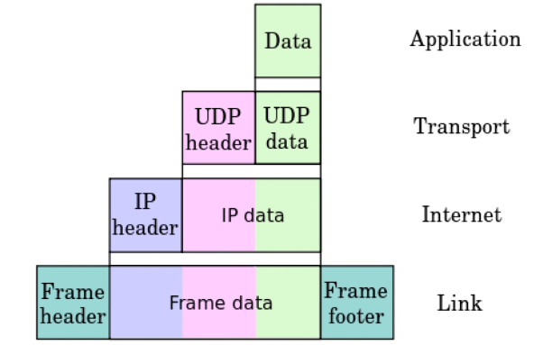

#### 远程服务器

两个局域网设备之间无法直接进行直接通信。必须通过公网（被分配了公务IP）上的服务器进行间接通信。比如说政府的服务器、主干上的服务器上分配的公网 IP 是固定的。

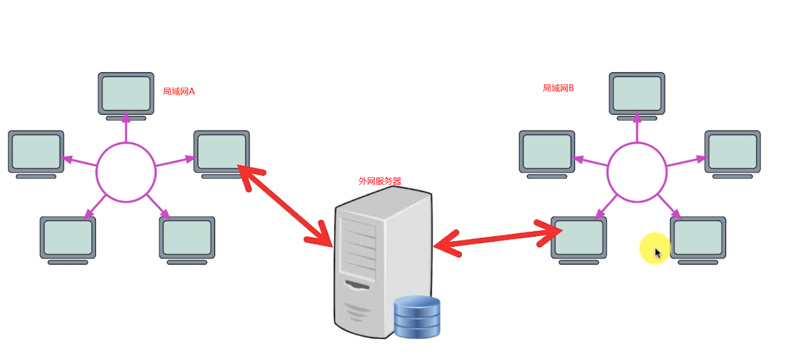

---
## 3 UDP 入门

### 3.1 UDP 协议

- User Datagram Protocol，一种用户数据包协议
- 是一个简单的面向数据报的传输层协议，正式规范为 RFC768

UDP 为什么不可靠：

- 一旦把应用程序发送给网络层的数据发送出去，就不保留备份。
- UDP 在 ip 协议报的头部仅仅加入了复用和数据校验（字段）。
- 发送端产生数据，接收端从网络中抓取数据。
- 结构简单、无校验、速度快、容易丢包、可广播。

UDP 能够做什么

- DNS、TFTP、SNMP
- 视频、音频、普通数据（无关紧要的数据）

UDP 报文（报文头 64 位）：


UDP 最多能发送多少数据：

- 报文头中有 16 位用于存储长度信息。
- 总数据长度：`2 ^ 16 -1 = 65536-1 = 65535`。
- 自身协议占用 64 位，即 8 字节。
- 一个数据包最多发送 `65535 - 8 = 65507` 个 byte。

### 3.2 UDP核心API讲解

- java.net.DatagramSocket：表示用来发送和接收数据报包的套接字。数据报套接字是包投递服务的发送或接收点。每个在数据报套接字上发送或接收的包都是单独编址和路由的。从一台机器发送到另一台机器的多个包可能选择不同的路由，也可能按不同的顺序到达。
- java.net.DatagramPacket：表示数据报包。数据报包用来实现无连接包投递服务。每条报文仅根据该包中包含的信息从一台机器路由到另一台机器。从一台机器发送到另一台机器的多个包可能选择不同的路由，也可能按不同的顺序到达。不对包投递做出保证。

### 3.3 UDP单播、广播、多播（组播）


现在的路由器一般都有拒绝发送广播的策略，因为无限制的发送广播容易造成网络拥塞。而多播一定是经过了筛选、分组的，性能要优于广播，多播、广播这些都是由路由器完成的，对于我们来讲，只需要发送一次即可。

#### 多播地址

IP 地址类别：


在 IP 分类上，D 类地址专门用于多播，这类地址是能被路由器所感知的，这也是多播比广播性能好的原因。

- `255.255.255.255` 为受限广播地址。在同一个广播域（广播域边界为网关）范围内所有主机都会接收这个包，同一个广播域范围内所有需要转发包的网络设备（例如交换机）应该转发这个包。
- C 类广播地址一般为：`xxx.xxx.xxx.255`（最后一组固定为 255，比如 `192.168.1.255`）。如果想要给路由下所有主机发送广播，可以使用 `255.255.255.255`，也可以使用 `xxx.xxx.xxx.255` 地址。
- D 类地址专门为多播预留。

子网掩码：

- 子网掩码一般用于将网络进一步划分为若干子网，以避免主机过多而拥堵或过少而IP浪费。子网掩码可以通过与IP地址“与”计算，分离出IP地址中的网络地址和主机地址，用于判断该IP地址是在局域网上，还是在广域网上。
- 子网掩码可以分离出IP地址中的网络地址和主机地址，那为什么要分离呢？因为两台计算机要通讯，首先要判断是否处于同一个广播域内，即网络地址是否相同。如果网络地址相同，表明接受方在本网络上，那么可以把数据包直接发送到目标主机，否则就需要路由网关将数据包转发送到目的地。
- 缺省子网掩码（未划分子网）：子网掩码32位与IP地址32位对应,如果某位是网络地址，则子网掩码为1，否则为0。例如A类IP地址，第一节为网络地址，其余三节为主机地址，故掩码为`“11111111.00000000.00000000.00000000”`。
- 自定义子网掩码（用于划分子网）：将一个网络划分为若干子网，希望每个子网拥有不同的网络地址或子网地址。因为ＩＰ是有限的，实际上我们是将主机地址分为两个部分：子网网络地址、子网主机地址。形式如下：`未做子网划分的ip地址：网络地址＋主机地址` 和 `做子网划分后的ip地址：网络地址＋（子网网络地址＋子网主机地址）`。
- 子网划分是通过借用IP地址中若干位主机地址来充当子网的网络地址，从而将原网络划分为若干子网。划分子网时，随着子网地址借用主机位数的增多，子网的数目随之增加，但每个子网中的可用主机数逐渐减少。以 C 类地址为例：
  - 原有 8 位主机位，`2^8-2` 即 254 个主机地址，默认子网掩码 `255.255.255.0` 职能划分一个子网。
  - 借用 2 位主机位，产生 `2^2 =4` 个子网，每个子网有 `2^6` 个主机地址，子网掩码为 `255.255.255.192`
  - 借用 3 位主机位，产生 `2^3 =8` 个子网，每个子网有 `2^5` 个主机地址，子网掩码为 `255.255.255.224`

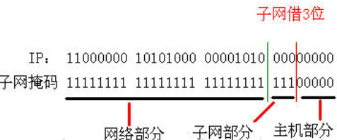

IP 地址构成：


广播地址运算：

```log
    情况 1：

        IP：192.168.124.7
        子网掩码：255.255.255.0
        网络地址：192.168.124.0
        广播地址：192.168.124.255

    情况 2：

        IP：192.168.124.7
        子网掩码：255.255.255.192(借两位)
        网络地址：192.168.124.0
        广播地址：192.168.124.63

        子网掩码：255.255.255.192 -> 11111111.11111111.11111111.11000000
        该子网掩码可划分子网数：2^2 = 4，分别为
            0-63(00000000-00111111)
            64-127(01000000-01111111)
            127-191(1000000-10111111)
            192-255(11000000-11111111)
        IP 192.168.124.7 在 0-63 网段，所以广播地址为 192.168.124.63
```

---
## 4 TCP 入门

### 4.1 TCP

Transmission Control procotol ，传输控制协议，是一种面向连接的、可靠的、基于字节流的传输层协议，由 IETF 的 RFC793 定义。

- 与 UDP 一样用于完成第四层传输层所制定的功能与职责。
- 链接建立需要三次握手，断开连接需要四次挥手。
- 具有校验机制、可靠、数据传输稳定。

TCP 能做什么

- 聊天消息传输、推送
- 单人语音、视频聊天等
- 几乎 UDP 能做的都能做，但需要考虑复杂性、性能问题
- 限制：无法进行多播、广播等操作

### 4.2 TCP核心API讲解

- `java.net.Socket`：此类实现客户端套接字。套接字是两台机器间通信的端点。套接字的实际工作由 SocketImpl 类的实例执行。应用程序通过更改创建套接字实现的套接字工厂可以配置它自身，以创建适合本地防火墙的套接字。
- `java.net.ServerSocket`：此类实现服务器套接字。服务器套接字等待请求通过网络传入。它基于该请求执行某些操作，然后可能向请求者返回结果。服务器套接字的实际工作由 SocketImpl 类的实例执行。应用程序可以更改创建套接字实现的套接字工厂来配置它自身，从而创建适合本地防火墙的套接字。

### 4.3 TCP连接可靠性-三次握手、四次挥手

三次握手：

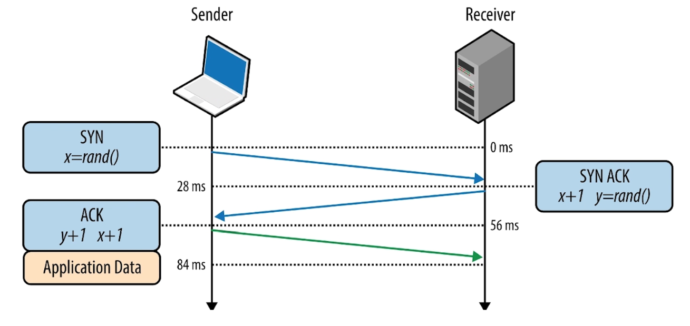

- 三次握手是确认对方能收到自己发送的信息，自己也能收到对方发送的信息的最少握手次数。
- 三次握手中存在一个随机值，通过这个随机值确认通信方，如果不使用随机数，那么服务端面对多个客户端链接请求时，将无法区分。

四次挥手：


>established：已确立的；已获确认的；确定的。

- 四次挥手用于保证双方都不需要再发送数据后才断开连接。

### 4.4 TCP传输可靠性-排序、丢弃、重发

- 大的数据拆分为多个数据包进行发送，对包进行排序、保证顺序性、服务器顺序组装收到的包。
- 单个包的发送失败不会导致整体上的失败，只需要对单个包进行重发即可。
- 重发机制：定时器。


### 4.5 TCP传输初始化配置

- `java.net.Socket` 和 `java.net.ServerSocket` 的初始化和各种配置。

### 4.6 案例实操-TCP基础数据传输

- 这里的基础数据不特定指某种语言的基本类型，而是针对网络传输中基本类型。
- 使用 `java.net.Socket` 发送和接受各种数据类型。
- `outputStream.write(127);` 方法只能接受 byte 范围的数值，高 24 位的数据都将被忽略。
- 使用 ByteBuffer 来简化操作 `byte[]`。

---
## 5 UDP 辅助 TCP 实现点对点传输案例

编码实现：

1. TCP 客户端事先不知道 TCP 服务端的 IP 和端口。
2. TCP 服务端提供了通过 UDP 提供 TCP 服务端 IP 和端口的服务，TCP 客户端事先知道服务端 UDP 的端口。
3. 客户端通过发送广播获取 TCP 服务端的 IP 和 TCP 服务端口。然后建立 TCP 连接。
4. UDP 连接中有对口令进行校验，使用口令用于防止非法连接。

[示例代码](../00-Code/Imooc-Socket/Java-Socket/src/main/l5/)

---
## 6 简易聊天室案例

### 6.1 聊天室设计

- 必要条件：客户端、服务器
- 必要约束：数据传输协议。
- 原理：服务器监听消息来源，客户端连接服务器并发送消息到服务器。

自定义数据传输协议：使用换行符协议（一旦读取到换行符，就认为这是一条完整的消息）。

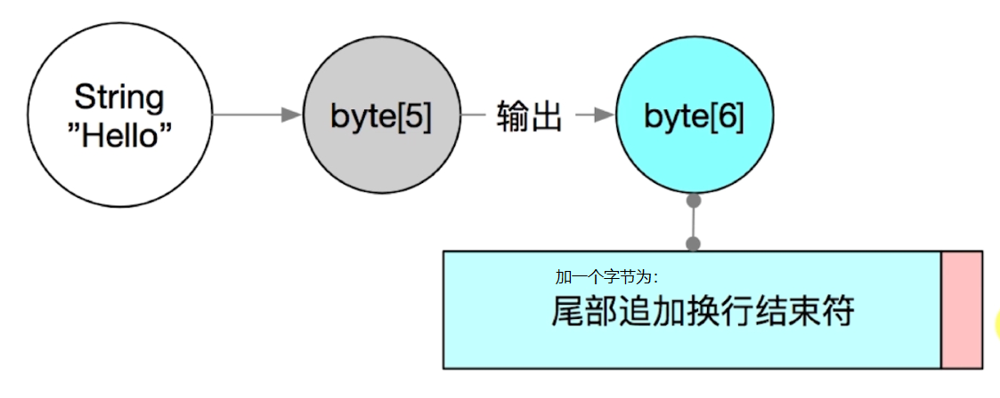

服务器客户端模型：服务器作为消息的中转站。


### 6.2 代码实现

[示例代码](../00-Code/Imooc-Socket/Java-Socket/src/main/l6/)

### 6.3 服务器状态与测试用例构建

目前的实现导致服务器状态繁忙：

- 每个客户端都需要服务器进行双通等待。
- 双通：客户端发送数据到服务器的接收通道，服务器回送消息的发送通道。每条通道因为阻塞只能使用异步线程实现。
- 服务器线程数量：一个客户端需要 2 个线程，n 个客户端需要 `2*n+` 线程。

测试用例：

- 工具：`JConsole`、`jvisualvm`(Java Visual VM)

服务器性能数据分析结果：

- 线程数量随着客户端增加而增加。
- CPU：取决于数据的频繁性、数据转发的复杂性。
- 内存：取决于客户端的数量，客户端发送数据的大小。
- 线程：取决于客户端连接数量。

优化建议：

- 减少线程的数量，避免过多无意义的线程上下文切换 --> 服务器用共享线程池处理消息转发。
- 增加线程执行繁忙状态。不要让线程大部分时间都在等待 --> 使用非阻塞 API。
- 内存：客户端 Buffer 复用机制。

---
## 7 服务器传输优化-NIO

### 7.1  阻塞 IO 与非阻塞 IO

- 对于阻塞 IO，对每个客户端的读取操作都要一个对应的线程。大部分线程都处于等待。CPU 需要扫描所有线程的状态，但大部分线程还是等待中的。
- 对于非阻塞 IO，通过事件驱动，只需要一个线程就可以处理所有客户端的读数据操作。这个线程的效率非常高，充分利用了系统资源。避免了资源浪费。

### 7.2 NIO（Non-Blocking IO）API


关于 NIO API 可以参考[NIO](../../Java/03-IO&Network/05-NIO.md)

### 7.3 使用 NIO 重写服务器

现有线程模型：

- 大量线程的消耗。

单线程非阻塞模型：

- 只用一个线程处理所有操作，但是当线程在处理某一个客户端消息读取时，就无法处理其他客户端了，虽然线程是非常繁忙，但是却不高效，没有充分发挥多核 CPU 的优势，并且当某个客户端存在大数据的读写时，即使是非阻塞也需要耗费大量的时间，此时无法处理其他已经准备好的客户端。

读写分离模型：

- 监听与数据处理分离模型：一个线程用来建立连接，使用一个线程池来处理客户端读写。线程池的线程不必很多，毕竟网络带宽有限，当某个客户端占用了带宽，其他客户端也无法发送数据了。
- 网卡负责将数据碎片段组装成程序数据，而且网卡具备读写分离能力的，但是不管是读还是写的能力，都是有限的，在程序设计上也采取读写分离调度，避免复杂的读写判断，而单个线程池也足够匹配底层网络单方面的读写能力，从而增加 IO 处理带宽。
- Clink 把连接内部调度、包的组装、心跳组合成一起，上层只需要调度发送、接收，就可以知道具体哪个连接发送数据来了，或者发送数据到哪个连接了，而不同具体的、数据层面的、Buffer层面的、字节层面的过程、不必关心 SocketChannel 与 Buffer 的衔接过程。

[示例代码](../00-Code/Imooc-Socket/Java-Socket/src/main/l7-clink-api/)

---
## 8 数据传输稳定性优化

### 消息粘包

- TCP 本质上并不会发送数据层面的粘包，TCP 的发送方与接收方一定会保证数据是以一种有序的方式到达客户端，并且会保证数据完整性。
- UDP 不保证数据完整性，所以 UDP 往往发送丢包等情况。
- TCP 数据传输具有：顺序性和完整性。
- 常规所说的 Socket 粘包，并非数据传输层面粘包。粘包是数据处理的逻辑方面上发送的粘包，这里所说的粘包：包含 TCP、UDP 甚至其他任意的数据流交互方案。
- Mina、Netty 等框架从根本上来说也是为了解决粘包而设计的高并发方案。
- 粘包现象：客户端发送两条数据（在TCP层同时到达），服务器当作一条数据。

图解消息粘包：M1 和 M2 当成了一条数据

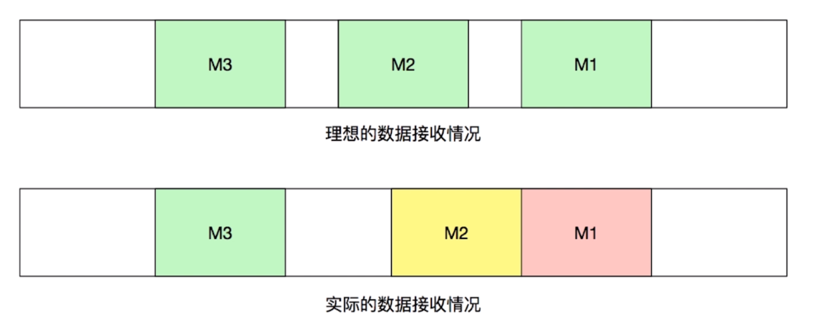

### 消息不完整

- 从数据的传输层面来讲，TCP 也不会发生数据丢失不完整等情况，一旦出现一定是 TCP 定制运行终止时，数据不完整依然是针对数据的逻辑接收层面。
- 在物理层面来讲，数据是一定能安全完整地送到另一端，但是另一端可能缓冲区不够或者数据处理上不够完整导致数据只能读取一部分，这种情况称为数据不完整、数据丢包等。
- 不完整现象：比如客户端发生一条大消息。被底层 TCP 分解为许多数据小包发送到服务端底层，服务端底层在读取了一部分数据小包后，发送这些小的数据包已经组成组装成一个数据大包，就会对数据小报进行组装，然后 push 到数据上层，这时如果上层代码直接读取，直到返回 0 后就停止读取，将读取的数据当作一个完整的消息进行处理。这时可能服务端业务层读取到的数据只是客户端发送数据的一半。一条大消息被当成了两条消息。（非阻塞式IO存在的问题）

复现消息传输错误：

- 消息到达提醒重复触发（读消息时未设置取消监听），[示例代码](../00-Code/Imooc-Socket/Java-Socket/src/main/l8-q1/)
- 多消息粘包，[示例代码](../00-Code/Imooc-Socket/Java-Socket/src/main/l8-q2/)
- 单消息不完整，[示例代码](../00-Code/Imooc-Socket/Java-Socket/src/main/l8-q3/)

### 如何有序的混传数据

- 数据传输头部和尾部都加上开始标记，需要对每个 byte 逐字校验。
- 数据传输使用固定头部的方案。头部采用固定标识，并且描述消息体的长度。
- 混合方案：固定头部、数据加密、数据描述。

起止符方案：

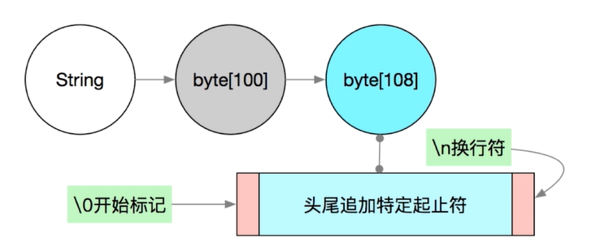

固定头部方案：

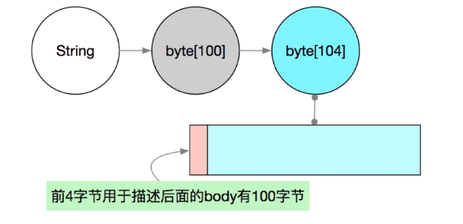

起止标记技术实现（需要逐字节扫描）

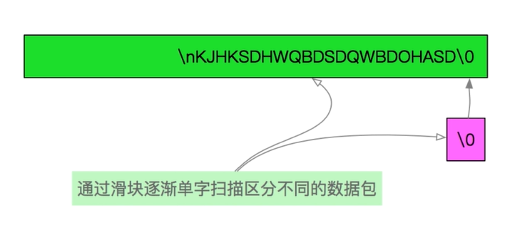

固定头部实现（不需要逐字节扫描，根据头部描述的消息体来读取特定长度的数据）

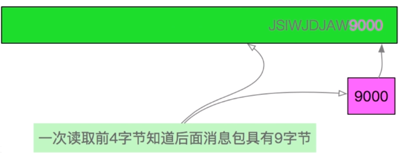

### 借鉴学习 HTTP 精髓

- HTTP 如何识别另一个请求？
- HTTP 如何读取请求头，请求头协议是怎样的？
- HTTP 如何接受数据包体？
- 当数据为文件时，HTTP 如何判断文件已经接收到底了？

#### HTTP 1.x

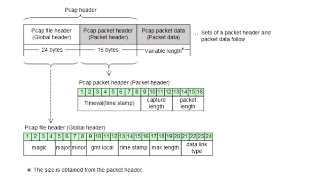

pcap header 是一个固定的长度，用于描述每次请求 header 的长度。

#### HTTP 2.x

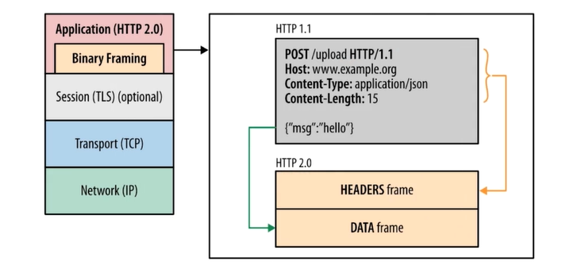

HTTP 2.x 中请求分多次发送，比如头部帧，数据帧。

长连接：

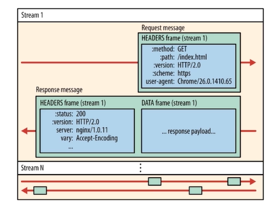

HTTP 2 中一个链接可以拿多个地址的数据：

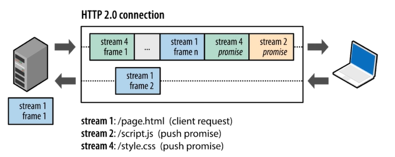

数据传输稳定性优化的[示例代码](../00-Code/Imooc-Socket/Java-Socket/src/main/chat-room-v1-bytes/)

---
## 9 局域网文件快传技术实战

### 9.1 文件传输与普通传输的区别

- 最大的分别：文件数据 bytes 远远大于普通数据 bytes。
- 为了避免一次性将文件加载到内存，需要对文件传输需要分片，组装分片。
- 同一个 Socket 连接中，要保证文件传输中途取消而不影响后续其他的 packet 发送。
- 数据安全性：文件传输校验，保证数据准确性。

### 9.2 方案1：文件消息模型基础实现——基于流的数据传输

- 为了支持文件传输，Packet 和 IoArgs 中的数据载体，由 byte 改为 Stream 传输

由 byte 改为 Stream 传输的[示例代码](../00-Code/Imooc-Socket/Java-Socket/src/main/chat-room-v2-stream/)

### 9.3 方案2：文件消息模型分片实现——基于帧的数据传输

基于流的文件传输有以下问题：

- 发送中无法取消文件发送（长度消息-->对应长度的数据）。
- 大文件传输容错率较低，无法分段校验文件。
- 同一个连接中，无法实现文件和普通消息优先级，一个包必须等待另一个包发送完毕才能发送。

**因此引入分片数据传输流程（帧的概念）**，解决上述难点：


- 根据文件大小计算分片，并读取数据到分片。
- 分片数据按固定格式打包发送。
- 分片数据的解析与分片组装。

分片消息规则：

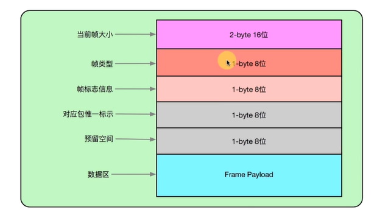

- 当前帧大小：`(2^16-1) = 65535`。
- 帧的标志位：用于存储加密信息等。
- 包的唯一标识：`1-255`，可以标识帧属于哪个包，最多支持 255 并发。
- 数据区：实体内容。
- 消息的结构：`一个头帧 + 若干个实体帧`。

帧 Frame 数据结构：


局域网文件快传技术实战[示例代码](../00-Code/Imooc-Socket/Java-Socket/src/main/chat-room-v3-sharding/)

---
## 10 聊天室升级版实战

### 10.1 消息调度分析

客户端与服务器之间最多简历多少个 Socket 连接

- Socket四要素：`服务器ip、服务器端口、客户端ip、客户端端口`。
- 49152 到 65535 号端口属于动态端口范围，没有端口可以被正式地注册占用。`65535-49152 = 16383`。
- 在本机测测试（服务器和客户端都在本地），单个服务器实例最多与本机客户端建立一万多个连接。

除此之外，还有一些因素：

- 系统部分端口无法分配。
- 系统单进程“文件句柄”最大值限制。

百万级别连接概念：服务器集群，对外暴露一致的地址。

### 10.2 并发客户端BUG修复与性能优化

当 Selector 在执行 select 操作时，其实就是对已经注册的 key 队列的扫描过程。在这个过程中，是不允许其他线程更改其内部队列的(比如调用 Selector 的 register 方法，获取调用 Selector 内部 Key 的 interestOps 方法，对已选则的key集合的 clear() 操作)，如果在扫描过程中其他线程调用方法修改 Selector 内部的队列，可能导致线程阻塞，所以应该下先调用 Selector 的 wakeup 方法，让 Selector 立即从 select 方法返回（此时它可能只遍历了队列的一部分）。之后再进行修改。


### 10.3 心跳包

CS模型中如何相互知晓状态？通过心跳包来实时获取连接状态。

从 TCP 理论上来讲，不需要心跳包的，因为客户端与服务器是直连的，它们通过三次握手与四次挥手来进行连接和断连，但是问题在于客户端可能因为意外导致 TCP 没有安装正常流程进行断连，这时候服务器还以为客户端是连接着的，从而造成了资源浪费等情况。

比如：程序崩溃、防火墙、网络运营商 ISP->NAT 路由器(映射状态表)更新都可能导致 TCP 非正常断开。

#### NAT 路由器映射状态表

NAT 图示，一般的客户端都通过一个公网上的路由器访问服务器（IPV4用尽的原因）：

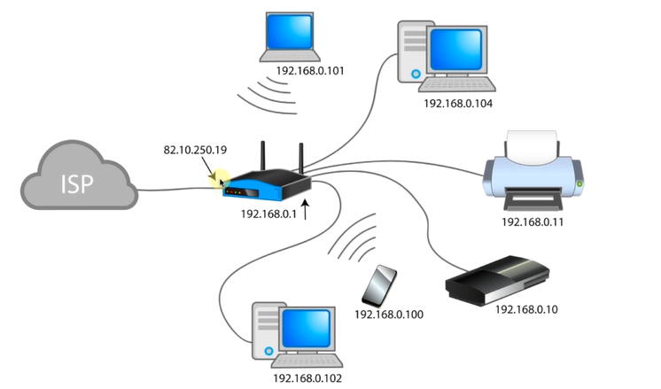

客户端通过 ISP 连接服务器：

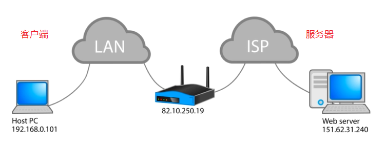

映射表：完全锥形 NAT，只要客户端的 ip 和端口不变，那么 NAT 对外公布的 IP 也不会边，这样的好处是传输速度快，但是安全性较低，因为如果客户端的地址不变，那么外部的服务器就可以主动连接到内网的客户端。

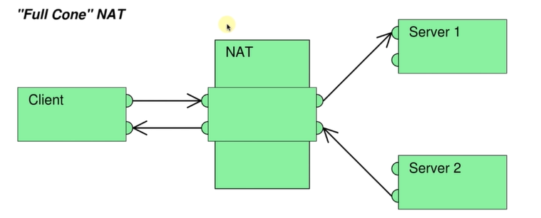

映射表：对此 NAT，客户端连接到通过 NAT 连接到外部的服务器，对每一个服务器的连接，IP 都不是固定的，只能由客户端主动接链接服务器，服务器服务主动连接内外客户端。

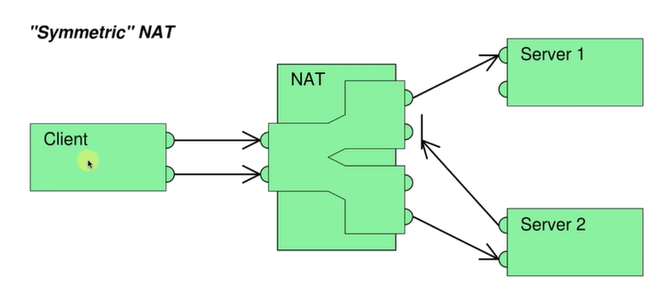

NAT 超时时间，规定时间内没有任何数据收发，那么 NAT 内部维护的地址映射将会被删除：

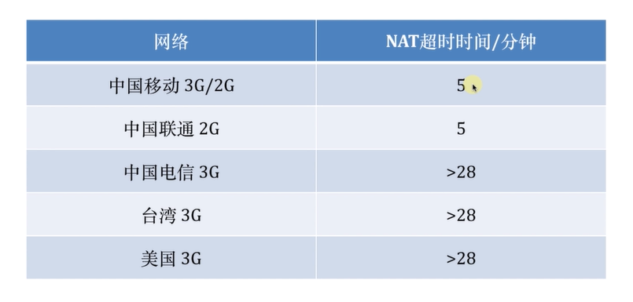

#### 心跳包的作用

客户端与服务器之间相互告知状态。通过定时发送消息，让中间运营商的 NAT 路由表得以维持，避免路由表过期带来的异常中断。由于器约定性、定时性所以称为心跳包。

#### 心跳包策略选择

TCP 自带的心跳策略：

- KeepAlive 7200 2H ACK，每隔两小时发送一次。
- TCP KeepAlive 仅代表连接保持，而不代表对方业务层是否可以消费数据，因为 TCP KeepAlive 的包在传输层就已经消费了，应用层对此是无感知的，有可能应用层已经奔溃了，而底层的 TCP KeepAlive 还是正常的状态。
- TCP KeepAlive 的时间过程，无法使网络中间运营商维持 NAT 路由表。
- HTTP 的 KeepAlive 意图在于多个 HTTP 请求复用同一个 TCP 连接，在同一个连接上串行方式传递请求-响应数据，与 TCP 层的 KeepAlive 是不同的。

通过 `socketsendUrgentData(0xFF)` 发送紧急数据包，只能传递一个字节：

- 接收方可以设置 SO_OOBINLINE 来让紧急数据包发送到业务层，但是存在一个问题，其只能传递一个字节，范围为 0-255，这个字节与业务层数据的冲撞性是非常高的。导致业务层数据处理非常复杂。

通过自定义数据帧实现心跳数据包：

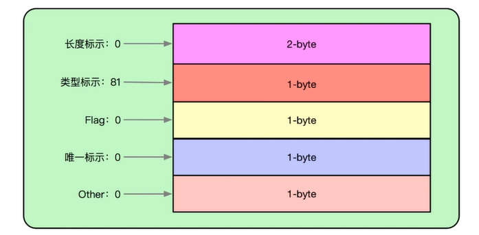

#### 心跳包发送与消费

- 客户端发送心跳包数据，服务器接收数据，但是不会送业务数据包，因为只要服务器正常接收了这个心跳包，客户端依然会收到数据的确认包(传输层的 ACK)，这样就足够正常连接是维持的，当然更加保险的做法是服务器也会送心跳包，但是当连接数量非常大时，会造成一定程度的性能消耗。

- 服务器使用 10 倍时长扫描客户端方案进行客户端活跃性扫描，超出时间未活跃则自动关闭连接。

### 10.4 心跳包构建与消费调度

#### Netty 心跳实现

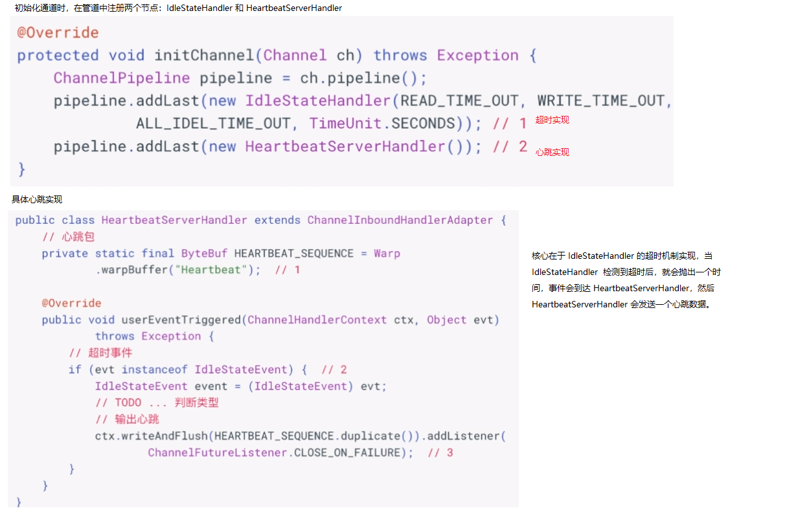
