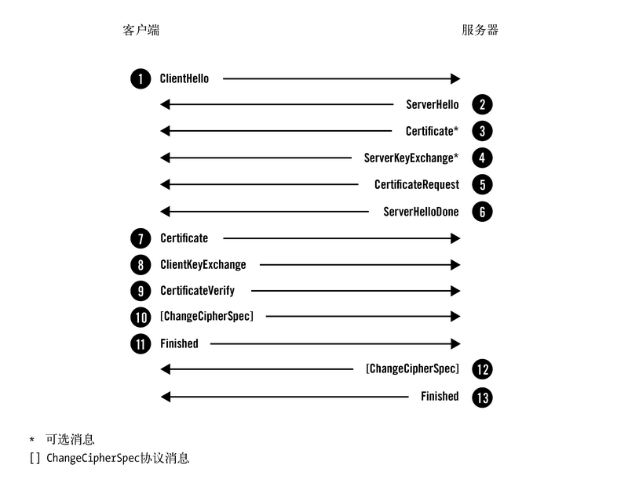

# TLS 协议

---
## 1 记录协议

宏观上，**TLS 以记录协议（record protocol）实现**，记录协议负责在整个传输连接上交换所有的底层消息，并且可以配置加密，每一条 TLS 记录以一个短标头起始，标头包括记录内容的类型（或子协议）、协议版本和长度。消息写紧跟在标头之后：

除了这些字段，还会给每一 TLS 记录指定唯一的 64 位序列号，但不会在线路上传输，任何一端都有自身的序列号并跟踪来自另一端的数量，这些值是对抗重放攻击的一部分。

记录协议从多个重要的宏观角度对公信进行考虑，是一个很有用的协议抽象：

- **消息传输**：`记录协议`传输由`其他协议层`提交给它的`不透明数据缓冲区`。如果缓冲区数据超过记录的长度限制（16384字节），记录协议会将其切割成更小的片段，反过来也是可能的，属于同一个子协议的小缓冲区也可以组合成一个单独的记录。
- **加密以及完整性验证**：在一个刚建立的连接上，最初的消息是没有受到任何保护的，这是必须的，否则第一次协商就无法完成，但是一旦握手完成，记录层就开始按照协商取得的连接参数进行加密和完整性校验。
- **压缩**：理论上，在加密前对数据机进行压缩非常好，可是实践中几乎没有人这样做。
- **扩展性**：记录协议只关注数据传输和加密，而将其他特新转交给子协议，这个方法使得 TLS 可以扩展，因为可以很方便地添加子协议。

TLS 的主规格说明书定义了四个核心子协议：握手协议（handshake protocol）、密钥规格变更协议（change cipher spec protocol）、应用数据协议（application data protocol）、警报协议（alert protocol）。

---
## 2 握手协议

握手是 TLS 协议中最精密复杂的部分。在这个过程中，通信双方协商连接参数，并且完成身份验证。根据使用的功能不同，整个过程需要交换 6-10 条消息，根据配置和支持的协议扩展的不同，交换过程可能有多种变种，在使用中经常可以观察到以下三种流程：

1. 完整的握手：对服务器身份进行验证。
2. 回复之前的会话采用的简短握手。
3. 对客户端和服务器都进行身份验证。

### 完整的握手

每一个 TLS 连接都会以握手开始，如果客户端此前并未与服务器建立会话，那么双方执行一次完整的握手流程来协商 TLS 会话。握手过程中，客户端和服务器进行以下四个主要步骤：

- 交换各自支持的功能，对需要的连接参数达成一致。
- 验证出示的证书，或使用其他方式进行身份验证。
- 对将用于保护的会话的共享主密钥达成一致。（协商对称加密的密钥）
- 验证握手消息并未被第三方团队修改。

如下图所示：

对服务器进行身份验证的完整握手，10 个步骤描述如下：

- 客户端开始新的握手，并将自身支持的功能提交给服务器。
- 服务器选择连接参数。
- 服务器发送其证书链（仅当需要服务器身份验证时）。
- 根据选择的密钥交换方式，服务器发送生成主密钥的额外信息。
- 服务器通知自己完成了协商过程。
- 客户端发送生成主密钥所需要的额外信息。
- 客户端切换加密方式并通知服务器。
- 客户端计算发送和接受到的握手消息的 MAC 并发送。
- 服务器切换到加密方式并通知客户端。
- 服务器计算发送和接受到的握手消息的 MAC 并发送。

假设没有错误，到最后一步，练级就建立起来了，可以开始发送应用数据了。

>原书关于这个过程有非常完整的描述，如果需要进一步了解握手细节，可以参阅原书。

### 客户端验证

只有已经经过身份验证的服务器才能请求客户端进行身份验证。基于这个原因，这个选项被称为互相身份验证（mutual authentication）。

图示过程如下：

### 会话回复

会话回复可以重新恢复之前建立的 TLS 连接，这个机制减少了 TLS 握手过程的通信次数。

---
## 3 密钥交换

密钥交换是握手过程中最引人入胜的地方，在 TLS 中，会话安全性取决于称为 **主密钥（master secret）** 的 48 字节共享密钥。密钥交换的目的就是计算另一个值，即预主密钥（premaster secret）。这个值是组成主密钥的来源。

密钥交换算法：

- RSA 密钥交换
- Diffie-Hellman 密钥交换
- 椭圆曲线 Diffie-Hellman 密钥交换

>原书关于密钥交换算法有非常完整的描述，如果需要进一步了解可以参阅原书。

---
## 4 身份验证

在 TLS 中，为了避免重复执行密码操作造成的巨大开销，身份验证与密钥交换紧紧捆绑在一起。大多数场景下，身份验证的基础是证书支持的公钥密码（最常见的是 RSA，又是也用 ECDSA）。

一旦证书验证通过，客户端就知道使用的公钥，在此之后，客户端将公钥交给指定的密钥交换算法，并由它负责以某种方式使用公钥验证另一端。

在 RSA 密钥交换过程中：

- 客户端生成一个随机值作为预主密钥，并服务器公钥加密后发送出去。
- 用于对于私钥的服务器解密消息得到预主密钥。
- 身份验证的原理就是：只有用于对于私钥的服务器才能取得预主密钥，构造出正确的会话密钥，并生成正确的 Finished 消息。

---
## 5 加密

TLS 可以使用各种加密算法，比如使用 3DES、AES、ARIA、CAMELLIA、RC4 或者 SEED 等算法，目前使用最为广泛的加密算法是 AES，TLS 支持三种加密类型：**序列密码、分组密码、已验证的密码**。在 TLS 中，完整性验证是加密处理的一部分，它要么在协议级中显式的处理，要么由协商的密钥隐式处理。

>原书三种加密类型加密算法有非常完整的描述，如果需要进一步了解可以参阅原书。

## 6 重新协商
## 7 应用数据协议
## 8 警报协议
## 9 关闭连接
## 10 密码操作
## 11 密码套件
## 12 扩展
## 13 协议限制
## 14 各协议版本之间的差异
