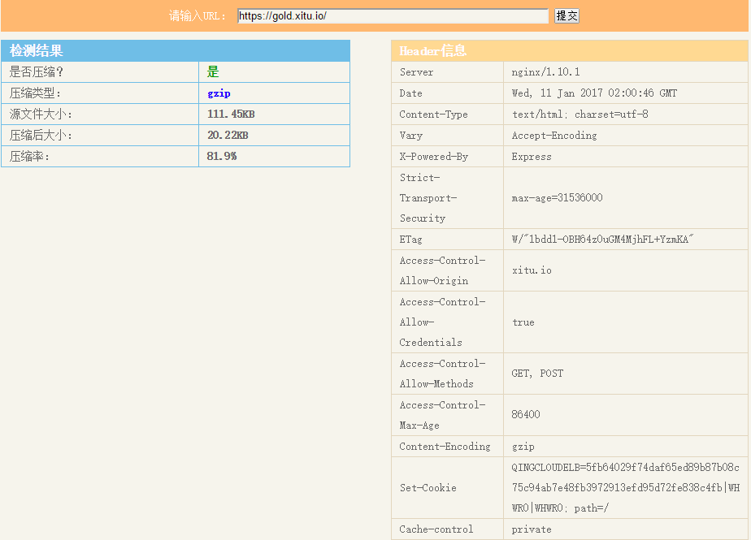

# Content-encoding 和 Transfer-Encoding

---
## 1 Content-encoding

通过 Accept-Encoding 和 Content-encoding 客户端和服务端可以协商采用压缩的方式来进行内容传输，针对文本数据的压缩可以大大减少传输量的大小，从而提高响应速度，gzip 是常见的压缩方式。

gzip是**GNUzip**的缩写，最早用于UNIX系统的文件压缩。HTTP协议上的gzip编码是一种用来改进web应用程序性能的技术，web服务器和客户端（浏览器）必须共同支持gzip。目前主流的浏览器，Chrome,firefox,IE等都支持该协议。常见的服务器如Apache，Nginx，IIS同样支持gzip。

gzip压缩比率在3到10倍左右，可以大大节省服务器的网络带宽。而在实际应用中，并不是对所有文件进行压缩，通常只是压缩静态文件。

客户端和服务器之间是如何通信来支持 gzip 的呢？通过下图我们可以很清晰的了解。

1. 浏览器请求url，并在request header中设置属性`accept-encoding:gzip`。表明浏览器支持gzip。
1. 服务器收到浏览器发送的请求之后，判断浏览器是否支持**gzip**，如果支持**gzip**，则向浏览器传送压缩过的内容，不支持则向浏览器发送未经压缩的内容。一般情况下，浏览器和服务器都支持gzip，`response headers`返回包含`content-encoding:gzip。`
1. 浏览器接收到服务器的响应之后判断内容是否被压缩，如果被压缩则解压缩显示页面内容。

现在的浏览器一般都支持GZIP压缩，以Chrome为例进行测试，打开一个网址，通过抓包获取Header：

可以看到请求头中：`accept-encoding:gzip, deflate, sdch`，表明chrome浏览器支持这三种压缩。accept-encoding 中添加的另外两个压缩方式 deflate 和 sdch。deflate 与 gzip 使用的压缩算法几乎相同。sdch是**Shared Dictionary Compression over HTTP**的缩写，即通过字典压缩算法对各个页面中相同的内容进行压缩，减少相同的内容的传输。**sdch**是Google 推出的，目前只有 Google Chrome, Chromium 和 Android 支持。

通过网址 http://gzip.zzbaike.com/ 可以检测一个网站的GZIP压缩率：

---
## 2 分块传输编码

### 2.1 什么是分块传输编码

分块传输编码（Chunked transfer encoding）是超文本传输协议（HTTP）中的一种数据传输机制，允许HTTP由网页服务器发送给客户端应用（ 通常是网页浏览器）的数据可以分成多个部分。分块传输编码只在HTTP协议1.1版本（HTTP/1.1）中提供。通常，HTTP应答消息中发送的数据是整个发送的，Content-Length消息头字段表示数据的长度。数据的长度很重要，因为客户端需要知道哪里是应答消息的结束，以及后续应答消息的开始。然而，使用分块传输编码，数据分解成一系列数据块，并以一个或多个块发送，这样服务器可以发送数据而不需要预先知道发送内容的总大小。通常数据块的大小是一致的，但也不总是这种情况。——[维基百科](https://zh.wikipedia.org/wiki/%E5%88%86%E5%9D%97%E4%BC%A0%E8%BE%93%E7%BC%96%E7%A0%81)

### 2.2 分块传输编码解决的问题

#### 持久链接
HTTP 运行在 TCP 连接之上，为了尽可能的提高 HTTP 性能，使用持久连接(多次请求复用已有的TCP连接)就显得尤为重要了。为此，HTTP 协议引入了相应的机制。HTTP/1.0 的持久连接机制是后来才引入的，通过 `Connection: keep-alive` 这个头部来实现，服务端和客户端都可以使用它告诉对方在发送完数据之后不需要断开 TCP 连接，以备后用。HTTP/1.1 则规定所有连接都必须是持久的，除非显式地在头部加上 `Connection: close`。所以实际上，HTTP/1.1 中 Connection 这个头部字段已经没有 keep-alive 这个取值了，但由于历史原因，很多 Web Server 和浏览器，还是保留着给 HTTP/1.1 长连接发送 Connection: keep-alive 的习惯。

#### Content-Length

在没有使用`keep-alive`保持连接之前，客户端判断传输结束的依据是连接关闭，比如编程调用`socket.close()`，而如果使用`keep-alive`保持连接的话，客户端怎么判断这次Http通讯已经完成，数据已经传输完毕的？答案是响应头中的`Content-Length`，客户端在读取完`Content-Length`指定的长度的响应正文后就会认为此次HTTP通讯已经接收。`Content-Length`字段非常重要，**它必须真实反映实体长度**，如果 Content-Length 比实际长度短，会造成内容被截断；如果比实体内容长，会造成网络一直处于 pending状态。

但是某些情况下服务端不可能或者非常难于获取将要传续的正文的长度，比如一个大文件的传输，通常是一边读一边写，不可能把整个大文件读取到内存中才写给客户端，其次有些内容实体来自于网络文件，或者由动态语言生成，也不能直接获取其长度。

#### Transfer-Encoding: chunked

HTTP 1.1引入分块传输编码可以解决上面问题：

- HTTP分块传输编码允许服务器为动态生成的内容维持HTTP持久链接。通常，持久链接需要服务器在开始发送消息体前发送`Content-Length`消息头字段，但是对于动态生成的内容来说，在内容创建完之前是不可知的。
- 分块传输编码允许服务器在最后发送消息头字段。对于那些头字段值在内容被生成之前无法知道的情形非常重要，例如消息的内容要使用散列进行签名，散列的结果通过HTTP消息头字段进行传输。没有分块传输编码时，服务器必须缓冲内容直到完成后计算头字段的值并在发送内容前发送这些头字段的值。
- HTTP服务器有时使用压缩 （gzip或deflate）以缩短传输花费的时间。分块传输编码可以用来分隔压缩对象的多个部分。在这种情况下，块不是分别压缩的，而是整个负载进行压缩，压缩的输出使用本文描述的方案进行分块传输。在压缩的情形中，分块编码有利于一边进行压缩一边发送数据，而不是先完成压缩过程以得知压缩后数据的大小。

---
## 引用

等多细节参考下列链接：

- [维基百科：分块传输编码](https://zh.wikipedia.org/wiki/%E5%88%86%E5%9D%97%E4%BC%A0%E8%BE%93%E7%BC%96%E7%A0%81)
- [HTTP 协议中的 Transfer-Encoding](https://imququ.com/post/transfer-encoding-header-in-http.html)
- [HTTP 内容编码，也就这 2 点需要知道 | 实用 HTTP](https://www.cnblogs.com/plokmju/p/http_gzip.html)
- [HTTP传输编码增加了传输量，只为解决这一个问题 | 实用 HTTP](https://www.cnblogs.com/plokmju/p/http_code.html)

