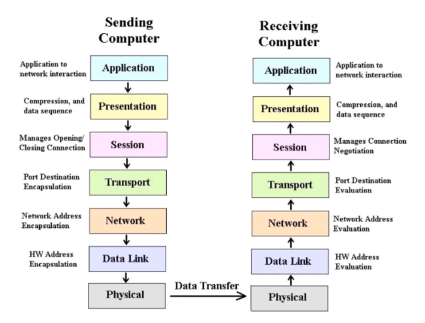
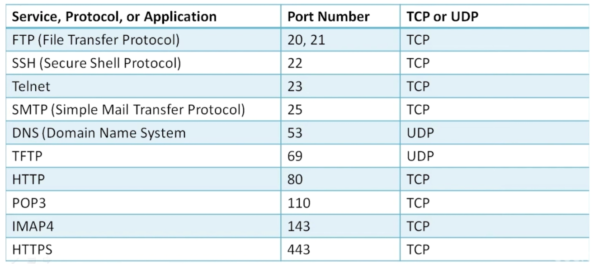
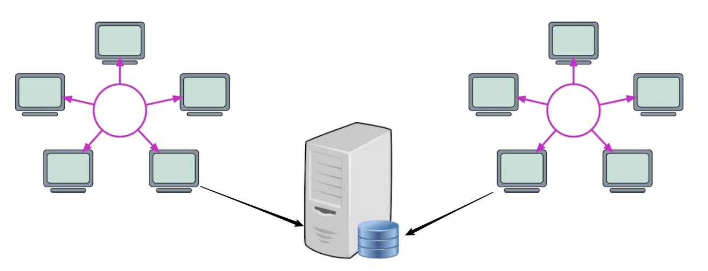

# Socket网络编程快速入门

---
## 1 什么是网络

- 在计算机领域中，网络是信息传输、接收、共享的虚拟平台。
- 通过它把各个点、面、体的信息联系到一起，从而实现这些这些资源的共享。
- 网络是人类发展史上最伟大的发明，促进了科技和人脸的发展。

---
## 2 什么是网络编程

- 网络编程从大的方面来说就是对信息的发送到接收。
- 通过操作相应 API 调度计算机硬件资源，并利用传输管道（比如网线）进行数据交换的过程。
- 更为具体的涉及：网络模型、套接字、数据包。

### 层网络模型

7 层网络模型（OSI）：

总结:

- 基础层：物理层、数据链路层、网络层
- 传输层：TCP-UDP 协议层、Socket
- 高级层：会话层、表示层、应用层

与 TCP 网络模型对应关系：

---
## 3 Socket 与 TCP、UDP

### 什么是 Socket：

- 简单来说是 IP 地址与端口的结合协议（RFC 793）
- 一种地址与端口的结合描述协议
- TCP/IP 协议的相关 API 的总称，是网络 API 的集合实现
- 涵盖了：Stream Socket/Datagram Socket
- TCP/IP 是 Socket 的一种实现。但 Socket 并不只有 TCP/IP。

>维基百科：在计算器科学中，网上套接字（英语：Network socket），又译`网络套接字、网络接口、网上插槽`，是计算机网上中进程间数据流的`端点`。使用以网际协议（Internet Protocol）为通信基础的网上套接字，称为网际套接字（Internet socket）。因为网际协议的流行，现代绝大多数的网上套接字，都是属于网际套接字。**socket是一种操作系统提供的进程间通信机制**。
在操作系统中，通常会为应用程序提供一组应用程序接口（API），称为`套接字接口`（英语：socket API）。应用程序可以通过套接字接口，来使用网上套接字，以进行数据交换。最早的套接字接口来自于4.2 BSD，因此现代常见的套接字接口大多源自Berkeley套接字（Berkeley sockets）标准。在套接字接口中，以IP地址及通信端口组成套接字地址（socket address）。远程的套接字地址，以及本地的套接字地址完成连线后，再加上使用的协议（protocol），这个`五元组（five-element tuple）`，作为套接字对（socket pairs），之后就可以彼此交换数据。

Socket的作用与组成：

- 在网络传输中用于唯一标识两个端点之间的连接（逻辑上的连接）
- 端点：包括（IP+Port）
- 4个要素：客户端IP、客户端端口、服务器IP、服务器端口

### TCP

- 面向连接
- 通过三次握手，通信完成需要拆除连接
- 由于面向连接，只能用于端到端通信

tcp 的传输是可靠的，每次发送出数据包，接收方收到后都要回复对方已经收到该包，否则发送方在一定时间后没有收到回复后就会认为该包发送失败，需要重新发送，当然操作系统底层是已经实现了的。

### UDP

- UDP 面向无连接
- UDP 数据包包括目的端口号和源端口号信息
- 由于通信不需要连接，所以可以实现广播发送，并不局限于端到端
- UDP 只管发送数据，不管对方是否已经收到

---
## 4 报文、协议、Mac地址

报文段：

- 报文段在 TCP/IP 协议网络传输过程中，起着路由导航作用。
- 用以查询各个网络路由网络、IP地址、交换协议等 IP 数据包。
- 报文段充当整个 TCP/IP 协议数据包的导航路由功能。
- 报文在传输过程中会不断地封装成分组、包、帧来传输。
- 封装方式就是添加一些控制信息组成的首部，即报文头。

传输协议:

- 一种约定、约束。
- 约定大于配置，在网络中传输中依然适用，网络的传输流程是健壮的稳定的，得益于基础的协议组成。
- 简单来说：通过约定，A -> B 的传输数据，B 能识别，反之 B -> A 的传输数据，A 也能识别，这就是协议。

Mac 地址：

- Madia Access Control 或者 Medium Access Control。
- 媒体访问控制或称为物理地址硬件地址。
- 用来定义网络设备的位置。
- 每个能连接互联网的设备都有自己的 MAC 地址。

---
## 5 IP、端口及远程服务器

### IP

维基百科：互联网协议地址（英语：Internet Protocol Address，又译为网际协议地址），缩写为IP地址（英语：IP Address），是分配给网上上使用网际协议（英语：Internet Protocol, IP）的设备的数字标签。

- 用以唯一标识互联网上的一台设备的地址。
- ip 分类：A、B、C 类。
- ip 版本：ipv4，ipv6.
- ip v4 的数量是 4294967296 个，最终于 2011 年 2 月 3 日用尽，现在分配的都是局域网地址。
- 如果主机号全是 1，那么这个地址为直接广播地址。
- IP 地址为 `255.255.255.255` 为受限广播地址。
- ip v4一定可以转换为 ipv6，但 ipv6 不一定能转换为 ipv4。

### 端口

- 用来唯一标识操作系统中运行的一个进程。
- 0 到 1023 端口已经 1024 到 49151 端口号都是特殊的端口号。
- 49152 到 65535 号端口属于 “动态端口” 范围，没有端口可以被正式地注册。
- 计算机之间依照互联网传输层协议 TCP/IP 协议的协议通信，不同协议都对应着不同的端口。

端口总数是 65536，但是并不意味着客户端只能建立 65536 个链接，标识一个链接使用的信息是 `IP + 端口`。

### 数据传输层次

层层封装：

### 远程服务器

两个局域网设备之间无法直接进行直接通信。必须通过公网（被分配了公务IP）上的服务器进行间接通信。比如说政府的服务器、主干上的服务器上分配的公网 IP 是固定的。

