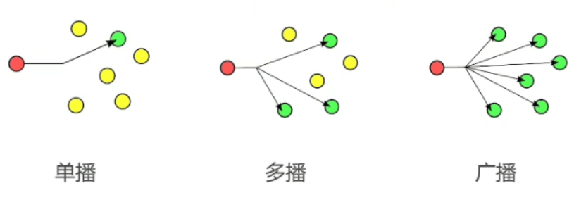
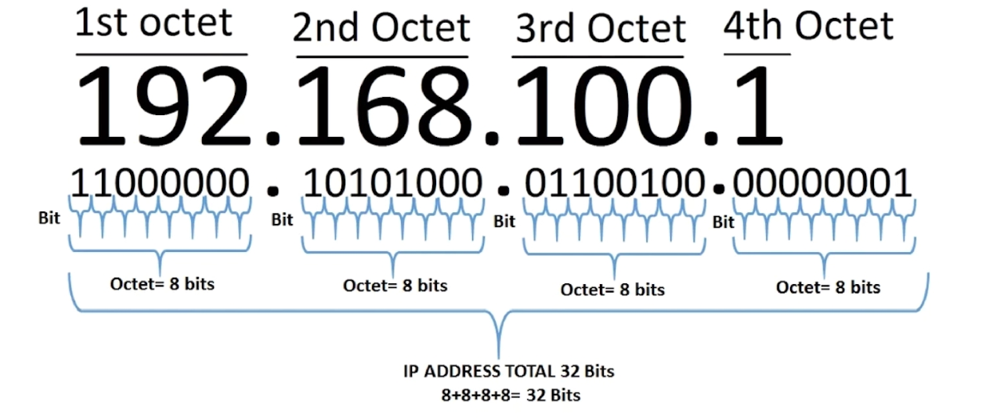

# UDP 入门

---
 ## 1 UDP 协议

 - User Datagram Protocol，一种用户数据包协议
 - 是一个简单的面向数据报的传输层协议，正式规范为 RFC 768
 
 UDP 为什么不可靠：

 - 一旦把应用程序发送给网络层的数据发送出去，就不保留备份。
 - UDP 在 ip 协议报的头部仅仅加入了复用和数据校验（字段）。
 - 发送端产生数据，接收端从网络中抓取数据。
 - 结构简单、无校验、速度快、容易丢包、可广播。

UDP 能够做什么

- DNS、TFTP、SNMP
- 视频、音频、普通数据（无关紧要的数据）

UDP 报文：

报文头（64位）：

UDP 最多能发送多少数据：

- 报文头中有 16 位用于存储长度信息。
- `2 ^ 16 = 65536-1 = 65535`。
- 自身协议占用 64 位，即 8 字节。
- `65535 - 8 = 65507` byte。

---
## 2 UDP核心API讲解

- java.net.DatagramSocket
- java.net.DatagramPacket

---
## 3 UDP单播、广播、多播（组播）

现在的路由器一般都有拒绝发送广播的策略，因为无限制的发送广播容易造成网络拥塞。而多播一定是经过了筛选、分组的，性能要优于广播，多播、广播这些都是由路由器完成的，对于我们来讲，只需要发送一次即可。

### 多播地址

IP 地址类别：

在 IP 分类上，D 类地址专门用于多播，这类地址是能被路由器所感知的，这也是多播比广播性能好的原因。

- `255.255.255.255` 为受限广播地址。在同一个广播域（广播域边界为网关）范围内所有主机都会接收这个包，同一个广播域范围内所有需要转发包的网络设备（例如交换机）应该转发这个包。
- C 类广播地址一般为：xxx.xxx.xxx.255（192.168.1.255）。
- D 类地址专门为多播预留。

IP 地址构成：

广播地址运算：

    情况 1：

        IP：192.168.124.7
        子网掩码：255.255.255.0
        网络地址：192.168.124.0
    广播地址：192.168.124.255

    情况 2：

        IP：192.168.124.7
        子网掩码：255.255.255.192
        网络地址：192.168.124.0
        广播地址：192.168.124.63

        子网掩码：255.255.255.192 -> 11111111.11111111.11111111.11000000
        可划分网段：2^2 = 4，分别为 
            0-63(00000000-00111111)
            64-127(01000000-01111111)
            127-191(1000000-10111111)
            192-255(11000000-11111111)
        IP 192.168.124.7 在 0-63 网段，所以广播地址为 192.168.124.63