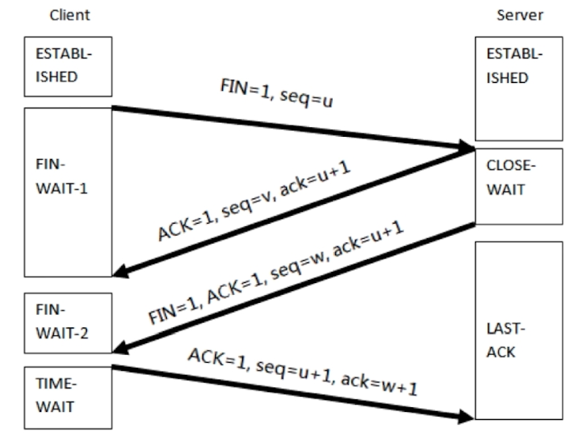
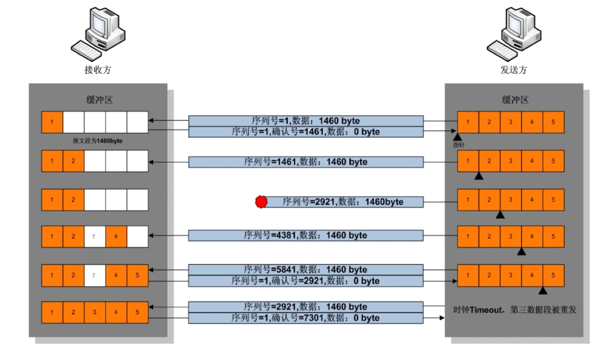

# TCP 入门

---
## 1 TCP

Transmission Control procotol ，传输控制协议，是一种面向连接的、可靠的、基于字节流的传输层协议，由 IETF 的 RFC 793 定义。

- 与 UDP 一样用于完成第四层传输层所制定的功能与指责。
- 链接建立需要三次握手，端口连接需要四次挥手。
- 具有校验机制、可靠、数据传输稳定。

TCP 能做什么

- 聊天消息传输、推送
- 单人语音、视频聊天等
- 几乎 UDP 能做的都能做，但需要考虑复杂性、性能问题
- 限制：无法进行多播、广播等操作

---
## 2 TCP核心API讲解

- `java.net.Socket`
- `java.net.ServerSocket`

---
## 3 TCP连接可靠性-三次握手、四次挥手

三次握手：

- 三次握手是确认对方能收到自己发送的信息，自己也能收到对方发送的信息的最少握手次数。
- 三次握手中存在一个随机值，通过这个随机值确认通信方。

四次挥手：

>established：已确立的；已获确认的；确定的。

- 四次挥手用于保证双方都不需要再发送数据后才端口连接。

---
## 4 TCP传输可靠性-排序、丢弃、重发

- 排序、顺序、顺序组装
- 丢弃、超时
- 重发机制：定时器

---
## 5 TCP传输初始化配置

- `java.net.Socket` 和 `java.net.ServerSocket` 的初始化和各种配置。

---
## 6 案例实操-TCP基础数据传输

- 这里的基础数据不特定指某种语言的基本类型，而是针对网络传输中基本类型。
- 使用 `java.net.Socket` 发送和接受各种数据类型。
- `outputStream.write(127);` 方法只能接受 byte 范围的数值，高 24 位的数据都将被忽略。
- 使用 ByteBuffer 来简化操作 `byte[]`。