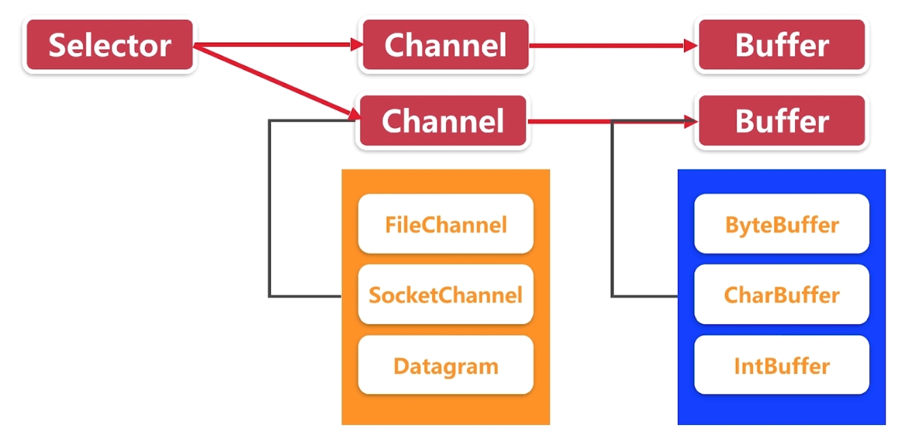

# 服务器传输优化-NIO

---
## 1  阻塞 IO 与非阻塞 IO

- 对于阻塞 IO，对每个客户端的读取操作都要一个对于的线程。大部分线程都处于等待。CPU 需要扫描所有线程的状态，但大部分线程还是等待中的。
- 对于非阻塞 IO，通过事件驱动，只需要一个线程就可以处理所有客户端的读数据操作。这个线程的效率非常高，充分利用了系统资源。避免了资源浪费。

---
## 2 NIO（Non-Blocking IO）

- 在 JDK 1.4 引入。在标准 Java 代码中，提供了高速的、可伸缩性的、面向块的、非阻塞的 IO 操作。

NIO API 一览：

- Buffer 缓冲区。
- Channel 通道。
- Selector 选择器：处理客户端所有的事件的分发器。
- Charset 字符编码。

Buffer：

- 写数据时先写道 Buffer->Channel。读则相反。
- 为 NIO 块状操作提供基础，数据都按块进行传输。
- 一个 Buffer 代表一块数据。

Channel：

- 可从通道中获取数据也可以输出数据到通道。
- 可并发异步读写数据。

NIO 职责：

Selector 注册事件：

- Selectionkey.OP_CONNECT 连接就绪
- Selectionkey.OP_ACCEPT 接受就绪
- Selectionkey.OP_READ 读就绪
- Selectionkey.OP_WRITE 写就绪

Selector 使用流程：

- open() 开启一个选择器，可以给选择器住粗需要关注的事件。
- register() 将一个 Channel 注册到选择器，当选择器触发对应关注事件时回调到 Channel 中，处理相关数据。
- select()/selectNow() 一个通道，处理一个当前可用、待处理的通道数据。这是阻塞操作，阻塞到有事件处理为止。
- selectedKeys() 的到当前就绪的通道。
- weakUp() 唤醒一个处理 select 状态的选择器。
- close() 关闭选择器，注销所有关注的事件。

Selector 注意事项：

- 注册到选择器的通道必须为非阻塞状态。
- FileChannel 不能用于 Selector，因为 FileChannel 不同切换非阻塞模式，套接字通道才可以。

SelectionKey 扩展：

- interest 集合（注册多个事件）、ready 集合。
- Channel 通道
- Seector 选择器
- obj 附加值

---
## 3 NIO 从写服务器