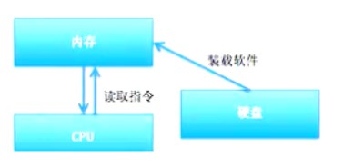
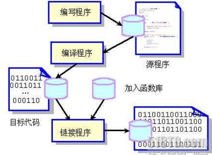
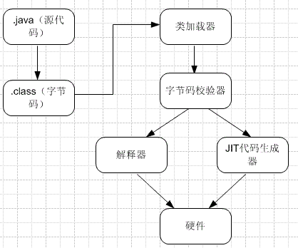

# 计算机语言概述

---
## 1 了解计算机

### 1.1 计算机运行原理

- 硬件基本组成：硬盘，内存，CPU。
- 各个部件之间的协调运作。



通过 0 和 1 的不同排列和组合就形成了各种指令。

### 1.2 计算机语言

计算机只能识别 0 和 1：`0和1组成的指令` 和 `0和1组成的数据`。

- **什么是计算机程序**：所谓程序就是一组计算机能识别和执行的指令，程序告诉计算机应如何完成任务，计算机的一切操作都是由程序控制的，计算机的本质就是程序的机器。
- **什么是机器语言**：计算机工作基于二进制，从根本上来说，计算机只能识别和接受由 0 和 1 组成的指令。计算机语言（Computer Language）指用于人与计算机之间通讯的语言。计算机系统最大特征是指令通过一种语言传达给机器。能被计算机识别和接受的二进制称之为**计算机指令**，机器指令的集合就是该计算机的机器语言。
- **指令**：是由指令集架构定义的单个的 CPU 操作。

程序由一系列指令（Instruction）组成，通常包括以下几类（对于程序来说，有下面这几类指令就足够了，复杂的程序都可以通过组合下面的基础指令来实现）：

- 输入（Input）：从键盘、文件或者其它设备获取数据。
- 输出（Output）：把数据显示到屏幕，或者存入一个文件，或者发送到其它设备。
- 基本运算：执行最基本的数学运算（加减乘除）和数据存取。
- 测试和分支：测试某个条件，然后根据不同的测试结果执行不同的后续指令。
- 循环：重复执行一系列操作。

---
## 2 计算机语言的发展

编程语言（Programming Language）分为低级语言（Low-level Language）、高级语言（High-level Language）。机器语言（Machine Language）和汇编语言（Assembly Language）属于低级语言，直接用计算机指令编写程序。而C、C++、Java、Python等属于高级语言，用语句（Statement）编写程序，语句是计算机指令的抽象表示。

### 2.1 机器语言

机器语言的所有代码只有0和1，每一条指令成为机器指令。

```log
    011011000101 010101110100
```

优点

- 能直接被计算机识别，效率非常高
- 直接访问计算机的各种硬件设备，比如硬盘，CPU，内存

缺点

- 程序全是0和1，可读性差，容易出错
- 要熟记所用计算机的全部指令和指令含义
- 对计算机的依赖性强，不同型号计算机的机器语言不一样，对于不同型号计算机可能需要写两套代码

使用场景

- 除了计算机生成厂家的专业人员之外，绝大多数程序员不再需要学习

### 2.2 汇编语言

用英文单词或者符号代替各种机器指令

```log
    ADD MOV
```

优点

- 可以直接访问、控制计算机各种硬件设备
- 效率高，占用内存少

缺点

- 不同机器有不同的汇编语言语法，代码缺乏可移植性
- 符号非常都，难记，容易产生Bug，难以调试
- 必须对硬件非常了解，开发效率低，周期长

使用场景

- 计算机系统、程序驱动、单片机程序
- 软件加密解密破解
- 病毒的制作与防御

### 2.3 高级语言

高级语言接近自然语言

```java
int a = 3;
int b = 3 + a;
```

优点

- 简单易用，易于理解，结构类似普通英文。
- 原理对硬件的操作，一般人经过学习之后都可以编程，而不用太熟悉计算机硬件知识。
- 很多语言可以在不同的机器上运行，具备可移植性。

缺点

- 不能被计算机识别，需要编译器翻译成二进制指令后，才能运行到计算机上。

种类

- C、C++、C#
- JAVA
- JavaScript
- Python

### 2.4 编程语言仍在发展演化

- 机器语言称为第一代语言（1GL，1st Generation Programming Language）
- 汇编语言称为第二代语言（2GL，2nd Generation Programming Language）
- C、C++、Java、Python等可以称为第三代语言（3GL，3rd Generation Programming Language）
- 目前已经有了4GL（4th Generation ProgrammingLanguage）和5GL（5th Generation Programming Language）的概念。

>3GL的编程语言虽然是用语句编程而不直接用指令编程，但语句也分为输入、输出、基本运算、测试分支和循环等几种，和指令有直接的对应关系。而4GL以后的编程语言更多是描述要做什么（Declarative）而不描述具体一步一步怎么做（Imperative），具体一步一步怎么做完全由编译器或解释器决定，例如SQL语言（SQL，Structured Query Language，结构化查询语言）就是这样的例子。

---
## 3 高级语言运行过程

现在的语言主要分为 **编译型语言** 和 **解释型语言**。

### 编译型语言

用编译型语言写的程序执行之前，需要一个专门的编译过程，通过编译系统（不仅仅只是通过编译器，编译器只是编译系统的一部分）把高级语言翻译成机器语言（具体翻译过程可以参看下图），把源高级程序编译成为机器语言文件，比如windows下的exe文件。以后就可以直接运行而不需要编译了，因为翻译只做了一次，运行时不需要翻译，所以编译型语言的程序执行效率高，但也不能一概而论，部分解释型语言的解释器通过在运行时动态优化代码，甚至能够使解释型语言的性能超过编译型语言。

### 解释型语言

解释型语言编写的程序不需要编译。解释型语言在运行的时候才翻译，比如VB语言，在执行的时候，专门有一个解释器能够将VB语言翻译成机器语言，每个语句都是执行的时候才翻译。这样解释型语言每执行一次就要翻译一次，效率比较低。

### 编译型语言与解释型语言对比

编译型与解释型，两者各有利弊。前者由于程序执行速度快，同等条件下对系统要求较低，因此像开发操作系统、大型应用程序、数据库系统等时都采用它，像C/C++、Pascal/Object Pascal（Delphi）等都是编译语言，而一些网页脚本、服务器脚本及辅助开发接口这样的对速度要求不高、对不同系统平台间的兼容性有一定要求的程序则通常使用解释性语言，如JavaScript、VBScript、Perl、Python、Ruby、MATLAB 等等。

#### C 语言

C 语言属于编译型语言，被直接编译成机器语言，效率非常高



#### Java

Java 语言写的源程序通过 Java 编译器，编译成与平台无关的‘字节码程序’(.class文件，也就是0，1二进制程序)，然后在 OS 之上的 Java 解释器中被解释执行。


JVM 是 Java 的核心和基础，在 Java 编译器和操作系统平台之间的虚拟处理器。它是一种利用软件方法实现的抽象的计算机，可以在上面执行 Java 的字节码程序。Java 编译器只要面向 JVM，生成 JVM 能理解的代码或字节码文件。Java 源文件经编译成字节码程序，通过 JVM 将每一条指令翻译成不同平台机器码，通过特定平台运行。



---
## 引用

- [《Linux C编程一站式学习》](https://akaedu.github.io/book/)
