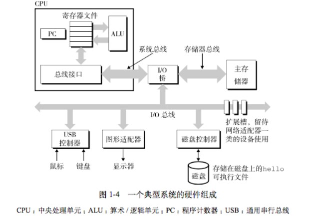
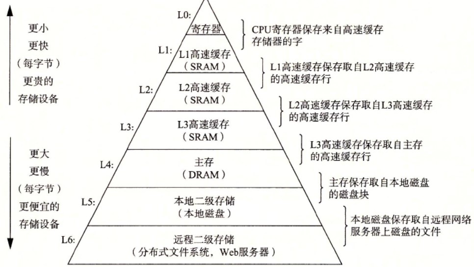

# 第一章：计算机系统漫游

计算机是有硬件和系统软件组成的。

---
## 1 信息就是(位 + 上下文)

- 系统中所有的信息，包括磁盘文件、存储器中的程序、存储器中存放的用户数据以及网络上传送的数据，都是值为 0 和 1 的组成的**位**(bit)序列。
- 8 个位组成一组，称为字节，每个字节表示程序中某个文本字符。
- 区分不同数据对象的唯一发方式是：我们读到这些数据时的**上下文**，比如不同上下文中，一个同样字节序列可能表示整数、浮点数、字符串、或者是机器指令。
- 作为程序员，需要了解数字的机器表示方式，**因为它们与实际的整数和实数不同，它们是对真值的有限近似值**，因此有时候会有意想不到的行为。

---
## 2 源程序被其他程序翻译成不同的格式

一个 helloword 程序从高级的 c 语言被其他程序转化为一系列低级的机器语言指令。比如：

```c
Hello.c

int main()
{
   printf("%s","helloword");
   return 0;
}
```

运行`unix> gcc -0 hello Hello.c` 将得到可执行文件 hello，gcc 读取 `Hello.c` 源文件并把它翻译为可执行的目标文件 hello，这个翻译过程需要经历四个步骤：


预处理器、编译器、汇编器和链接器(ld)组成了一个编译系统。

- 预处理阶段，由预处理器完成，展开 include 文件，一般输出后缀为 `.i` 的文件
- 编译阶段，由编译器完成，将 `hello.i` 翻译成 `hello.s` 文本文件，它包含一个汇编语言程序
- 汇编阶段，由汇编器完成，将 `hello.s` 翻译成机器语言指令，这些指令打包成称为`可重定位目标程序`的格式，并将结果保存到 `hello.o` 中，这是一个二进制文件
- 链接阶段：由链接完成，Hello 程序调用的 printf 函数，它是每个 c 编译器都会提供了一个 c 标准函数，printf 存在与一个名为 `printf.o` 的单独的预编译好的目标文件中，而这个文件必须以某种形式合并到 `hello.o` 中，链接器就负责这个过程，并输出可执行文件 hello

---
## 3 了解编译系统如何工作是大有溢处的

1. 优化程序性能
   - swtch 与 if else 哪个更高效
   - 一个函数调用的开销有多大
   - while 循环是否比 for 更加高效
   - 指针引用是否比数组索引更有效
   - 为什么读取本地变量更快
2. 理解链接时出现的错误
3. 避免安全漏洞

---
## 4 处理器读并解释存储在存储器中的指令

### 系统的硬件组成



- **总线**:贯穿整个系统的一组电子管道，携带信息字节并在各个部位之间传递。通常总线被设计成传送定长的字节块，也就是**字**，字中的字节数称为**字长**，是一个基本的系统参数，在各个系统中不尽相同。大多数机器字长有的为 4 个字节，有的为 8 个字节
- **I/O设备**：输入输出设备时系统与外部世界的联系通道，比如鼠标、键盘、显式屏、磁盘驱动器
  - 每个 I/O 设备都通过一个控制器或者适配器与 I/O 总线相连
  - 控制器置于 I/O 设备本身扩展主板上
  - 适配器是可以插在主板上的卡
  - 它们的功能都是在 I/O 总线和 I/O 设备中传递数据
- **主存**：临时存储设备，由一个组动态随机存储器(DRAM)芯片组成。
- **处理器**：中央处单元(CPU)，是解释和执行存储在主存中指令的引擎。一个程序的的指令最初都存放在硬盘上，然后程序加载时它们被复制到主存，当处理器运行程序时指令又从主存复制到处理器中。处理器的核心是一个字长的存储设备（或寄存器），称为程序计数器，在任何时刻，PC 都指向主存中某条机器语言指令。

从系统通电开始，处理器就在不断地执行程序计数器指向的指令，再更新程序计数器，使其指向下一条指令。处理器看上去是按照一个非常简单的执行模型来操作的，这个模型的有指令集结构决定的，在这个模型中，指令按照严格的顺序执行，而执行一条指令包含一系列步骤，处理器从程序计数器(PC)指向的存储器出读取指令，解释指令中的位，执行该指令指示的简单操作，然后更新PC，使其指向下一条指令，而这条指令并不一定是与存储器中刚刚执行的指令相邻的。

这些操作是围绕着主存、寄存器文件(register file)、算术/逻辑单元(ALU)进行的，寄存器文件是是一个小的存储设备，有一些 1 字长的寄存器组成，ALU 计算新的数据和地址值，下面是 CPU 在指令的要求下可能执行的工作：

- 加载：把一个字节或者一个字从主存复制到寄存器，以覆盖寄存器中原来的内容
- 存储：把一个字节或者一个字从寄存器复制到主存的某个位置，以覆盖主存中原来的内容
- 操作：把两个寄存器的内容复制到ALU(算术逻辑单元)，ALU对这两个字做算术操作，并将结果存放到一个寄存器中，以覆盖寄存器中原来的内容
- 跳转：从指令本身中抽取一个字，并将这个字复制到程序计数器中，以覆盖pc中原来的值

处理器看上去只是它的指令集结构的简单实现，但是现代处理器实际使用了非常复杂的机制来加速程序的执行，因此可以这样区分处理器的指令集结构和微体系结构：

- 指令集结构描述的是每条机器代码的执行效果
- 微体系结构描述的是处理器实际上如何实现

### Hello 程序的执行过程

- 在shell中敲下`./hello`，处理器调度 DMA 将 hello 读取到主内存。
- hello 程序被加载到主内存后，处理器就开始读取和执行 hello 中的指令。
- 处理器将 `"helloword"` 字符串中的字节从主内存复制到寄存器文件，然后又从寄存器文件复制到显示设备，最终显示出来。

---
## 5 高速缓存至关重要

由于 CPU 直接从主内存读取数据和把数据写入到主内存中都是比较慢的，所以在 CPU 和主内存之间插入更小更快的存储设备(高速缓存)已经成为一个普遍的观念。现在的处理器都是如此。高速缓存用来存放处理器近期可能需要的信息。cup 的大部分操作都可以快速的在高速缓存中执行。

例如：

```log
寄存器-->一级缓存-->二级缓存-->三级缓存 ————>主存
```

一个典型的磁盘驱动器可能是主存大小的 **1000** 倍，但是从磁盘读取一个字花费的开销要比直接从主存读取大 **100万** 倍。

从寄存器到主存的层次结构，从左到右，设备的访问速度越来越慢，容量却越来越大。存储设备形成的层次结构：



---
## 6 操作系统管理硬件

操作系统之上的应用程序不会直接操作硬件，它们依靠操作系统提供服务，所以**可以把操作系统看作是应用程序和硬件之间的一层软件**。

操作系统的两个基本功能：

1. 防止硬件被失控的应用程序滥用
2. 向应用程序提供简单一致的机制来控制复杂而又通常大相庭径的低级硬件设备。

操作系统通过几个基本抽象概念来实现这两个功能：

- **文件**是对I/O设备的抽象表示
- **虚拟存储器**是对主存和硬盘I/O设备的抽象表示
- **进程**是对处理器、主存、I/O设备的抽象表示

### 进程

- 进程是对操作系统正在运行程序的抽象，处理器在多个进程间快速的切换实现多个程序并行执行的错觉。
- 操作系统实现这种进程执行的机制称为**上下文切换**，操作系统保持跟踪进程所需的所有状态信息。这种状态就是上下文。

### 线程

现代的操作系统中，一个进程可以由多个称之为线程的执行单元组成，所有线程都运行在进程的上下文中，并共享所有的代码和全局数据。

### 虚拟存储器

虚拟存储器是一个抽象的概念，它为每一个进程提供了一个假象，即每个进程都在独占的使用主存，每个进程看到的是一致的存储器，称为**虚拟地址空间**。

每个进程看到的虚拟地址空间由大量准确定义的区域构成，每个区域都有专门的功能：

- 程序代码和数据：对所有进程来说，代码是从同一固定地址开始
- 堆：程序代码和数据之后紧随着运行时堆
- 共享库：用于存储 C 标准函数库等
- 栈：位于用户虚拟空间顶部的是用户栈，编译器用它来实现函数调用
- 内核虚拟空间：内核总是驻留在内存中，是操作系统的一部分，地址空间顶部是为内核保留的，不允许应用程序读写这个区域的内容或者直接调用内核代码定义的函数

### 文件

文件就是字节序列，仅此而已，每个 I/O 设备(包括：磁盘、键盘、显示器、甚至网络)都可以被视为文件。

比如，程序员无须了解具体的磁盘技术，而是通过操作抽象的文件来处理磁盘内容。同一个抽象可以在使用不同磁盘技术的不同系统上运行。

---
## 7 系统之间利用网络通讯

网络提供了计算机系统之间通讯的手段，特殊的角度来看，网络可以视为一个 `I/O` 设备，通过网络把孤立的操作系统连接起来。

---
## 8 重要概念

系统是硬件和系统软件互相交织的集合体，它们必须共同合作已达到运行应用程序的最终目标。

### 并发与并行

- 并发（concurrency）是一个通用的概念，指一个`同时具有多个活动`的系统
- 并行（parallelism）是指用并发使一个系统运行得更快

按照系统层次由高到低的顺序重点强调三次层次：

- 线程级并发
  - 同时执行多个程序的系统，导致了并发。由一个处理器完成的被称为单处理器系统。（CPU 快速切换时间片）。
  - 超线程，有时称为同时多线程，是一项允许一个 CPU 执行多个控制流的技术。比如 Intel 的四核心八线程 CPU。
  - 多处理器是将多个 CPU 集成到一个集成电路芯片上。
  - 多处理器可以从两方面提高性能。首先减少了在执行多个任务时模拟并发的需要。其次，它可以使应用程序运行得更快。
- 指令级的并行：在较低的抽象层次上，现代处理器可以同时执行多条指令的属性被称为指令级并行。如果处理器可以达到比一个周期一条指令更快的执行速率，就称之为超标量处理器。大多数现代处理器都支持超标量操作。
- 单指令多数据并行：在最低的抽象层次上，许多现代处理器拥有特殊硬件，允许一条指令产生多个可以并行执行的操作，这种方式称为单指令，多数据，即 SIMD 并行。

### 计算机系统中抽象的重要性

抽象的使用是计算机科学中最为重要的概念之一。例如：为一组函数提供一个简单的应用程序接口(API)就是一个良好的编程习惯。程序员无须了解它的内部工作原理。

- 在处理器里 **指令级结构** 提供了对实际处理硬件的抽象。
- 除了前面介绍的文件、虚拟内存空间、进程还有一个重要的抽象:**虚拟机**。虚拟机是对整个计算机(包括操作系统、处理器和抽象)的抽象。
