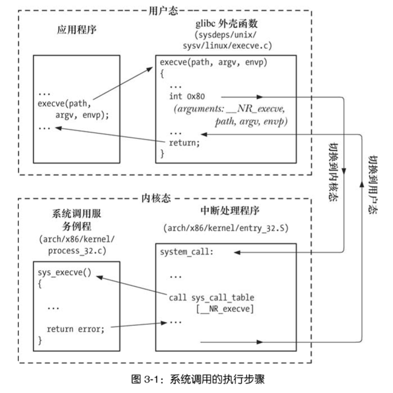

# 03 系统编程概念

任务：

- 掌握什么是系统调用，系统调用执行期间所发生的每个步骤。
- 掌握库函数及其与系统调用之间的差别，并结合这一差异，了解（GNU）C语言函数库。

**无论何时，只要执行了系统调用或者库函数，检查调用的返回状态以确定调用是否成功，这是一条编程铁律**。

## 1 系统调用

系统调用是受控的内核入口，借助于这一机制，进程可以请求内核以自己的名义去执行某 些动作。以应用程序编程接口（API）的形式，内核提供有一系列服务供程序访问。这包括创建 新进程、执行 I/O，以及为进程间通信创建管道等。使用 `man 2 syscall` 可以查看 Linux 系统调用手册。

在深入系统调用的运作方式之前，务必关注以下几点：

1. 系统调用将处理器从用户态切换到核心态，以便 CPU 访问受到保护的内核内存。
2. 系统调用的组成是固定的，每个系统调用都由一个唯一的数字来标识。（程序通过名称来标识系统调用，对这一编号方案往往一无所知。）
3. 每个系统调用可辅之以一套参数，对用户空间（亦即进程的虚拟地址空间）与内核空间之间（相互）传递的信息加以规范。

### 外壳（wrapper）函数

应用程序通过调用 C 语言函数库中的外壳（wrapper）函数，来发起系统调用。具体调用过程参考原书。



### 系统调用返回

在 Linux 上，系统调用服务例程遵循的惯例是调用成功则返回非负值。发生错误时，例程会对相应 errno 常量取反，返回一负值。C 语言函数库的外壳函数随即对其再次取反（负负得正），将结果拷贝至 errno，同时以 -1 作为外壳函数的返回值返回，向调用程序表明有错误发生。**该惯例所依赖的前提条件是系统调用服务例程，若调用成功则不会返回负值，可是， 对于少数例程来说，这一前提并不成立。**

### 系统调用的开销

可以以 `getppid()` 系统调用为例，研判一下发起系统调用的开销—该系统调用只是简 单地返回调用进程的父进程 ID。在作者的一台运行 Linux 2.6.25 的 x86-32 系统上，调用 `getppid()` 一千万次大约需要 2.2 秒钟，每次调用大致需要 0.3 微秒。相形之下，在同一系统 上，调用某个只返回整数的 C 语言函数一千万次，仅需 0.11 秒，约为调用 `getppid()` 耗费时间的 1/20。当然，大多数系统调用的开销都明显高于 `getppid()`。

### 对程序发起的系统调用进行跟踪

使用 strace 命令可以发起的系统调用跟踪。

## 2 库函数

一个库函数是构成标准 C 语言函数库的众多库函数之一。

- 许多库函数（比如，字符串操作函数）不会使用任何系统调用。
- 还有些库函数构建于系统调用层之上。例如，库函数 `fopen()`就利用系统调用 `open()` 来执行打开文件的实际操作。

往往，设计库函数是为了提供比底层系统调用更为方便的调用接口，比如：

- `printf()` 函数可提供格式化输出和数据缓存功能，而 `write()` 系统调用只能输出字节块。
- 与底层的 `brk()`系统调用 相比，`malloc()`和`free()`函数还执行了各种登记管理工作，内存的释放和分配也因此而容易许多。

### 3 标准 C 语言函数库；GNU C 语言函数库（glibc）

标准 C 语言函数库的实现随 UNIX 的实现而异。GNU C 语言函数库（[glibc](http://www.gnu.org/software/libc/)）是 Linux 上最常用的实现。

>Linux 同样支持各种其他 C 语言函数库，其中包括应用于嵌入式设备领域、受限内存 条件下的 C 语言函数库。uClibc（<http://www.uclibc.org/）和> dietlibc（<http://www.fefe.de/dietlibc/>）便是其中的两个例子。

**确定系统的 glibc 版本**：

1. 在 shell 中，可以直接运行 glibc 共享库文件：`/lib/libc.so.6`，将其视为可执行文件来获取 glibc 版本。这会输出各种文本信息，其中也包括了 glibc 的版 本号。
2. 在某些 Linux 发行版中，GNU C 语言函数库的路径名并非“/lib/libc.so.6”。确定该库所在 位置的方法之一是：针对某个与 glibc 动态链接的可执行文件（大多数可执行文件都采用这种 链接方式），运行 ldd（列出动态依赖性）程序。接下来，再检查输出的库依赖性列表，便能 发现 glibc 共享库的位置： `ldd myprog | grep libc`。
3. 应用程序可通过测试常量和调用库函数这两种方法，来确定系统所安装的 glibc 版本
   1. 从版本 2.0 开始，glibc 定义了两个常量：`__GLIBC__` 和 `__GLIBC_MINOR__`，供程序在编译时（在#ifdef 语句中）测试使用。在安装有 glibc 2.12 版本的系统上，以上两个常量的值分别为 2 和 12。然而， 如果程序在 A 系统上编译，而在 B 系统（安装了不同版本的 glibc）上运行，这两个常量作用就有限了。
   2. 程序还可以调用函数 `gnu_get_libc_version()`，来确定运行时的 glibc 版本。

## 4 处理来自系统调用和库函数的错误

几乎每个系统调用和库函数都会返回某类状态值，用以表明调用成功与否。要了解调用 是否成功，必须坚持对状态值进行检查。若调用失败，那么必须采取相应行动。至少，程序应 该显示错误消息，警示有意想不到的事件发生。

>少数几个系统函数在调用时从不失败。例如，`getpid()` 总能成功返回进程的 ID，而 `_exit()` 总能终止进程。无需对此类系统调用的返回值进行检查。

### 处理系统调用错误

1. 每个系统调用的手册页记录有调用可能的返回值，并指出了哪些值表示错误。通常，返回值为 -1 表示出错。
2. 系统调用失败时，会将全局整形变量 errno 设置为一个正值，以标识具体的错误。程序应包含 `<errno.h>` 头文件，该文件提供了对 errno 的声明，以及一组针对各种错误编号而定义的常量。所有这些符号名都以字母 E 开头。在每个手册页内标题为 ERRORS 的章节内都有一份相应系统调用可能返回的 errno 值列表。
3. 如果调用系统调用和库函数成功，errno 绝不会被重置为 0，故此，该变量值不为 0，可能 是之前调用失败造成的。此外，SUSv3 允许在函数调用成功时，将 errno 设置为非零值。因此，在进行错误检查时，必须坚持首先检查函数的返回值是否表 明调用出错，然后再检查 errno 确定错误原因。
4. 少数系统调用（比如，`getpriority()`）在调用成功后，也会返回 −1。要判断此类系统调用 是否发生错误，应在调用前将 errno 置为 0，并在调用后对其进行检查（上述手法同样适用于 某些库函数）。
5. 系统调用失败后，常见的做法之一是根据 errno 值打印错误消息。库函数 `perror()` 和 `strerror()` 就是用于打印错误信息的。
   1. 函数 `perror()` 会打印出其 msg 参数所指向的字符串，紧跟一条与当前 errno 值相对应的消息。
   2. 函数 `strerror()` 会针对其 errnum 参数中所给定的错误号，返回相应的错误字符串。由 `strerror()` 所返回的字符串可以是静态分配的，这意味着后续对 `strerror()` 的调用可能会覆盖该字符串。若无法识别 errnum 所含的错误编号，则 `strerror()` 会返回“Unknown error nnn.”形式的字符串。在某些其他的实现中，在这种情况下，`strerror()`会返回 NULL。

示例代码：

```c
cnt = read(fd, buf, numbytes);
if(cnt == -1){
    if(errno = EINTR){
        perror("read");
        exit(EXIT_FAILURE);
    } else {
        //handle other error
    }
}
```

### 处理来自库函数的错误

不同的库函数在调用发生错误时，返回的数据类型和值也各不相同。具体参考每个函数的手册页。从错误处理的角度来说，可将库函数划分为以下几类。

- 某些库函数返回错误信息的方式与系统调用完全相同—返回值为−1，伴之以 errno 号来表示具体错误。
- 某些库函数在出错时会返回−1 之外的其他值，但仍会设置 errno 来表明具体的出错情况。例如，`fopen()`在出错时会返回一个 NULL 指针，还会根据出错的具体底层系统调用来设置 errno。
- 还有些函数根本不使用 errno。对此类函数来说，确定错误存在与否及其起因的方法各不相同，可见诸于相应函数的手册页中，不应使用 `errno`、`perror()` 或 `strerror()` 来诊断错误。

## 5 常见函数和头文件

略

## 6 可移植性问题

系统调用和库函数 API 的行为受各种标准的制约。这些标准中的一部分是 由 Open Group（SUS）这样的标准机构来制定的，而另一部分则是由具有重要历史意义的两个 UNIX 实现 BSD 和 System V Release 4来定义。

### 特性测试宏

编写可移植性应用程序时，有时会希望各个头文件只显露遵循特定标准的定义（常量、函数原型等）。要达到这一目的，在编译程序时需要定义一个或多个特性测试宏。方式之一是在程序源码包含任何头文件之前，定义相关的宏。术语“特性测试宏”似乎易于让人产生误解，但只要从 UNIX 实现的角度看来，读者便会发现这一称谓其实颇有道理。通过测试（使用`#if`）应用程序为宏所定义的值，实现可以决定应该让哪些（由头文件提供的）特性可见。

```c
//包含任何头文件之前，定义相关的宏
#define _BSD_SOURCE 1

//还可以使用 C 编译器的 -D 选项
cc -D_BSD_SOURCE prog.c
```

具体特性测试宏的作用：比如程序中 `_POSIX_SOURCE`，一经定义（任何值），头文件会显露符合 POSIX.1-1990 和 ISO C（1990）标准的定义。更多特性测试宏及其相关含义参考原书。

### 系统数据类型

随着 UNIX 实现的不同（例如，long 型可能在系统 A 上长度为 4 字节，在系统 B 上 为 8 字节），有时甚至是同一实现中编译环境的不同，这些基本类型的大小各不相同。 更有甚者，不同实现可能会使用不同类型来表示相同信息。例如，进程 ID 在系统 A 上为 int 型，而在系统 B 上为 long 型。为了避免程序的可移植性问题，在涉及到系统相关的数据信息时（比如pid），应该使用系统数据类型，例如，pid_t 数据类型用以表示进程 ID，标准系统数据类型中的大多数，其命名均以_t 结尾。其中的许多都声明于头文件 `<sys/types.h>` 中，余下的少量则定义于其他头文件中。

### 打印系统数据类型

使用 `printf()` 打印系统数据类型时，需要注意不要引入对表现形式的依赖。这一依赖是由于 C 语言的（升级型）自动类型转换造成的。 该转换会将 short 型转换为 int 型，而对于 int 型和 long 型则置之不问。这就意味着传入 `printf()` 的要么为 int 型，要么为 long 型。然而，因为 `printf()`在运行时无从判定其参数类型，调用者必须明确其格式限定符为`%d` 还是 `%ld`。问题在于在 `printf()` 中仅就一种限定符进行编码会导致对实现 的依赖。常见的应对策略是强制转换相应值为 long 型后，再使用`%ld`的限定符。

```c
printf("%d",short)
printf("%d",int)
printf("%ld",long)
printf("%lld",long long)
//glibc 支持以下限定符，但其并未获得所有 UNIX 实现的支持。
printf("%zd", size_t)
printf("%zd", ssize_t)
printf("%jd", intmax_t)
printf("%jd", uintmax_t)
```

### 初始化操作和使用结构

每种 UNIX 实现，都明确定义了一系列标准结构，用于各种系统调用及库函数。比如用来表示信号量操作（通过 `semop()` 系统调用去执行）的结构 sembuf

```c
struct sembuf{
    unsigned short sem_num;//信号号码
    short sem_op;//将被执行的操作
    short sem_flg;//操作标识
}
```

尽管 SUSv3 定义了诸如 sembuf 之类的结构，但意识到如下两点尤为重要。

- 总体而言，未对此类结构内部的字段顺序作出规范。
- 一些情况下，此类结构内会包含额外的、与实现相关的字段。

因此，以如下方式对数据结构进行初始化，其代码是无法移植的：

```c
struct sembuf s = {3,-1,SEM_UNDO};
```

这段初始化程序尽管在 Linux 上运行没有问题，但在其他一些实现上，由于对 sembuf 结构的定义中顺序会有所不同，故而将无法工作。要在初始化时消除此类移植问题，必须明确采用如下赋值语句：

```c
struct sembuf s;
s.sem_num = 3;
s.sem_op = -1;
s.sem_flg = SEM_UNDO;

//如果采用的是 C99 语言标准，可以利用该语言针对结构初始化的新语法，写出等价代码
struct sembuf s = {.sem_num = 3, sem_op = -1, sem_flg = SEM_UNDO};
```
