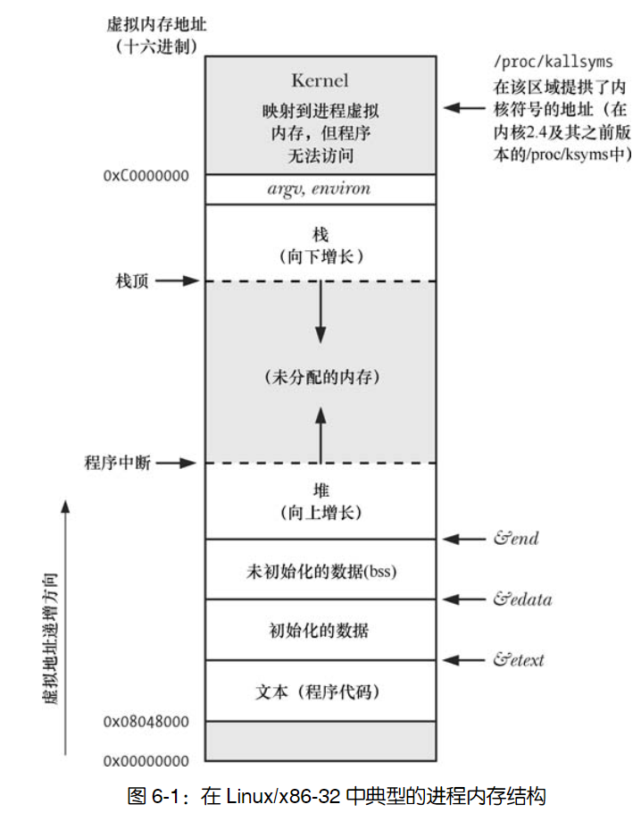

# 六、进程

## 1 进程与程序代关系

- **程序**：是包含了一系列信息的文件，这些信息描述了如何在运行时创建一个进程，程序时静态地存放在磁盘上的。
- **进程（process）**：表现上是一个可执行程序（program）的实例，打开一个程序就创建了一个进程。
- 可以用一个程序来创建许多进程，或者多个进程运行的可以是同一个程序。

进程的本质：其实进程是由内核定义的抽象的实体，并为该实体分配用以执行程序的各项系统资源。从内核角度看，进程由用户内存空间（user-space  memory）和一系列内核数据结构组成，其中：

- 用户内存空间包含了程序代码及代码所使用的变量。
- 内核数据结构则用于维护进程状态信息。记录在内核数据结构中的信息包括许多与进程相关的标识号（IDs）、虚拟内存表、打开文件的描述符表、信号传递及处理的有关信息、进程资源使用及限制、当前工作目录和大量的其他信息。

## 2 进程号

### 什么是进程号

- 每个进程都有一个进程号（PID），进程号是一个正数，用以唯一标识系统中的某个进程。
- 通过 `pid_t pid = getPid` 系统调用可以获取当前进程的进程号。`getPid` 总是可以成功返回。

进程号与父进程号：

- 每个进程都有一个创建自己的父进程。使用系统调用 `getppid()` 可以检索到父进程的进程号。
- 如果某个进程的父进程挂了，则该进程的父进程变为 init 进程。

### 进程号的范围

- init 进程的进程号为 1，其他程序与运行该程序进程的进程号之间没有固定关系。
- Linux 内核限制进程号需小于等于 32767。新进程创建时，内核会按顺序将下一个可用的进程号分配给其使用。每当进程号达到 32767 的限制时，内核将重置进程号计数器，以便从小整数开始分配。
- 一旦进程号达到 32767，会将进程号计数器重置为 300，而不是 1。因为低数值的进程号为系统进程和守护进程所长期占用，在此范围内搜索尚未使用的进程号只会是浪费时间。

### 进程号的范围的扩展

- 在 Linux2.4 版本及更早版本中，进程号的上限 32767，由内核常量 PID_MAX 所定义。
- 在 Linux2.6 版本中进程号的默认上限仍是 32767，但可以通过 Linux 系统特有的 `/proc/sys/kernel/pid_max` 文件来进行调整（其值=`最大进程号+1`）。在 32 位平台中，pid_max 文件的最大值为 32768，但在 64 位平台中，该文件的最大值可以高达到 222（约 400 万），系统可能容纳的进程数量会非常庞大。

### 如何查看进程号

- 一个操作系统中所有进程应该是一个树状的结构。使用 `pstree(1)` 命令可以查看到进程树。
- 通过查看由 Linux 系统所特有的 `/proc/PID/status` 文件所提供的 PPid 字段，可以获知每个进程的父进程。

## 3 进程内存布局

每个进程所分配的内存由很多部分组成，通常称之为“段（segment）”。进程内存布局包括以下部分：

- **文本段**：包含了进程运行的程序机器语言指令。该段具有只读属性，一个程序的多个进程可共享该段。
- **初始化数据段**：包含显式初始化的全局变量和静态变量。
- **未初始化数据段**（bbs）：包含了未进行显式初始化的全局变量和静态变量。区分初始化数据段和未初始化数据段的主要原因是，没有必要在磁盘上为未初始化数据段的数据分配磁盘空间。初始化数据段和未初始化数据段更加准确的名词是：用户初始化数据段（user-initialized data segment）和零初始化数据段。（zero-initialized data segment）。
- **栈（stack）**：是一个动态增长和收缩的段，由栈帧（stack frames）组成。系统会为每个当前调用的函数分配一个栈帧。栈帧中存储了函数的局部变量（自动变量）、实参和返回值。
- **堆（heap）**：是可在运行时（为变量）动态进行内存分配的一块区域。堆顶端称作 program break。

`size(1)`命令可显示二进制可执行文件的文本段、初始化数据段、非初始化数据段（bss）的段大小。

下面程序没有任何功能，用于展示各种数据所属内存段（假定使用了非优化的编译器）。

```c
#include <stdio.h>
#include <stdlib.h>

char globBuf[65536];            /* 未初始化数据段 */
int primes[] = { 2, 3, 5, 7 };  /* 初始化数据段 */

static int
square(int x)                   /* 在 square() 函数的栈帧中分配  */
{
    int result;                 /* 在 square() 函数的栈帧中分配 */

    result = x * x;
    return result;              /* 返回值通过寄存器传递 */
}

static void
doCalc(int val)                 /* 在 doCalc() 函数的栈帧中分配 */
{
    printf("The square of %d is %d\n", val, square(val));

    if (val < 1000) {
        int t;                  /* 在 doCalc() 函数的栈帧中分配 */

        t = val * val * val;
        printf("The cube of %d is %d\n", val, t);
    }
}

int
main(int argc, char *argv[])    /* 在 main() 函数的栈帧中分配 */
{
    static int key = 9973;      /* 初始化数据段 */
    static char mbuf[10240000]; /* 未初始化数据段 */
    char *p;                    /* 在 main() 函数的栈帧中分配 */

    p = malloc(1024);           /* 在堆中分配 */

    doCalc(key);

    exit(EXIT_SUCCESS);
}
```

### 全局符号（symbol）：`etext、edata 和 end`

使用这些可在程序内使用这些符号以获取相应程序文本段、初始化数据段和非初始化数据段结尾处下一字节的地址。

```c
extern char etext, edata, end;
```

### 什么是 ABI

应用程序二进制接口（ABI）是一套规则，规定了二进制可执行文件在运行时应如何与某些服务（诸如内核或函数库所提供的服务）交换信息。ABI特别规定了使用哪些寄存器和栈地址来交换信息以及所交换值的含义，一旦针对某个特定ABI进行了编译，其二进制可执行文件应能在ABI相同的任何系统上运行。

ABI 提供了二进制可以执行问题，而标准化的API（如SUSv3）仅能通过编译源代码来保证应用程序的可移植性。

### 进程内存布局图



### 扩展：为什么栈向下增长，而堆向上增长

>生长方向的设计与虚拟地址空间的分配规则有关，每一个可执行 C 程序，从低地址到高地址依次是：`text，data，bss，堆，栈，环境参数变量`；其中堆和栈之间有很大的地址空间空闲着，在需要分配空间的时候，堆向上涨，栈往下涨。”这样设计可以使得堆和栈能够充分利用空闲的地址空间。如果栈向上涨的话，我们就必须得指定栈和堆的一个严格分界线，但这个分界线怎么确定呢？平均分？但是有的程序使用的堆空间比较多，而有的程序使用的栈空间比较多。所以就可能出现这种情况：一个程序因为栈溢出而崩溃的时候，其实它还有大量闲置的堆空间呢，但是我们却无法使用这些闲置的堆空间。所以呢，最好的办法就是让堆和栈一个向上涨，一个向下涨，这样它们就可以最大程度地共用这块剩余的地址空间，达到利用率的最大化！——参考[判断栈和堆的生长方向](https://www.cnblogs.com/youxin/p/3313288.html)

## 4 虚拟内存管理

### 虚拟内存管理技术

实际运行的进程中的内存地址并不与实际的物理内存地址相对应，我们的程序访问的都是虚拟内存，虚拟内存和实际物理内存存在着映射关系，这个映射关系由操作系统内核维护。

### 局部性原理

虚拟内存管理技术利用了大多数程序的一个典型特征，即访问局部性（locality of reference），以求高效使用 CPU 和 RAM（物理内存）资源。大多数程序都展现了两种类型的局部性：

- **空间局部性（Spatial  locality）**：是指程序倾向于访问在最近访问过的内存地址附近的内存（由于指令是顺序执行的，且有时会按顺序处理数据结构）。
- **时间局部性（Temporal  locality）**：是指程序倾向于在不久的将来再次访问最近刚访问过的内存地址（由于循环）。

### 驻留集（resident  set）和交换区

1. 由于局部性原理，使得程序即便仅有部分地址空间存在于RAM中，依然可能得以执行。
2. 虚拟内存管理技术将每个程序使用的内存切割成小型的、固定大小的 **“页”（page）单元**。相应地，将 RAM 划分成一系列与虚存页尺寸相同的页帧。
3. 任一时刻，每个程序仅有部分页需要驻留在物理内存页帧中。这些页构成了所谓 **驻留集（resident  set）**。程序未使用的页拷贝保存在 **交换区（swap  area）** 内—这是磁盘空间中的保留区域，作为计算机 RAM 的补充—仅在需要时才会载入物理内存。
4. 进程欲访问的页面目前并未驻留在物理内存中，将会发生页面错误（page fault），内核即刻挂起进程的执行，同时从磁盘中将该页面载入内存。

### page 的大小

- 在 x86-32 中，页面大小为 4096 个字节。其他一些Linux实现使用的页面比4096个字节更大。
- 程序可调用 `sysconf(_SC_PAGESIZE)` 来获取系统虚拟内存的页面大小。

### 虚拟内存映射

- 内核需要为每个进程维护一张页表（page table），该页表描述了每页在进程虚拟地址空间（virtual address space）中的位置（可为进程所用的所有虚拟内存页面的集合）。
- 页表中的每个条目要么指出一个虚拟页面在RAM中的所在位置，要么表明其当前驻留在磁盘上。
- 若进程试图访问的地址并无页表条目与之对应，那么进程将收到一个 SIGSEGV 信号。这个与进程欲访问的页面目前并未驻留在物理内存中的情况是不同的。

### 触发进程的有效虚拟地址范围发生变化的场景

进程的有效虚拟地址范围在其生命周期中可以发生变化，主要出现在如下场景中：

- 由于栈向下增长超出之前曾达到的位置时。
- 当在堆中分配或释放内存时。
- 当调用 `mmap()` 创建内存映射时，或者当调用 `munmap()` 解除内存映射时。
- 当调用 `shmat()` 连接 System V 共享内存区时，或者当调用 `shmdt()` 脱离共享内存区时。

### 虚拟内存管理技术的优点

- 进程与进程、进程与内核相互隔离，所以一个进程不能读取或修改另一进程或内核的内存。
- 两个或者更多进程能够共享内存。通过虚拟内存映射到同一个物理内存位置。
- 便于实现内存保护机制，可以对页表条目进行标记，以表示相关页面内容是可读、可写、可执行亦或是这些保护措施的组合。
- 程序员和编译器、链接器之类的工具无需关注程序在 RAM 中的物理布局。
- 需要驻留在内存中的仅是程序的一部分，所以程序的加载和运行都很快。而且，一个进程所占用的内存（即虚拟内存大小）能够超出 RAM 容量。
- 由于每个进程使用的 RAM 减少了，RAM 中同时可以容纳的进程数量就增多了。这增大了如下事件的概率：在任一时刻，CPU 都可执行至少一个进程，因而往往也会提高 CPU 的利用率。

## 5 栈和栈帧

什么是栈、栈帧：

- 每次调用函数时，会在栈上新分配一帧，每当函数返回时，再从栈上将此帧移去。
- 用户栈（user  stack）与内核栈：内核栈是每个进程保留在内核内存中的内存区域，在执行系统调用的过程中供（内核）内部函数调用使用。用户栈驻留在不受保护的用户内存中，所以内核无法利用用户栈来达成这一目的。

每个（用户）栈帧包括的信息：

- 函数实参和局部变量：当函数退出时，对应的栈帧被释放，其保持的实参和句部变量也会被释放。
- 函数调用的链接信息：每个函数都会用到一些CPU寄存器，比如程序计数器，其指向下一条将要执行的机器语言指令。每当一函数调用另一函数时，会在被调用函数的栈帧中保存这些寄存器的副本，以便函数返回时能为函数调用者将寄存器恢复原状。

## 6 命令行参数：`argc, argv`

每个 C 语言程序都必须有一个称为 `main()` 的函数，作为程序启动的起点。当执行程序时，命令行参数。

```c
/**
 * argc 表示参数的个数。
 * argv 是参数数组：
 *  - 每个参数以空（null）字节终止
 *  - 第一个元素未调用该程序时的程序名称
 *  - argv[argc] = NULL。
 */
int main(int argc, char *argv[]) {

}
```

`argc/argv`参数机制的局限之一在于这些变量仅对 `main()` 函数可用，处理把 `argc/argv` 传递给其他函数或者将其设置为全局变量之外，还有两种方式可以获取些信息的部分或者全部内容：

- 通过 linux 系统专有的 `/proc/PID/cmdline` 文件可以读取任一进程的命令行参数。每个参数以空（null）字节终止。
- GNU C 语言库提供有两个全局变量，可在程序内任一位置使用以获取调用该程序时的程序名称。

## 7 环境列表

### 什么是环境列表

- 每一个进程都有与其相关的称之为环境列表（environment  list）的字符串数组，或简称为环境（environment）。
- 其中每个字符串都以名称=值（name=value）形式定义。因此，环境是“名称-值”的成对集合，可存储任何信息。
- 列表中的名称称为环境变量（environment variables）。

### 环境列表的单继承性

- 新进程在创建之时，会继承其父进程的环境副本。这是一种原始的进程间通信方式。
- 子进程只有在创建时才能获得其父进程的环境副本，这一信息传递是单向的、一次性的。
- 子进程创建后，父、子进程均可更改各自的环境变量，且这些变更对对方而言不再可见。

### 在 shell 中访问环境变量

```shell
# 定义变量
A=B
# 使用 export 向环境中添加变量值
export A

# 撤销一个变量
unset A

# 打印所有变量
printenv
```

### 通过文件访问环境

- 通过 Linux 专有的 `/proc/PID/environ` 文件检查任一进程的环境列表，每一个`“NAME=value”`对都以空字节终止。

### 从程序中访问环境

- 使用全局变量 `extern char  **environ` 访问环境列表，C 运行时启动代码定义了该变量并以环境列表位置为其赋值。
- 过声明 `main()` 函数中的第三个参数来访问环境列表：`int main(int argc, char* argv[], char* envp[]`。
- 其他相关函数，具体用法参考原书：
  - `getenv()`
  - `putenv()`
  - `setenv()`
  - `unusetenv()`
  - `clearenv()`

## 8 执行非局部跳转：`setjmp()和longjmp()`

- goto 可以在函数内进行跳转。
- `setjmp()和longjmp()` 可以跨函数进行跳转。
- 使用跳转会使程序难以阅读，应该尽可能避免使用 `setjmp()`函数和 `longjmp()` 函数。
