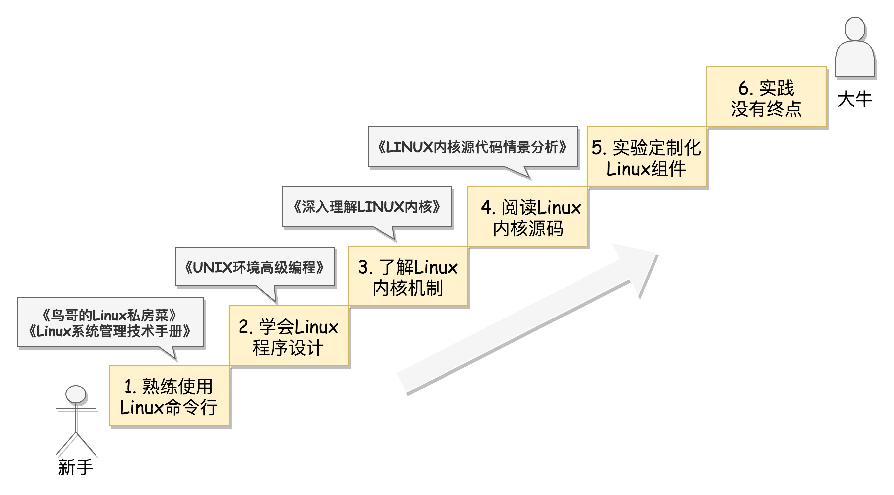

# 学习路径：爬过这六个陡坡，你就能对Linux了如指掌

- Windows：基于图形化界面操作模式
- Linux：基于命令行的操作模式

Linux 上手难，学习曲线陡峭，所以它的学习过程更像一个爬坡模式。在整个 Linux 的学习过程中，要爬的坡有六个，分别是：

- 熟练使用 Linux 命令行
- 使用 Linux 进行程序设计
- 了解 Linux 内核机制
- 阅读 Linux 内核代码
- 实验定制 Linux 组件
- 落到生产实践上。

## 第一个坡：抛弃旧的思维习惯，熟练使用 Linux 命令行

上手 Linux 的第一步，要先从 Windows 的思维习惯，切换成 Linux 的“命令行 + 文件”使用模式。

- 在 Linux 中，无论我们做什么事情，都会有相应的命令工具。这些命令一般会在 bin 或者 sbin 目录下面。
- 一旦找到某个命令行工具，替代输入框的是各种各样的启动参数。这些参数怎么填，一般可以通过 -h 查看 help，也可以通过 man 目录查看具体的命令文档。
- 进阶命令：`进阶：sed、awk、正则、管道、grep、find、shell脚本、vim、git`

相关书籍推荐：

- 《鸟哥的 Linux 私房菜》
- 《Linux 系统管理技术手册》（ Linux 运维手边必备）
- [别出心裁的Linux命令学习法](https://www.cnblogs.com/rocedu/p/4902411.html)

## 第二个坡：通过系统调用或者 glibc，学会自己进行程序设计

- 用代码操作 Linux，可以直接使用 Linux 系统调用，也可以使用 glibc 的库。
- Linux 的系统调用非常多，而且每个函数都非常复杂，传入的参数、返回值、调用的方式等等都有很多讲究。
- 每个系统调用都要进行深入地学习、读文档、做实验。

书籍推荐

- 《Unix/Linux编程实践教程》
- 《UNIX 环境高级编程》

## 第三个坡：了解 Linux 内核机制，反复研习重点突破

当你已经会使用代码操作 Linux 的时候，你已经很希望解开这层面纱，看看系统调用背后到底做了什么。

- 进一步了解内核的原理，有助于你更好地使用命令行和进行程序设计，能让你的运维和开发水平上升一个层次
- 不建议你直接看代码，因为 Linux 代码量太大，很容易迷失，找不到头绪。最好的办法是，**先了解一下 Linux 内核机制，知道基本的原理和流程就可以了**。

书籍推荐

- 《深入理解 LINUX 内核》
- 《庖丁解牛Linux内核分析》

## 第四个坡：阅读 Linux 内核代码，聚焦核心逻辑和场景

在了解内核机制的时候，你肯定会遇到困惑的地方，因为理论的描述和提炼虽然能够让你更容易看清全貌，但是容易让你忽略细节。

方法：**一开始阅读代码不要纠结一城一池的得失，不要每一行都一定要搞清楚它是干嘛的，而要聚焦于核心逻辑和使用场景。**

书籍推荐：

- 《LINUX 内核源代码情景分析》

## 第五坡：实验定制化 Linux 组件，已经没人能阻挡你成为内核开发工程师了

纸上得来终觉浅，绝知此事要躬行。从只看内核代码，到上手修改内核代码，这又是一个很大的坎。

Linux 有源代码，很多地方可以参考现有的实现，定制化自己的模块。例如，你可以自己实现一个设备驱动程序，实现一个自己的系统调用，或者实现一个自己的文件系统等等。

## 最后一坡：面向真实场景的开发，实践没有终点

真正的高手都是在实战中摸爬滚打练出来的。

## 总结

