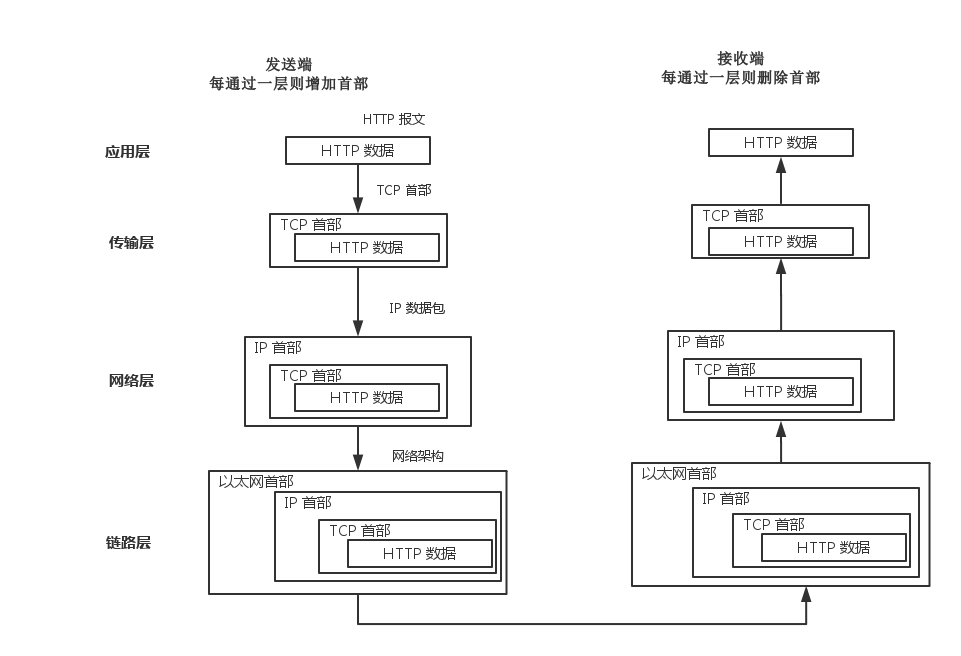
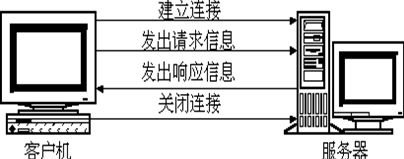
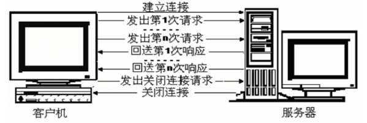

# Http基础

---
## 1 Http协议简述

Http（`hyperText tranfer protocol`）协议即超文本传输协议，基于tcp/ip的应用层协议，定义了WEB浏览器与WEB服务器之间的一问一答的交互过程的规则。

http协议的主要特点：

1. 支持客户端/服务器模式
2. 简单快速，客户端向服务器请求服务时，只需要传送方法和路径
3. 灵活，HTTP 允许传输任意类型的数据对象。正在传输的类型由 Content-Type 加以标记
4. 无连接，限制每次连接只处理一个请求
5. 无状态，http协议是无状态协议，无状态是指协议对于事务处理没有记忆能力，缺少状态意味着如果后继处理需要前面的数据信息，则它需要重传

根据网络分层，一个Http请求的过程为：



---
## 2 http协议的版本

### 2.1 Http1.0

1，浏览器与WEB服务器的连接过程是短暂的，每次连接只处理一个请求和响应。对每一个页面的访问，浏览器与WEB服务器都要建立一次单独的连接。

>比如：在一个HTML页面中如果包含标记的话，当浏览器解析到这些标记时，还会向服务器请求访问标记中指定的文件，即再次建立连接并发出HTTP请求。




2，浏览器到WEB服务器之间的所有通讯都是完全独立分开的请求和响应
3，Http是无状态的


### 2.2 Http1.1

Http1.1是基于http1.0改进的协议，有如下特点：

1，建议一次连接可以发送和接收到多次响应
2，多个请求和响应过程可以重叠
3，增加了更多的请求方式，以及请求头和响应头，比如Host、If-Unmodified-Since请求头等




### 2.3 Http2.0

略

---
## 3 Http协议：请求

### 3.1 请求消息

客户端连上服务器后，向服务器请求某个web资源，称之为客户端向服务器发送了一个HTTP请求。一个完整的HTTP请求包括如下内容：

- 一个请求行，包括请求方式、请求的资源名称、http版本号，用空格隔开。
- 若干个消息头（可选），每个消息头占一行
- 请求正文（可选，请求正文与消息头要用空行隔开）

示例：


    GET /books/java.html HTTP/1.1         ----->   **请求行**（请求方式，请求的资源名称，http版本号）
    Accept: */*                          |
    Accept-Language: en-us               |
    Connection: Keep-Alive               |
    Host: localhost                      |----->   **请求头**（用于描述客户端请求哪台主机，以及客户端的一些环境信息）
    Referer: http://localhost/links.asp  |
    User-Agent: Mozilla/4.0              |
    Accept-Encoding: gzip, deflate       |
                          一个空行
    然后是请求正文

### 3.2  Http请求行

#### 格式

请求方式 资源路径 Http协议版本号 如： `GET /books/java.html HTTP/1.1`

#### 请求方式

- GET，请求获取Request-URI所标识的资源，向指定的资源发出“显示”请求，使用 GET 方法应该只用在读取数据上，而不应该用于产生“副作用”的操作中
- POST，指定资源提交数据，请求服务器进行处理（例如提交表单或者上传文件）。数据被包含在请求文本中。这个请求可能会创建新的资源或者修改现有资源，或两者皆有。
- HEAD，请求获取有Request-URI所标识的响应消息报头，与 GET 方法一样，都是向服务器发出指定资源的请求，只不过服务器将不传回资源的本文部分，它的好处在于，使用这个方法可以在不必传输全部内容的情况下，就可以获取其中关于该资源的信息（原信息或称元数据）
- OPTIONS，使服务器传回该资源所支持的所有HTTP请求方法。用`*`来代替资源名称，向 Web 服务器发送 OPTIONS 请求，可以测试服务器功能是否正常运作
- DELETE，请求服务器删除Request-URI所标识的资源
- TRACE，请求服务器回送收到的请求信息，主要用于测试和诊断
- PUT，请求服务器存储一个资源，并用Request-URI标识

如果没有指明请求方式，默认的请求发送都是get请求

#### GET方式与POST方式的区别

- **如果请求方式为GET方式**
    - 可以在请求的URL地址后以?的形式带上交给服务器的数据，多个数据之间以&进行分隔，例如：
    `GET /mail/1.html?name=abc&password=xyz HTTP/1.1`
    - HTTP 本身没有限制 GET 方式 URL 的长度，但是浏览器会对其进行限制
    - GET 的请求方式没有包含主体
    - GET 用于向服务器获取一份文档
- **如果请求方式为POST方式**
    - 在请求的正文内容中向服务器发送数据
    - 用于向服务提交需要处理的数据
    - POST 可以发送各种数据类型：普通表单、MultiPart表单，纯文本，二进制等等
    - 安全系数一样不高，只用不是进行HTTPS通讯，都容易被破击
- **Http请求的URL字符遵循以下规范**
    - 保留字符 `**A-Z、a-z、0-9、-*_**`
    - 用+字符替换所有的空格
    - 将其他所有字符编码为 UTF-8，并将每个字节都编码为%后面紧跟一个两位的十六进制的数字。
    - POST请求中，仍需要对请求体中的key-value进行URL编码，并用&字符将它们隔开。
    - 在语义上，GET用于获取信息，POST用于提交数据


### 3.3 Http请求头

请求头字段用于客户端在请求消息中向服务器传递附加信息，主要包括客户端可以接受的**数据类型(MIME类型)**、**压缩方法**、**语言**以及发出请求的超链接所属页面的URL地址等信息。

常用请求头：

- `Accept: text/html,application/xhtml+xml`  浏览器可接受的MIME类型
- `Accept-Charset: UTF-8` 浏览器通过这个头告诉服务器，它支持哪种字符集
- `Accept-Encoding: gzip` 浏览器能够进行解码的数据编码方式，比如gzip
- `Accept-Language: zh-CN` 浏览器所希望的语言种类，当服务器能够提供一种以上的语言版本时要用到。 可以在浏览器中进行设置。
- `Host: www.google.com` 初始URL中的主机和端口
- `Refere www.google.com`:包含一个URL，用户从该URL代表的页面出发访问当前请求的页面
- `Content-Type:img/jpeg` 媒体内容类型
- `If-Modified-Since: Wed, 02 Feb 2011 12:04:56 GMT` 利用这个头与服务器的文件进行比对，如果一致，则从缓存中直接读取文件。
- `User-Agent: Mozilla/5.0 (Windows NT 10.0; Win64; x64) AppleWebKit/537.36 (KHTML, like Gecko) Chrome/65.0.3325.181 Safari/537.36Mozilla/5.0 (Windows NT 10.0; Win64; x64) AppleWebKit/537.36 (KHTML, like Gecko) Chrome/65.0.3325.181 Safari/537.36` 表示执行请求的浏览器类型
- `Content-Length: 123` 表示请求消息正文的长度
- `Connection: Keep -Alive` 表示是否需要持久连接（HTTP 1.1默认进行持久连接）
- `Cookie: xxx` 这是最重要的请求头信息之一，用于在客户端保存一些重要的用户信息
- `Date：Date: Mon, 22 Aug 2011 01:55:39 GMT` 请求时间GMT

### 3.3 Http请求体

Http请求体是可选的，请求体用于向服务器传输具体的数据。一般情况想有一下几种形式：

#### form表单

form表单常见于浏览器提交数据，比如一个注册页面，多个键值对之间用 `&` 连接，键与值之间用 `=` 连接，且只能用 ASCII 字符，非 ASCII 字符需使用UrlEncode编码，比如`key1=value1&key2=value2`。

```
POST http://www.example.com HTTP/1.1
Content-Type: application/x-www-form-urlencoded;charset=utf-8

title=test&age=28&sub%5B%5D=1
```

#### multipart

multipart用于向服务器上传文件与提交表达数据，ContextType为`multipart/form-data; boundary=----WebKitFormBoundaryhqr13NeJHnxtf8C3`，这种格式最先是被用于邮件传输中，每个字段/文件都被 boundary（Content-Type中指定的）分成单独的段，每段以`--`加 boundary 开头，然后是该段的描述头，描述头之后空一行接内容，请求结束的标识为 boundary 后面加`--`，区分part是否被当成文件的关键是 Content-Disposition 是否包含 filename，因为文件有不同的类型，所以还要使用 Content-Type 指示文件的类型，如果不知道是什么类型取值可以为 application/octet-stream 表示文件是一个二进制的文件，如果part不是文件则 Content-Type 可以省略，示例：

```
Accept-Language: zh-CN,zh;q=0.9,en;q=0.8
Cache-Control: max-age=0
Connection: keep-alive
Content-Length: 300
Content-Type: multipart/form-data; boundary=----WebKitFormBoundaryhqr13NeJHnxtf8C3

------WebKitFormBoundaryhqr13NeJHnxtf8C3//第一个部分
Content-Disposition: form-data; name="username"

你好
------WebKitFormBoundaryhqr13NeJHnxtf8C3//第二部分
Content-Disposition: form-data; name="photo"; filename="file.txt"
Content-Type: text/plain

...文件的二进制数据
------WebKitFormBoundaryhqr13NeJHnxtf8C3--//结束，这里还有一个\r\n
```

#### 其他类型的请求体

比如在请求时，直接上传二进制、json等，在请求体头使用ContextType表示请求体的媒体类型。


---
## 4 Http协议：响应

### 4.1  Http响应消息

一个HTTP响应代表服务器向客户端回送的数据。一个完整的HTTP响应包括如下内容：

- 响应行
- 若干个消息头（可选）
- 响应正文（可选，与响应消息头用空行隔开）

示例：

    HTTP/1.1 200 OK                      -----> 响应行（Http协议版本，状态码，状态码描述）
    Server: Microsoft-IIS/5.0            |
    Date: Thu, 13 Jul 2000 05:46:53 GMT  |
    Content-Length: 2291                 |-----> 用于描述服务器的基本信息，服务器通过这些信息告知客户端如何处理服务器将要发送的数据
    Content-Type: text/html              |
    Cache-control: private               |
                      一个空行
    <HTML>
    <BODY>                               |----->响应正文
    ……


###  4.2 Http状态行

状态行：

1. 格式：`HTTP协议版本号 状态码 状态码说明` 如：`HTTP/1.1 200 OK`，三个部分，用空格隔开
2. 状态码用于表示服务器对请求的各种不同处理结果和状态，它是一个三位的十进制数。响应状态码分为5类，使用最高位为1到5来进行分类如下所示：


**常用的状态码**：

- **200**：表示一切正常，返回的是正常请求结果
- **302/307**：指出被请求的文档已被临时移动到别处，此文档的新的URL在Location响应头中给出
- **304**：表示客户机缓存的版本是最新的，客户机可以继续使用它，无需到服务器请求。
- **404**：服务器上不存在客户机所请求的资源
- **500**：服务器端的程序发生错误

### 4.3 Http响应头

- `Location: http://www.it315.org/index.jsp` 告知客户端，资源的新地址。一般与302响应码一同实现请求的重定向。
- `Server: apache tomcat` 指示服务器的类型
- `Content-Encoding: gzip` 服务器发送的数据采用的编码类型
- `Content-Length: 80` 告诉浏览器正文的长度
- `Content-Language: zh-cn` 服务发送的文本的语言
- `Content-Type: text/html; charset=GB2312` 服务器发送的内容的MIME类型
- `Last-Modified: Tue, 11 Jul 2000 18:23:51 GMT` 文件的最后修改时间
- `Refresh: 1;url=http://www.it315.org` 指示客户端刷新频率。单位是秒
- `Content-Disposition: attachment; filename=aaa.zip` 指示客户端下载文件
- `Set-Cookie:SS=Q0=5Lb_nQ; path=/search` 服务器端发送的Cookie
- `Expires: -1` 缓存有效期
- `Cache-Control: no-cache` 缓存控制策略(1.1)
- `Pragma: no-cache` 缓存相关(1.0)
- `Connection: Keep-Alive` 是否持久连接
- `Date: Tue, 11 Jul 2000 18:23:51 GMT` 响应时间
- `Content-Disposition: attachment;filename=22.jpg` 告知客户端，用下载的方式访问。
- `Refresh: 1` 每隔一秒刷新一次


----
## 5 Http请求与响应的共性

- 使用消息头，可以实现HTTP客户机与服务器之间的条件请求和应答，消息头相当于服务器和浏览器之间的一些暗号指令。
- 每个消息头包含一个头字段名称，然后依次是冒号、空格、值、回车和换行符，如： `Accept-Encoding: gzip, deflate`
- 消息头字段名是不区分大小写的，但习惯上讲每个单词的第一个字母大写。
- 整个消息头部分中的各行消息头可按任何顺序排列。
- 消息头又可分为**通用信息头**、**请求头**、**响应头**、**实体头**等四类
- 许多请求头字段都允许客户端在值部分指定多个可接受的选项，多个选项之间以逗号分隔。
- 有些头字段可以出现多次，例如，响应消息中可以包含有多个”Warning”头字段。

---
## 6 MIME类型

**多用途互联网邮件扩展**（**MIME**，**Multipurpose Internet Mail Extensions**），MIME是通过标准化电子邮件报文的头部的附加域（fields）而实现的；这些头部的附加域，描述新的报文类型的内容和组织形式。

内容类型（Content-Type），这个头部领域用于指定消息的类型。一般以下面的形式出现。

格式：`Content-Type: [type]/[subtype]; parameter`
示例：`text/html;charset=utf-8`

type有下面的形式。

*   Text：用于标准化地表示的文本信息，文本消息可以是多种字符集和或者多种格式的；
*   Multipart：用于连接消息体的多个部分构成一个消息，这些部分可以是不同类型的数据；
*   Application：用于传输应用程序数据或者二进制数据；
*   Message：用于包装一个E-mail消息；
*   Image：用于传输静态图片数据；
*   Audio：用于传输音频或者音声数据；
*   Video：用于传输动态影像数据，可以是与音频编辑在一起的视频数据格式。

subtype用于指定type的详细形式。content-type/subtype配对的集合和与此相关的参数，将随着时间而增长。为了确保这些值在一个有序而且公开的状态下开发，MIME使用Internet Assigned Numbers Authority (IANA)作为中心的注册机制来管理这些值。常用的subtype值如下所示：

*   `text/plain`（纯文本）
*   `text/html`（HTML文档）
*   `application/xhtml+xml`（XHTML文档）
*   `image/gif`（GIF图像）
*   `image/jpeg`（JPEG图像）【PHP中为：image/pjpeg】
*   `image/png`（PNG图像）【PHP中为：image/x-png】
*   `video/mpeg`（MPEG动画）
*   `application/octet-stream`（任意的二进制数据）
*   `application/pdf`（PDF文档）
*   `application/json`（json文件）
*   `application/msword`（Microsoft Word文件）
*   `application/vnd.wap.xhtml+xml` (wap1.0+)
*   `application/xhtml+xml` (wap2.0+)
*   `message/rfc822`（RFC 822形式）
*   `multipart/alternative`（HTML邮件的HTML形式和纯文本形式，相同内容使用不同形式表示）
*   `application/x-www-form-urlencoded`（使用HTTP的POST方法提交的表单）
*   `multipart/form-data`（同上，但主要用于表单提交时伴随文件上传的场合）

---
## 7 Http Java 编程

Http 客户端 API 底层实现都是对 Socket 的封装，常用的 API 有以下几种：

- HttpUrlConnection(Java 原生 API)
- [ApcheHttpClient](http://hc.apache.org/downloads.cgi)
- Square-OkHttp（适用于 Android）

---
## 8  附录：Http 响应码对照


|响应码 | msg | 详细说明|
| --- | --- |---|
| 100  |  继续发送请求 |这个临时响应是用来通知客户端它的部分请求已经被服务器接收，且仍未被拒绝。客户端应当继续发送请求的剩余部分，或者如果请求已经完成，忽略这个响应。服务器必须在请求完成后向客户端发送一个最终响应。|
| 101  |  需要切换协议 |服务器已经理解了客户端的请求，并将通过Upgrade消息头通知客户端采用不同的协议来完成这个请求。只有在切换新的协议更有好处的时候才应该采取类似措施。|
| 102  |  正在处理中 |由WebDAV（RFC 2518）扩展的状态码，代表处理将被继续执行。|
| 200 | 成功  |请求已成功，请求所希望的响应头或数据体将随此响应返回。|
| 201  | 成功，请求已被处理（新资源已创建）  |请求已经被实现，而且有一个新的资源已经依据请求的需要而建立，且其 URI 已经随Location 头信息返回。假如需要的资源无法及时建立的话，应当返回 '202 Accepted'。|
| 202  | 成功，请求已被接受，但尚未处理  |服务器已接受请求，但尚未处理。正如它可能被拒绝一样，最终该请求可能会也可能不会被执行。在异步操作的场合下，没有比发送这个状态码更方便的做法了。|
| 203  | 成功，非有效信息   |服务器已成功处理了请求，但返回的实体头部元信息不是在原始服务器上有效的确定集合，而是来自本地或者第三方的拷贝。当前的信息可能是原始版本的子集或者超集。|
| 204  | 成功，但无信息内容  |服务器成功处理了请求，但不需要返回任何实体内容|
| 205  | 成功，无信息内容，但需重置旧内容  |服务器成功处理了请求，且没有返回任何内容。但是与204响应不同，返回此状态码的响应要求请求者重置文档视图。|
| 206  |  服务器已经成功处理了范围 GET 请求。 | 服务器已经成功处理了范围 GET 请求。|
| 207  |  成功，各部分处理均成功 | 由WebDAV(RFC 2518)扩展的状态码，代表之后的消息体将是一个XML消息，并且可能依照之前子请求数量的不同，包含一系列独立的响应代码。|
| 300  | 重定向，多地址可选  |被请求的资源有一系列可供选择的回馈信息，每个都有自己特定的地址和浏览器驱动的商议信息。|
| 301 | 永久性转移  |被请求的资源已永久移动到新位置，并且将来任何对此资源的引用都应该使用本响应返回的若干个 URI 之一。|
| 302  |  暂时性转移 |请求的资源现在临时从不同的 URI 响应请求。由于这样的重定向是临时的，客户端应当继续向原有地址发送以后的请求。|
| 303  |  重定向，应该使用另外一个地址|对应当前请求的响应可以在另一个 URI 上被找到，而且客户端应当采用 GET 的方式访问那个资源。|
| 304  |  内容未改变 |如果客户端发送了一个带条件的 GET 请求且该请求已被允许，而文档的内容（自上次访问以来或者根据请求的条件）并没有改变，则服务器应当返回这个状态码。304响应禁止包含消息体，因此始终以消息头后的第一个空行结尾。|
| 305  |  应该使用代理访问 |被请求的资源必须通过指定的代理才能被访问。Location 域中将给出指定的代理所在的 URI 信息，接收者需要重复发送一个单独的请求，通过这个代理才能访问相应资源。只有原始服务器才能建立305响应。|
| 306  |  306状态码已经不再被使用 |在最新版的规范中，306状态码已经不再被使用。|
| 307  | 暂时重定向  |请求的资源现在临时从不同的URI 响应请求。由于这样的重定向是临时的，客户端应当继续向原有地址发送以后的请求。|
|  400 | 鉴权失败  |当前请求需要用户验证。该响应必须包含一个适用于被请求资源的 WWW-Authenticate 信息头用以询问用户信息。|
|401|鉴权失败|当前请求需要用户验证。该响应必须包含一个适用于被请求资源的 WWW-Authenticate 信息头用以询问用户信息。|
|  402 | 预留状态码  |该状态码是为了将来可能的需求而预留的。|
|  403 | 拒绝执行  |服务器已经理解请求，但是拒绝执行它。与401响应不同的是，身份验证并不能提供任何帮助，而且这个请求也不应该被重复提交。|
|  404 |  未发现内容 |请求失败，请求所希望得到的资源未被在服务器上发现。没有信息能够告诉用户这个状况到底是暂时的还是永久的。|
|  405 | 请求方法不被允许  |请求行中指定的请求方法不能被用于请求相应的资源。该响应必须返回一个Allow 头信息用以表示出当前资源能够接受的请求方法的列表。|
|  406 | 内容不符合条件  | 请求的资源的内容特性无法满足请求头中的条件，因而无法生成响应实体。|
|  407 | 代理服务器上鉴权失败  |与401响应类似，只不过客户端必须在代理服务器上进行身份验证。|
|  408 | 客户端请求已超时  | 请求超时。客户端没有在服务器预备等待的时间内完成一个请求的发送。|
|  409 | 冲突  |由于和被请求的资源的当前状态之间存在冲突，请求无法完成。|
|  410 |  资源不再可用 |被请求的资源在服务器上已经不再可用，而且没有任何已知的转发地址。这样的状况应当被认为是永久性的。|
|  411 | 请求需要消息体长度  |服务器拒绝在没有定义 Content-Length 头的情况下接受请求。|
|  412 | 请求不满足前提条件  |服务器在验证在请求的头字段中给出先决条件时，没能满足其中的一个或多个。|
|  413 |  提交数据大小超过服务器接受范围 |服务器拒绝处理当前请求，因为该请求提交的实体数据大小超过了服务器愿意或者能够处理的范围。|
|  414 | 请求URI太长  | 请求的URI 长度超过了服务器能够解释的长度，因此服务器拒绝对该请求提供服务。|
|  415 | 请求提交的格式不被服务器支持  |对于当前请求的方法和所请求的资源，请求中提交的实体并不是服务器中所支持的格式，因此请求被拒绝。|
|  416 | 请求的数据区域不合法  |如果请求中包含了 Range 请求头，并且 Range 中指定的任何数据范围不合法。|
|  417 |  请求Expect中的内容无法被满足 |在请求头 Expect 中指定的预期内容无法被服务器满足，或者这个服务器是一个代理服务器，它有明显的证据证明在当前路由的下一个节点上，Expect 的内容无法被满足。|
|  421 | 客户端IP地址到服务器的连接数超过了最大范围  |从当前客户端所在的IP地址到服务器的连接数超过了服务器许可的最大范围。|
|  422 |  请求格式正确，但语义错误 |请求格式正确，但是由于含有语义错误，无法响应。|
|  423 | 当前资源被锁定  |当前资源被锁定|
|  424 | 之前的请求发生错误  | 由于之前的某个请求发生的错误，导致当前请求失败，例如 PROPPATCH。|
|  425 |  之前的请求发生错误 |由于之前的某个请求发生的错误，导致当前请求失败，例如 PROPPATCH。|
|  426 |  客户端应当切换到TLS/1.0 |客户端应当切换到TLS/1.0。|
|  449 | 请在执行完适当的操作后进行重试  |由微软扩展，代表请求应当在执行完适当的操作后进行重试。|
|  500 | 服务器出错  |服务器遇到了一个未曾预料的状况，导致了它无法完成对请求的处理。|
|  501 | 方法未实现  |当服务器无法识别请求的方法，并且无法支持其对任何资源的请求。|
|  502 |  错误网关 | 作为网关或者代理工作的服务器尝试执行请求时，从上游服务器接收到无效的响应。|
|  503 | 服务当前不可用  |由于临时的服务器维护或者过载，服务器当前无法处理请求。|
|  504 |  网关超时 |作为网关或者代理工作的服务器尝试执行请求时，未能及时从上游服务器（URI标识出的服务器，例如HTTP、FTP、LDAP）或者辅助服务器（例如DNS）收到响应。|
|  505 | 不支持的HTTP版本  |服务器不支持，或者拒绝支持在请求中使用的 HTTP 版本。|
|  506 |  服务器配置有误 |由《透明内容协商协议》（RFC 2295）扩展，代表服务器存在内部配置错误|
|  507 |  服务器空间不足 |服务器无法存储完成请求所必须的内容。这个状况被认为是临时的。|
|  509 | 服务器达到带宽限制(非官方状态码)  |服务器达到带宽限制。这不是一个官方的状态码，但是仍被广泛使用。|
|  510 | 获取资源的策略并没有满足  |获取资源所需要的策略并没有没满足。|
|  600 |  只有消息体，没有返回响应头 |源站没有返回响应头部，只返回实体内容|